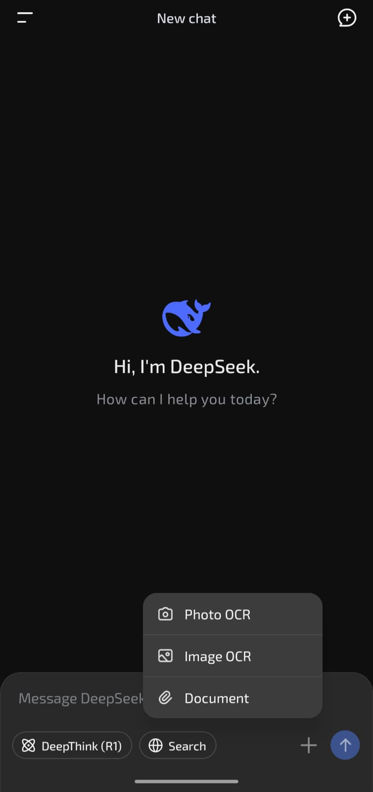
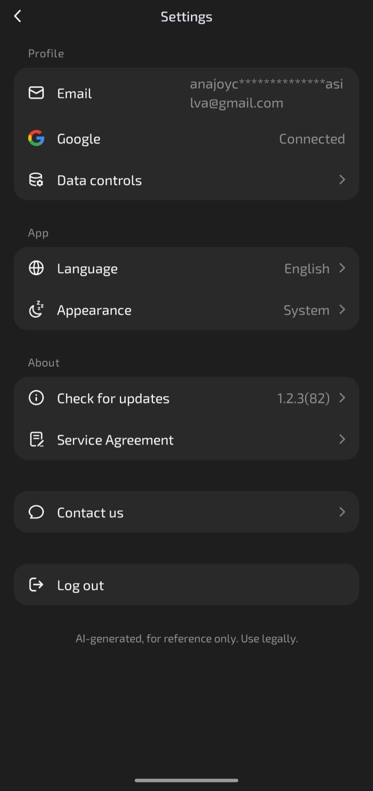
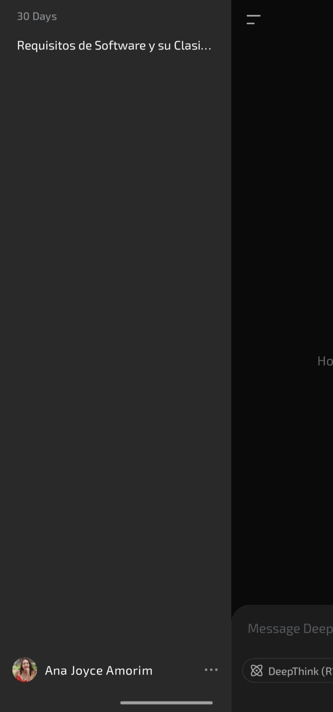

## Análise de Interface de Sistemas

## Introdução

A análise de interface de sistemas é uma técnica de elicitação de requisitos que examina as conexões entre um sistema e os sistemas externos com os quais ele 
interage. Essa abordagem ajuda a identificar requisitos funcionais, como troca de dados e serviços, permitindo documentar informações essenciais para o desenvolvimento 
do sistema (IIBA, 2009).  
Por meio de diagramas de contexto e mapas de ecossistema, é possível visualizar e validar as interfaces do sistema. Isso possibilita determinar quais dados 
devem ser enviados e recebidos, além de regras sobre esses dados, como critérios de validação, garantindo um desenvolvimento eficiente e evitando retrabalho.

## Metodologia

A metodologia adotada para a elicitação de requisitos baseou-se na abordagem descrita em Requirements Elicitation (WIEGERS), complementada pela análise da 
documentação pública do [DeepSeek](https://github.com/deepseek-ai/DeepSeek-V) e pelo uso da própria ferramenta para levantamento e validação de informações.  
Inicialmente, foi realizada a análise de interface de sistemas, identificando conexões do DeepSeek com sistemas externos e documentando os fluxos de dados e interações 
funcionais.  
A documentação existente do DeepSeek foi examinada para validar e complementar os requisitos levantados.  
Além disso, foram conduzidas consultas e testes exploratórios com o próprio DeepSeek, permitindo identificar requisitos específicos e regras associadas à comunicação entre sistemas. Essa abordagem iterativa possibilitou a validação dos requisitos levantados, garantindo que fossem precisos e alinhados com os objetivos do sistema.  
Essa metodologia proporcionou uma elicitação de requisitos eficiente, combinando fontes documentais confiáveis e análise prática do sistema para garantir uma definição precisa e bem fundamentada dos requisitos do projeto.

## Versão utilizada e registro das telas de origem

- DeepSeek-V3  

  
  
  
  

## Resultados

### 1- Requisitos Funcionais (RF)

| **Categoria**                   | **Código** | **Descrição**                                                                               | **Status**                |
| ------------------------------- | ---------- | ------------------------------------------------------------------------------------------- | ------------------------- |
| **Interface do Usuário (UI)**   | RF01       | O sistema deve permitir interação via chat em tempo real.                                   | Implementado              |
|                                 | RF02       | O sistema deve aceitar uploads de arquivos nos formatos PDF, DOCX, TXT e imagens (com OCR). | Implementado              |
|                                 | RF03       | O sistema deve oferecer um botão para ativar/desativar busca na web.                        | Implementado              |
|                                 | RF04       | O sistema deve exibir respostas formatadas em Markdown (títulos, listas, código).           | Parcialmente implementado |
|                                 | RF05       | O sistema deve permitir limpar o histórico de conversas.                                    | Parcialmente implementado |
| **Interface de Dados**          | RF06       | O sistema deve extrair e processar texto de arquivos de até 10MB.                           | Implementado              |
|                                 | RF07       | O sistema deve citar fontes externas quando usar busca na web.                              | Parcialmente implementado |
|                                 | RF08       | O sistema deve permitir interromper respostas em andamento.                                 | Não implementado          |
| **Interface de Software (API)** | RF09       | O sistema deve fornecer uma API RESTful para integração com outros serviços.                | Parcialmente implementado |
|                                 | RF10       | A API deve aceitar autenticação via token de acesso.                                        | Implementado              |
|                                 | RF11       | A API deve retornar respostas em JSON (padrão para integração).                             | Implementado              |  

**Fonte:** [Ana Joyce](anajoyceamorim)

### 2- Requisitos Não-Funcionais (RNF)

| **Categoria**      | **Código** | **Descrição**                                                                               | **Status**                |
| ------------------ | ---------- | ------------------------------------------------------------------------------------------- | ------------------------- |
| **Usabilidade**    | RNF01      | O tempo de resposta para prompts curtos deve ser ≤2 segundos.                               | Implementado              |
|                    | RNF02      | A interface deve ser acessível (suporte a leitores de tela, alto contraste).                | Parcialmente implementado |
|                    | RNF03      | O sistema deve manter histórico de conversas por no mínimo 30 dias de usuários não logados. | Não implementado          |
| **Desempenho**     | RNF04      | O sistema deve suportar múltiplas requisições simultâneas sem degradação.                   | Implementado              |
|                    | RNF05      | O processamento de arquivos grandes (PDF/DOCX) deve ocorrer em ≤10 segundos.                | Implementado              |
| **Segurança**      | RNF06      | Dados de upload devem ser excluídos após processamento.                                     | Não implementado          |
|                    | RNF07      | Conexões devem usar HTTPS para criptografia.                                                | Implementado              |
| **Confiabilidade** | RNF08      | O sistema deve ter disponibilidade de 99,9% (SLA).                                          | Implementado              |
|                    | RNF09      | Em caso de falha, deve retornar mensagens de erro claras.                                   | Implementado              |  

**Fonte:** [Ana Joyce](anajoyceamorim)

## Bibliografia

> WIEGERS, Karl; BEATTY, Joy. Software Requirements. 3. ed. [S. l.]: Microsoft Press, 2013.  
> DEEPSEEK AI. DeepSeek V3. Disponível em: https://github.com/deepseek-ai/DeepSeek-V

| Data       | Versão | Descrição                                 | Autor             | Revisor          |
| :--------: | :----: | :----------:                              | :---------------: | :---------------:|
| 04/05/2025 |  1.0   | Adição da Análise de Interface            | [Ana Joyce](https://github.com/anajoyceamorim)| [Ana Borges](https://github.com/anabborges)|
| 06/05/2025 |  1.1   | Ajustes na documentação                   | [Ana Joyce](https://github.com/anajoyceamorim)| [Revisor](https://github.com/)|