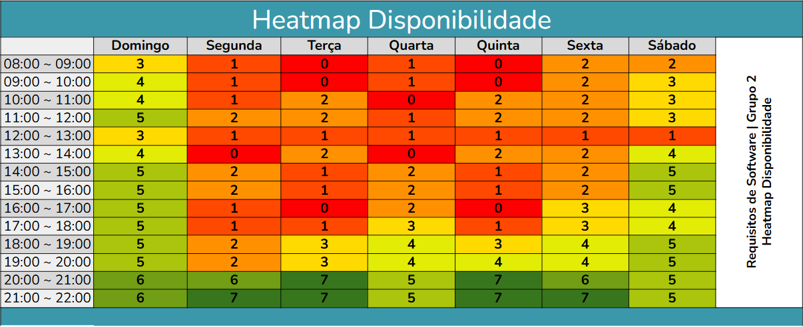
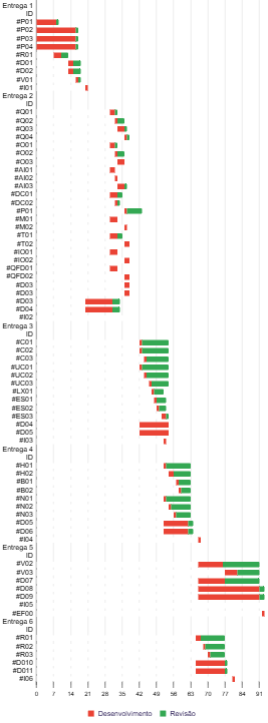
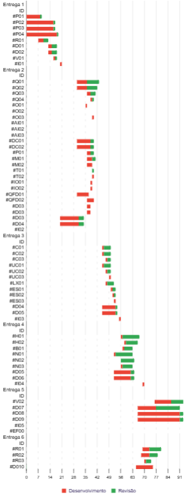

O planejamento do trabalho teve início imediatamente após a composição da equipe, visando assegurar clareza no papel de cada integrante e organizar de forma realista o esforço de coleta, análise e especificação. Foram definidas as seguintes diretrizes principais:

## **Alocação de tempo e reuniões periódicas**
  Com base em um heatmap(figura 1) de disponibilidade coletado junto aos membros, optou-se por realizar reuniões semanais às terças e quintas-feiras, em horários compatíveis com a maioria. Essa cadência regular garantiu alinhamento frequente sobre o progresso das atividades de elicitação e análise, além de permitir a identificação rápida de bloqueios ou dúvidas.

??? summary "Heatmap - Figura 1"  
    

     
    <strong>Figura 1.</strong> Heatmap de disponibilidade dos integrantes.
    

## **Flexibilidade na metodologia**
  Decidiu-se não adotar uma metodologia de desenvolvimento formal (como Scrum ou RUP), tampouco estabelecer ritos fixos de planejamento, revisão e retrospectiva, ou uma estrutura de liderança hierárquica. Essa abordagem trouxe duas consequências principais:

  1. **Autonomia individual**: cada membro teve liberdade para organizar suas tarefas segundo seu próprio fluxo de trabalho, o que favoreceu a motivação e a produtividade em momentos de maior concentração individual.
  2. **Falta de sincronia**: a ausência de cerimônias padronizadas e de uma figura central de coordenação resultou em escoamentos de informação e alinhamentos realizados de forma desigual, gerando retrabalhos em pontos de integração entre as atividades de requisitos.

## **Cronograma**

Para garantir visibilidade e controle detalhado do progresso, o cronograma foi estruturado em duas versões: [planejado](../planejamento/cronograma.md) e [executado](../planejamento/cronograma-executado.md).

A seguir, apresentam-se os diagramas de Gantt correspondentes a cada visão:

| Cronograma Planejado                         | Cronograma Executado                         |
| :--------------------------------------------: | :-------------------------------------------: |
|  |  |
| **Figura 2.** Cronograma Planejado            | **Figura 3.** Cronograma Executado           |

## **Conclusão**
Em suma, o planejamento buscou equilibrar autonomia e controle leve sobre progresso e qualidade, priorizando reuniões objetivas e entregas incrementais. O maior aprendizado foi que, apesar de estimulante para a iniciativa individual, a falta de cerimônias padronizadas requer atenção extra ao definir check-points, pois mantê-los é essencial para evitar desalinhamentos e incorporar feedback de todos os envolvidos.

## Bibliografia
>  MELO, Arthur. Planejamento dos Recursos e das Entregas. Repositório do Grupo Bilheteria Digital da disciplina de Requisitos de Software da Universidade de Brasília, 2023. Disponível em: <https://requisitos-de-software.github.io/2023.1-BilheteriaDigital/entrega-final/planejamento-recursos-entregas/>. Acesso em: 07 julho 2025.

## Histórico de Versões

| Versão | Data       | Descrição          | Autor(es)                                        | Revisor(es)                                    |
| ------ | ---------- | ------------------ | ------------------------------------------------ | ---------------------------------------------- |
| `1.0`  | 06/07/2025 | Criação da página. | [Gabriela](https://github.com/gaubiela) | [Ana Clara](https://github.com/anabborges)  |
