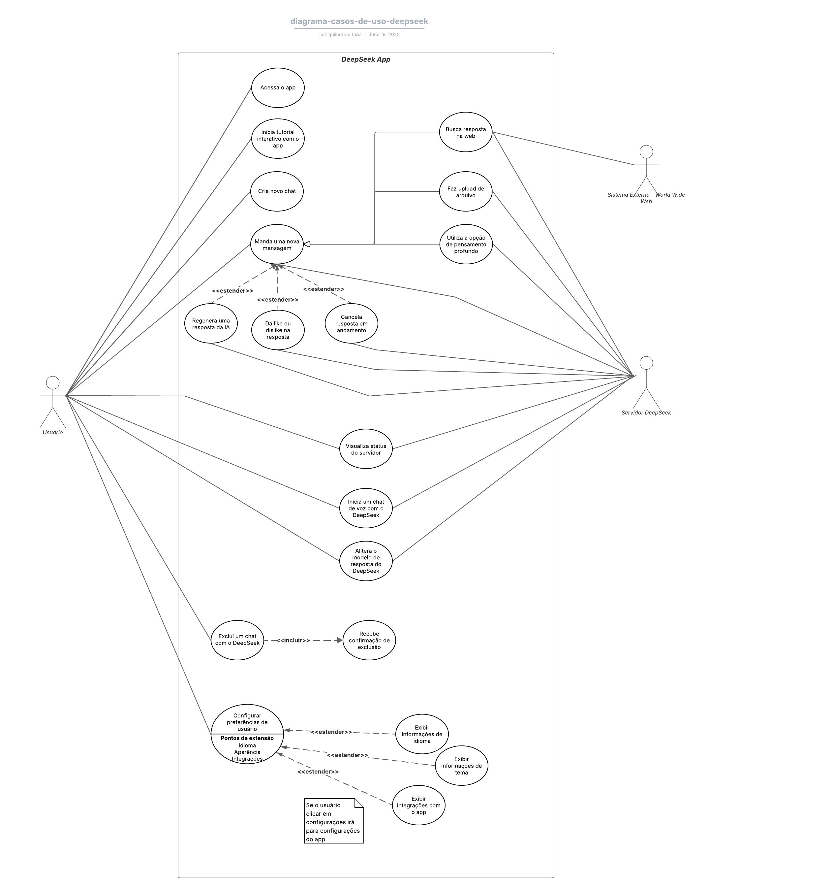

## Introdução
Os diagramas de caso de uso são uma ferramenta fundamental da linguagem de modelagem unificada (UML) que permitem representar graficamente as funcionalidades esperadas de um sistema do ponto de vista de seus usuários. Essa técnica é amplamente utilizada na engenharia de requisitos para descrever as interações entre os atores (usuários ou sistemas externos) e os serviços oferecidos pela aplicação. No contexto do projeto DeepSeek, a modelagem dos casos de uso contribui para a compreensão do comportamento do sistema sob diferentes perspectivas de interação, facilitando a comunicação entre stakeholders técnicos e não técnicos, e servindo como base para futuras etapas de projeto, desenvolvimento e testes.

## Diagrama de Casos de Uso

Um diagrama de casos é uso é utilizado para descrever um conjunto de ações (casos de uso), que um sistema, ou um determinado conjunto de sistemas deve desempenehar em conjunto com um ou vários usuários extermos ao sistema, assim, cada caso de uso deverá trazer algum resultado observável e de valor para os atores ou algum outro interessado no sistema <a id="anchor_1" href="#REF1">[1]</a>.

### Componentes de um Diagrama de Casos de Uso

Um diagrama de casos de uso é possui quatro componentes principais: atores, casos de uso, barreira do sistema e relacionamentos. 

1. **Atores:** Os atores são representados por bonecos palito, podem ser seres humanos ou sistemas e subsistemas, eles são externos ao sistema que está sendo estudado, por isso, devem ficar de fora da barreira do sistema <a id="anchor_2" href="#REF2">[2]</a>;
2. **Casos de uso:** Os casos de uso são representados por elipses, e devem estar representados dentro da barreira do sistema que está sendo descrito no diagrama, é recomendado o uso de verbos no infinitivo para descrever os casos de uso para poder indicar que eles são ações que podem ser feitas no sistema <a id="anchor_3" href="#REF3">[3]</a>;
3. **Barreira do sistema:** A barreira do sistema é representada por um retângulo de lados sólidos que engloba tudo aquilo que faz parte do sistema que está sendo representado no diagrama <a id="anchor_4" href="#REF4">[4]</a>;
4. **Relacionamentos:** Um diagrama de casos de uso também representa os relacionamentos que estão presentes entre os casos de uso, eles podem ser de **extensão** (para representar esse tipo de relacionamento deve-se ligar uma seta tracejada do caso extendido ao caso base com o texto "extend" na seta), de **inclusão** (para representar esse relacionamento deve-se ligar uma seta tracejada do caso base ao caso incluído com o texto "include" na seta) e de gereralização ou **herança** (a qual é representa com uma seta cuja a ponta é um triângulo) <a id="anchor_5" href="#REF5">[5]</a>.

### Diagrama de Casos de Uso do App DeepSeek:

Com base nos requisitos elicitados na entrega 2 do projeto, foi possível elaborar um conjunto de casos de uso, que compõem o diagrama UML de casos de uso, o qual possui o usuário como ator primário, o servidor DeepSeek e o Sistema externo de conteúdos da internet como atores secundários. O diagrama possui requisitos já implementados no app bem como requisitos que não foram implementados ainda.

* [Link para o diagrama UML](https://lucid.app/lucidchart/410dc733-3efb-402b-84da-275d5d27d77b/edit?viewport_loc=-1735%2C-664%2C2778%2C1869%2C0_0&invitationId=inv_fb93f228-b92d-4633-a8cf-5a1409a3fdd0)

## Casos de uso

Além do diagrama, é possível contruir uma tabela para cada um dos casos de uso presente no diagrama de caso de uso do app, essas tabelas buscam explicar ainda mais esses requisitos, apresentando os atores, os diferentes fluxos, pré e pós-condições, ação e itens de rastreabilidade.

Para isso, é necessário explicar os componentes presentes em um caso de uso.

1. **Ator:** É quem será responsável por utilizar aquela funcionalidade presente no sistema <a id="anchor_2" href="#REF2">[2]</a>;
2. **Pré-condições:** São condições que devem existir para que o caso de uso comece de fato <a id="anchor_6" href="#REF6">[6]</a>;
3. **Ação:** São as tarefas ou funções principais que são realizadas pelo ator <a id="anchor_7" href="#REF7">[7]</a>;
4. **Fluxo principal:** É a maneira padrão que aquele ator irá utilizar aquela funcionalidade, é também chamado de fluxo básico ou fluxo de sucesso. Cada caso de uso tem somente um fluxo principal <a id="anchor_8" href="#REF8">[8]</a>;
5. **Fluxo alternativo:** Representa as escolhas que o usuário poderá fazer na execução de uma funcionalidade que serão responsáveis por alterar o comportamento da funcionalidade <a id="anchor_9" href="#REF9">[9]</a>;
6. **Fluxo de excessão:** Representa excessões que podem ocorrer ao utilizar aquele sistema, essas excessões devem ser previstas e tratadas, contudo é difícil que um software trate todas as possibilidades de excessão <a id="anchor_10" href="#REF10">[10]</a>;
7. **Pós-condições:** São condições irão existir após a ação do caso de uso ser finalizada.

Com base nesses itens, é possível elaborar a tabela template para preenchimento dos casos de uso presentes no diagrama de casos de uso.

**Tabela 01** - Tabela template para descrever um caso de uso.

| **Item** | **Informações**                                                                                                    |
| ---- | :------------------------------------------------------------------------------------------------------------: |
| **Código** | - |
| **Descrição**     -    | - |
| **Ator**              |  -                                                                   |
| **Pré-condições**     | -  |
| **Ação**              | -  |
| **Fluxo principal**   | -	 |
| **Fluxo alternativo** | - |
| **Fluxo de exceção**  | -  |
| **Pós-condições**     |  - |
| **Data de Criação**   | -       |
| **Rastreabilidade**   | -  |
| **Cenário relacionado** | - |
| **Léxico relacionado** |  - |

## Metodologia
A modelagem dos casos de uso do DeepSeek foi conduzida com base nos princípios da UML, utilizando diagramas e descrições textuais conforme recomendação da literatura especializada. Inicialmente, identificaram-se os atores relevantes do sistema, como usuários finais, administradores e sistemas externos. Em seguida, foram definidos os principais casos de uso que representam as funcionalidades que o sistema deverá oferecer a esses atores. Os diagramas foram elaborados por meio da ferramenta Lucidchart, e cada caso de uso foi descrito com os seguintes elementos: nome, objetivo, atores envolvidos, fluxo de eventos (principal e alternativos), pré-condições, pós-condições e exceções. Essa abordagem visual e textual permite alinhar expectativas entre os envolvidos no projeto e fornecer uma visão clara do escopo funcional da aplicação.

## Tabela de Contribuições

**Tabela 02** - Contribuições no documento de casos de uso.

| Contribuinte | Descrição                                                            | Links                                           |
|--------------|----------------------------------------------------------------------|-------------------------------------------------|
| Ana Joyce     | Criação dos casos de uso #UC01 | [#UC01](#uc01) |
| Davi     | Criação dos casos de uso #UC02, #UC03 | [#UC02](#uc02) · [#UC03](#uc03)|
| Fábio     | Criação dos casos de uso #UC04, #UC05 | [#UC04](#uc04) · [#UC05](#uc05)|
| Gabriela     | Criação dos casos de uso #UC06, #UC07, #UC08 | [#UC06](#uc06) · [#UC07](#uc07) · [#UC08](#uc08) |
| Luiz     | Criação dos casos de uso #UC09, #UC10, #UC11 | [#UC09](#uc09) · [#UC10](#uc10) · [#UC11](#uc11) |
| Ana Clara     | Criação dos casos de uso #UC12, #UC13 | [#UC12](#uc12) · [#UC13](#uc13) |
| Mateus     | Criação dos casos de uso #UC14 | [#UC14](#uc14)|

## Casos de Uso Modelados:

## #UC01 -  Exclusão automática de dados de upload
**Autor:** [Ana Joyce](https://github.com/anajoyceamorim)

**Tabela 03** - Caso de uso 01 - Exclusão automática de dados de upload

| **Item** | **Informações**                                                                                                    |
| ---- | -------------------------------------------------------------------------------------------------------------- |
| **Código** | #UC01 |
| **Descrição**         | O sistema deve excluir automaticamente os dados enviados via upload após determinado período ou após o uso concluído, garantindo segurança e privacidade. |
| **Ator**              | Sistema                                                                      |
| **Pré-condições**     | O usuário realizou um upload de arquivo (documento, imagem, PDF, etc.) para uso temporário no DeepSeek.    |
| **Ação**              | O sistema verifica uploads armazenados e realiza exclusão automática conforme a política de retenção definida.   |
| **Fluxo principal**   | 	<ul><li>O usuário realiza o upload de um arquivo temporário <ul><li>O sistema processa o conteúdo e o utiliza conforme a solicitação do usuário <li>Após finalização da tarefa, inicia-se a contagem de tempo para retenção temporária <li>O sistema verifica periodicamente os arquivos expirados <li>Arquivos vencidos são excluídos automaticamente <li>Um log interno é registrado para fins de auditoria</li></ul></li></ul> |
| **Fluxo alternativo** | <ul><li>O usuário encerra a sessão sem usar o conteúdo do upload <ul><li>O sistema aplica o mesmo ciclo de exclusão após o tempo padrão</li></ul></li></ul> |
| **Fluxo de exceção**  | <ul><li>Erro no mecanismo de exclusão automática <ul><li>O sistema registra a falha e envia alerta para manutenção interna</li></ul></li></ul> |
| **Pós-condições**     | Arquivos temporários são removidos automaticamente; nenhum dado de upload permanece após o período estabelecido.  |
| **Data de Criação**   | 18/05/2025        |
| **Rastreabilidade**   | #RN04 — Exclusão automática de dados de upload #RIN11 — Requisito relacionado à segurança de dados   |
| **Cenário relacionado** | [#CN01](../modelagem/cenarios.md#cn01) |
| **Léxico relacionado** | [#LX01](../modelagem/lexicos.md#lx01) |

## #UC02 - Permite que o usuário use o DeepSeek e o integre com plataformas Externas.
**Autor:** [Davi Emanuel](https://github.com/daviRolvr)

**Tabela 04** - Caso de uso 02 - Permite que o usuário use o DeepSeek e o integre com plataformas Externas.

| **Item** | **Informações**                                                                                                    |
| ---- | -------------------------------------------------------------------------------------------------------------- |
| **Código** | #UC02 |
| **Descrição**         | 	O usuário pode conectar plataformas externas (GitHub, Google, LinkedIn, Discord) ao DeepSeek para ampliar fontes de informação. |
| **Ator**              | 	Usuário                                                                                                         |
| **Pré-condições**     | 	Acesso à internet, conta em plataformas externas, autorização do usuário para integração.                                                          |
| **Ação**              | O usuário integra uma ou mais plataformas externas ao DeepSeek.                                                      |
| **Fluxo principal**   | <ul><li>Usuário abre o DeepSeek <ul><li>O usuário acessa a aba de integrações <ul><li>Seleciona uma plataforma (ex: GitHub) <ul><li>Autoriza o acesso via token ou login OAuth </li></ul></li></ul></li></ul> |
| **Fluxo alternativo** | <ul><li>O usuário tenta integrar, mas não tem sessão ativa na plataforma <ul><li>O DeepSeek redireciona para login externo e, após sucesso, finaliza a integração |
| **Fluxo de exceção**  | <ul><li>A autorização da plataforma externa é negada ou expira <ul><li>O sistema informa falha na conexão e sugere nova tentativa  |
| **Pós-condições**     | O DeepSeek pode acessar dados autorizados das plataformas externas para enriquecer as respostas ou contexto do usuário.                    |
| **Data de Criação**   | 17/05/2025                                                                                                     |
| **Rastreabilidade**   | #RF37     |
| **Cenário relacionado** | [#CN02](../modelagem/cenarios.md#cn02) |
| **Léxico relacionado** | [#LX02](../modelagem/lexicos.md#lx02) |

## #UC03 - Permite que o usuário use o Deepseek com a funcionalidade de integração por Voz.
**Autor:** [Davi Emanuel](https://github.com/daviRolvr)

**Tabela 05** - Caso de uso 03 - Permite que o usuário use o Deepseek com a funcionalidade de integração por Voz.

| **Item** | **Informações**                                                                                                    |
| ---- | -------------------------------------------------------------------------------------------------------------- |
| **Código** | #UC03 |
| **Descrição**         | 		O usuário é capaz de realizar perguntas ao DeepSeek por meio de comandos de voz. |
| **Ator**              | 		Usuário                                                                                                     |
| **Pré-condições**     | Acesso à internet, microfone habilitado, permissão concedida ao app para uso de áudio.                                                         |
| Ação              | O usuário interage com o DeepSeek por comando de voz para realizar perguntas ou pesquisas.                                                   |
| **Fluxo principal**   | <ul><li>O usuário acessa o aplicativo <ul><li>Ativa o modo de entrada por voz <ul><li>Faz uma pergunta verbalmente <ul><li>O DeepSeek converte voz em texto e responde </li></ul></li></ul></li></ul> |
| **Fluxo alternativo** | <ul><li> O usuário acessa o aplicativo <ul><li>Ativa o modo de entrada por voz <ul><li>Sistema detecta ausência de fala <ul><li> Solicita nova tentativa ou oferece teclado como alternativa|
| **Fluxo de exceção**  | <ul><li>O microfone do usuário está desativado ou bloqueado <ul><li>O sistema exibe mensagem de erro solicitando ativação do microfone  |
| **Pós-condições**     | O usuário recebe a resposta para sua pergunta em texto.                    |
| **Data de Criação**   | 17/05/2025                                                                                                     |
| **Rastreabilidade**   | #RF14     |
| **Cenário relacionado** | [#CN03](../modelagem/cenarios.md#cn03) |
| **Léxico relacionado** | [#LX03](../modelagem/lexicos.md#lx03) |

## #UC04 - Permite que o usuário selecione diferentes versões/modelos de IA no DeepSeek
**Autor:** [Fabio](https://github.com/fabinsz)

**Tabela 06** - Caso de uso 04 - Permite que o usuário selecione diferentes versões/modelos de IA no DeepSeek.

| Item | Informações                                                                                                                                      |
| ---- | ------------------------------------------------------------------------------------------------------------------------------------------------ |
| **Código** | #UC04 |
| **Descrição**         | Permite que o usuário selecione diferentes versões de modelos de IA (ex: R1, R2, R3) no DeepSeek, personalizando o estilo e a profundidade das respostas. |
| **Ator**              | Júlia                                                                                                                           |
| **Pré-condições**     | Estar com o DeepSeek aberto e com conexão à internet.                                                                            |
| **Ação**              | Júlia decide escolher o modelo que melhor se adequa à sua necessidade de resposta antes de enviar uma pergunta à IA.            |
| **Fluxo principal**   | <ul><li>Júlia abre o DeepSeek <ul><li>Seleciona “Modelos de IA” no canto superior direito <ul><li>Visualiza as opções R1, R2 e R3 com descrições <ul><li>Escolhe o modelo R2 por preferir respostas mais diretas <ul><li>Digita sua pergunta no campo de chat <ul><li>Clica na seta para enviar <ul><li>Lê a resposta gerada pelo modelo R2</li></ul></li></ul></li></ul></li></ul></li></ul></li></ul> |
| **Fluxo alternativo** | <ul><li>Júlia está insatisfeita com a resposta gerada pelo modelo atual <ul><li>Retorna à seleção de modelos <ul><li>Escolhe o modelo R1 para uma explicação mais aprofundada <ul><li>Reenvia a mesma pergunta <ul><li>Lê a nova resposta mais detalhada</li></ul></li></ul></li></ul></li></ul> |
| **Fluxo de exceção**  | <ul><li>Ao tentar trocar o modelo, a conexão com o servidor falha <ul><li>DeepSeek exibe a mensagem: “Erro ao carregar modelos. Verifique sua conexão.” <ul><li>Usuária tenta novamente após restabelecer a internet</li></ul></li></ul></li></ul> |
| **Pós-condições**     | Júlia recebe uma resposta ajustada ao modelo escolhido, com o estilo e profundidade desejados.                                  |
| **Data de Criação**   | 17/05/2025                                                                                                                       |
| **Rastreabilidade**   | #RF32   
| **Cenário relacionado** | [#CN04](../modelagem/cenarios.md#cn04) |
| **Léxico relacionado** | [#LX04](../modelagem/lexicos.md#lx04) |

## #UC05 - Permite que o usuário acesse as configurações para alterar o tema do sistema (claro/escuro), ajustando a aparência da interface conforme suas preferências.
**Autor:** [Fabio](https://github.com/fabinsz)

**Tabela 07** - Caso de uso 05 - Permite que o usuário acesse as configurações para alterar o tema do sistema (claro/escuro), ajustando a aparência da interface conforme suas preferências.

| **Item**              | **Informações**                                                                                                                                                     |
|--------------------|------------------------------------------------------------------------------------------------------------------------------------------------------------------|
| **Código** | #UC05 |
| **Descrição**       | Permite que o usuário acesse as configurações do DeepSeek para alterar o tema visual da interface, escolhendo entre tema claro ou escuro, de acordo com suas preferências. |
| **Ator**            | Lucas                                                                                                                                                            |
| **Pré-condições**   | Estar logado no DeepSeek com conexão ativa à internet. Interface carregada.                                                                                      |
| **Ação**            | Lucas deseja mudar o tema do sistema para modo escuro, pois está em um ambiente com pouca luz.                                                                  |
| **Fluxo principal** | <ul><li>Lucas abre o DeepSeek <ul><li>Clica no ícone de menu ou perfil <ul><li>Seleciona “Configurações” <ul><li>Clica em “Tema do Sistema” <ul><li>Escolhe “Modo Escuro” <ul><li>Confirma a alteração <ul><li>A interface do sistema muda imediatamente</li></ul></li></ul></li></ul></li></ul></li></ul></li></ul> |
| **Fluxo alternativo** | <ul><li>Lucas acessa o DeepSeek <ul><li>Vai até “Configurações” <ul><li>Percebe que o modo escuro já está ativado <ul><li>Decide não realizar alterações</li></ul></li></ul></li></ul> |
| **Fluxo de exceção** | <ul><li>Lucas tenta acessar “Configurações” <ul><li>A página demora para carregar ou apresenta erro <ul><li>DeepSeek exibe mensagem: “Erro ao carregar configurações” <ul><li>Lucas recarrega a página e tenta novamente</li></ul></li></ul></li></ul></li></ul> |
| **Pós-condições**   | O sistema permanece com o tema selecionado até nova alteração. A preferência visual do usuário foi respeitada.                                                   |
| **Data de Criação** | 17/05/2025                                                                                                                                                       |
| **Rastreabilidade** | #RF27  |                                                             
| **Cenário relacionado** | [#CN05](../modelagem/cenarios.md#cn05) |
| **Léxico relacionado** | [#LX05](../modelagem/lexicos.md#lx05) |

                                             

## #UC06 - Permite que o usuário envie um PDF e receba o texto extraído e insights, preservando formatação e símbolos.
**Autor:** [Gabriela](https://github.com/gaubiela)

**Tabela 08** - Caso de uso 06 - Permite que o usuário envie um PDF e receba o texto extraído e insights, preservando formatação e símbolos.

| **Item** | **Informações**                                                                                                    |
| ---- | -------------------------------------------------------------------------------------------------------------- |
| **Código** | #UC06
| **Descrição**         | Permite que o usuário envie um PDF e receba o texto extraído e insights, preservando formatação e símbolos. |
| **Ator**              | Usuário                                                                                                         |
| **Pré-condições**     | PDF acessível no dispositivo                                                             |
| **Ação**              | Júlia faz upload de um PDF e obtém o texto e insights extraídos                                                           |
| **Fluxo principal**   | <ul><li>Júlia abre o DeepSeek <ul><li>Seleciona “Upload de Documento” <ul><li>Escolhe o PDF e confirma <ul><li>DeepSeek processa apresenta texto e  insights extraídos </li></ul></li></ul></li></ul> |
| **Fluxo alternativo** | <ul><li>Júlia abre o DeepSeek <ul><li>Seleciona “Upload de Documento” <ul><li>DeepSeek detecta formato inválido e exibe mensagem de erro </li></ul></li></ul></li></ul> |
| **Fluxo de exceção**  | <ul><li>Inicia upload do PDF <ul><li>Conexão é perdida <ul><li>DeepSeek notifica “Conexão perdida” e oferece retomar </li></ul></li></ul></li></ul> |
| **Pós-condições**     | Texto completo disponível como conteúdo editável; inconsistências sinalizadas para revisão                     |
| **Data de Criação**   | 10/05/2025                                                                                                     |
| **Rastreabilidade**   | #RF03, #RN06, #RN08                                                                                            |
| **Cenário relacionado** | [#CN06](../modelagem/cenarios.md#cn06) |
| **Léxico relacionado** | [#LX06](../modelagem/lexicos.md#lx06) |

## #UC07 - Permite buscar, em menos de 3 s, a versão mais recente do Node.js em 10/05/2025 e copiar o resultado.
**Autor:** [Gabriela](https://github.com/gaubiela)

**Tabela 09** - Caso de uso 07 - Permite buscar, em menos de 3 s, a versão mais recente do Node.js em 10/05/2025 e copiar o resultado.

| **Item** | **Informações**                                                                                                    |
| ---- | -------------------------------------------------------------------------------------------------------------- |
| **Código** | #UC07 |
| **Descrição**         | Permite buscar, em menos de 3 s, a versão mais recente do Node.js em 10/05/2025 e copiar o resultado.      |
| **Ator**              | Usuário                                                                                                     |
| **Pré-condições**     | Internet ativa; aba **Search** habilitada no DeepSeek                                                        |
| **Ação**              | Pedro busca a versão do Node.js e copia o trecho retornado                                                   |
| **Fluxo principal**   | <ul><li>Pedro ativa a aba **Search** <ul><li>Digita “versão mais recente do Node.js em 10/05/2025” <ul><li>Sistema retorna “Node.js v20.7.0 – lançado em 08/05/2025” e exibe botão **Copy** </li></ul></li></ul></li></ul> |
| **Fluxo alternativo** | <ul><li>Resultado sem data <ul><li>Pedro refina a query para “Node.js versão estável maio 2025” e repete a busca </li></ul></li></ul></li></ul> |
| **Fluxo de exceção**  | <ul><li>Consulta demora > 3 s <ul><li>Sistema exibe aviso de lentidão com opção “Recarregar” </li></ul></li></ul></li></ul> |
| **Pós-condições**     | Versão documentada no repositório; critério de agilidade validado                                             |
| **Data de Criação**   | 10/05/2025                                                                                                     |
| **Rastreabilidade**   | #RF01, #RF13                                                                                                   |
| **Cenário relacionado** | [#CN07](../modelagem/cenarios.md#cn07) |
| **Léxico relacionado** | [#LX07](../modelagem/lexicos.md#lx07) |

## #UC08 - Permite refinar uma resposta gerada usando **Like/Dislike/Regenerate/Copy** até atingir clareza e concisão.
**Autor:** [Gabriela](https://github.com/gaubiela)

**Tabela 10** - Caso de uso 08 - Permite refinar uma resposta gerada usando **Like/Dislike/Regenerate/Copy** até atingir clareza e concisão.

| **Item** | **Informações**                                                                                                    |
| ---- | -------------------------------------------------------------------------------------------------------------- |
| **Código** | #UC08 |
| **Descrição**         | Permite refinar uma resposta gerada usando **Like/Dislike/Regenerate/Copy** até atingir clareza e concisão. |
| **Ator**              | Usuário                                                                                                       |
| **Pré-condições**     | Resposta inicial gerada; conexão ativa                                                        |
| **Ação**              | Mariana itera feedback e copia a versão final do texto                                                        |
| **Fluxo principal**   | <ul><li>Mariana lê o parágrafo inicial <ul><li>Clica em **Dislike** e fornece feedback <ul><li>Clica em **Regenerate** e aguarda nova versão (~ 1 s) </li></ul></li></ul></li></ul><ul><li>Clica em **Like** e depois em **Copy** na versão final </li></ul> |
| **Fluxo alternativo** | <ul><li>Regeneração demora > 3 s <ul><li>Sistema exibe botão **Cancelar** para interromper </li></ul></li></ul></li></ul> |
| **Fluxo de exceção**  | <ul><li>Feedback não traz mudança satisfatória <ul><li>Mariana fornece comentário mais detalhado e regenera novamente </li></ul></li></ul></li></ul> |
| **Pós-condições**     | Parágrafo final satisfatório; avaliação registrada                                                             |
| **Data de Criação**   | 10/05/2025                                                                                                     |
| **Rastreabilidade**   | #RF11, #RF12, #RF13, #RF17                                                                                     |
| **Cenário relacionado** | [#CN08](../modelagem/cenarios.md#cn08) |
| **Léxico relacionado** | [#LX08](../modelagem/lexicos.md#lx08) |

## #UC09 - Permite que o usuário resolva problemas difíceis, como os de matemática, oferecendo o fluxo de pensamento da IA além da resposta. Utiliza o modelo R1 do DeepSeek
**Autor:** [Luiz](https://github.com/luizfari1989)

**Tabela 11** - Caso de uso 09 - Permite que o usuário resolva problemas difíceis, como os de matemática, oferecendo o fluxo de pensamento da IA além da resposta. Utiliza o modelo R1 do DeepSeek.

| **Item** | **Informações**                                                                                                    |
| ---- | -------------------------------------------------------------------------------------------------------------- |
| **Código** | #UC09 |
| **Descrição**         | Permite que o usuário resolva problemas difíceis, como os de matemática, oferecendo o fluxo de pensamento da IA além da resposta. Utiliza o modelo R1 do DeepSeek |
| **Ator**              | Gauss                                                                                                         |
| **Pré-condições**     | Internet ativa, aba **Pensamento Profundo (R1)**  habilitada no DeepSeek                                                            |
| **Ação**              | Gauss digita a equação que está com dúvidas e pede para a IA resolvê-la                                                       |
| **Fluxo principal**   | <ul><li>Gauss abre o DeepSeek <ul><li>Seleciona "Pensamento Profundo (R1)" <ul><li>Digita a equação do problema que está com dúvidas no chat <ul><li>Clica na seta para enviar </li><ul><li>Lê a resposta da IA</li></ul></ul></li></ul></li></ul> |
| **Fluxo alternativo** | <ul><li>Gauss abre o DeepSeek <ul><li>Seleciona “Pensamento Profundo (R1)” <ul><li>Percebe que é uma pergunta simples de ser resolvida </li><ul><li>Desativa o modo "Pensamento Profundo (R1)"</li></ul></ul></li></ul></li></ul> |
| **Fluxo de exceção**  | <ul><li>Inicia o desenvolvimento da pergunta <ul><li>Conexão é perdida <ul><li>DeepSeek notifica “Conexão perdida” e oferece retomar </li></ul></li></ul></li></ul> |
| **Pós-condições**     | Texto completo disponível com equações além do fluxo de consciência da IA                  |
| **Data de Criação**   | 11/05/2025                                                                                                     |
| **Rastreabilidade**   | #RF02, #RN07  
| **Cenário relacionado** | [#CN09](../modelagem/cenarios.md#cn09) |
| **Léxico relacionado** | [#LX09](../modelagem/lexicos.md#lx09) |

## #UC10 - Permite que o usuário cancele uma mensagem em andamento da IA no chat
**Autor:** [Luiz](https://github.com/luizfari1989)

**Tabela 12** - Caso de uso 10 - Permite que o usuário cancele uma mensagem em andamento da IA no chat

| **Item** | **Informações**                                                                                                    |
| ---- | -------------------------------------------------------------------------------------------------------------- |
| **Código** | #UC10 |
| **Descrição**         | Permite que o usuário cancele uma mensagem que está sendo gerada pela IA no chat |
| **Ator**              | João                                                                                                         |
| **Pré-condições**     | Internet ativa, uma mensagem precisa obrigatoriamente estar sendo gerada pela IA no chat                                                      |
| **Ação**              | João cancela uma mensagem que está sendo gerada pois ela está incorreta                                     |
| **Fluxo principal**   | <ul><li>João abre o DeepSeek <ul><li>Digita a sua mensagem no chat <ul><li>Clica na seta para enviar <ul><li>Lê o início da resposta que está sendo gerada pela IA <ul><li>Clica em "Interromper mensagem em andamento" </li></ul></li></ul></li></ul></li></ul></li></ul> |
| **Fluxo alternativo** | <ul><li>João abre o DeepSeek <ul><li>Digita a sua mensagem no chat <ul><li>Clica na seta para enviar <ul><li>Não encontra nenhum problema na mensagem que está sendo gerada pela IA</ul></li><ul></ul></ul></li></ul></li></ul> |
| **Fluxo de exceção**  | <ul><li>Inicia o desenvolvimento da pergunta <ul><li>Conexão é perdida <ul><li>DeepSeek notifica “Conexão perdida” e oferece a opção de retomar </li></ul></li></ul></li></ul> |
| **Pós-condições**     | Texto gerado parcialmente com a mensagem "Mensagem cancelada pelo usuário" escrita embaixo            |
| **Data de Criação**   | 16/05/2025                                                                                                     |
| **Rastreabilidade**   | #RF19
| **Cenário relacionado** | [#CN10](../modelagem/cenarios.md#cn10) |
| **Léxico relacionado** | [#LX10](../modelagem/lexicos.md#lx10) |

## #UC11 - Permite que o usuário veja o status do servidor, indicando se ele está em manutenção ou disponível para uso do chat da IA
**Autor:** [Luiz](https://github.com/luizfari1989)

**Tabela 13** - Caso de uso 11 - Permite que o usuário veja o status do servidor, indicando se ele está em manutenção ou disponível para uso do chat da IA.

| **Item** | **Informações**                                                                                                    |
| ---- | -------------------------------------------------------------------------------------------------------------- |
| **Código** | #UC11 |
| **Descrição**         | Permite que o usuário veja o status do servidor da IA, indicando se ele está em manutenção ou funcionando normalmente|
| **Ator**              | Clarice                                                                                                         |
| **Pré-condições**     | Internet ativa, Estar na tela de conversa com o DeepSeek                                                            |
| **Ação**              | Visualizar a mensagem no topo da tela indicando o status do servidor no momento                                             |
| **Fluxo principal**   | <ul><li>Clarice abre o DeepSeek <ul><li>Visualiza a mensagem indicando que o servidor está funcionando normalmente <ul><li>Digita sua pergunta para o chat da IA <ul></ul></ul></li></ul></li></ul> |
| **Fluxo alternativo** | <ul><li>Clarice abre o DeepSeek <ul><li>Visualiza a mensagem indicando que o servidor está em manutenção <ul><li>Fecha o app </li><ul></ul></ul></li></ul></li></ul> |
| **Fluxo de exceção**  | <ul><li>Tenta abrir o app <ul><li>Aparece a mensagem "Aplicativo sendo atualizado" <ul><li>O app é fechado automaticamente </li></ul></li></ul></li></ul> |
| **Pós-condições**     | O usuário visualiza a mensagem em tempo real do status do servidor                 |
| **Data de Criação**   | 16/05/2025                                                                                                     |
| **Rastreabilidade**   | #RF29                                                                                       |
| **Cenário relacionado** | [#C11](../modelagem/cenarios.md#cn11) |
| **Léxico relacionado** | [#LX11](../modelagem/lexicos.md#lx11) |

## #UC12 - Permite que o usuário entenda o funcionamento da plataforma a partir de um tutorial interativo
**Autor:** [Ana Clara](https://github.com/anabborges)

**Tabela 14** - Caso de uso 12 - Permite que o usuário entenda o funcionamento da plataforma a partir de um tutorial interativo.

| **Item** | **Informações**                                                                                                    |
| ---- | -------------------------------------------------------------------------------------------------------------- |
| **Código** | #UC12 |
| **Descrição**         | O usuário é capaz de entender o funcionamento da plataforma por meio de um tutorial interativo. |
| **Ator**              | Usuário                                                                                          |
| **Pré-condições**     | Conexão ativa.                                                |
| **Ação**              | O usuário acessa e segue o tutorial até concluir os passos propostos.                              |
| **Fluxo principal**   | <ul><li>O usuário clica em “Ver Tutorial” na tela inicial</li> <li>O sistema exibe uma introdução com explicação do objetivo da plataforma</li> <li>O usuário navega pelas seções (ex: “Como começar”, “Dar comandos”, “Usar feedback”)</li> <li>O usuário interage com exemplos sugeridos no tutorial</li> <li>Ao final, clica em “Finalizar tutorial”</li></ul> |
| **Fluxo alternativo** | <ul><li>O usuário considera o tutorial longo ou repetitivo; O usuário já sabe utilizar a plataforma</li> <li>Clica em “Pular tutorial”</li> <li>Sistema registra a decisão e recomenda revisitar mais tarde</li></ul> |
| **Fluxo de exceção**  | <ul><li>Erro no carregamento de conteúdo</li> <li>Sistema exibe mensagem “Erro ao carregar o tutorial”</li> <li>O usuário tenta novamente após atualizar a página</li></ul> |
| **Pós-condições**     | O usuário entende as funcionalidades principais da plataforma; tutorial marcado como concluído. |
| **Data de Criação**   | 15/05/2025                                                                                      |
| **Rastreabilidade**   | #RF28                                                                                       |
| **Cenário relacionado** | [#CN12](../modelagem/cenarios.md#cn12) |
| **Léxico relacionado** | [#LX12](../modelagem/lexicos.md#lx12) |

## #UC13 - Permite que o usuário apague o histórico de conversas, a partir de uma confirmação
**Autor:** [Ana Clara](https://github.com/anabborges)

**Tabela 15** - Caso de uso 13 - Permite que o usuário apague o histórico de conversas, a partir de uma confirmação.

| **Item** | **Informações**                                                                                                    |
| ---- | -------------------------------------------------------------------------------------------------------------- |
| **Código** | #UC13 |
| **Descrição**         | O usuário pode apagar o histórico de conversas, a partir de uma confirmação explícita. |
| **Ator**              | Usuário                                                                                          |
| **Pré-condições**     | O usuário está logado na plataforma; histórico existente; conexão ativa.                          |
| **Ação**              | O usuário acessa a opção de histórico e opta por apagar todas as conversas após confirmação.       |
| **Fluxo principal**   | <ul><li>O usuário clica em “Histórico” no menu principal</li> <li>Seleciona “Apagar histórico”</li> <li>O sistema exibe um aviso solicitando confirmação</li> <li>O usuário clica em “Confirmar”</li> <li>O sistema apaga todas as conversas do histórico</li></ul> |
| **Fluxo alternativo** | <ul><li>O usuário clica em “Cancelar” na janela de confirmação</li> <li>O sistema mantém o histórico intacto</li></ul> |
| **Fluxo de exceção**  | <ul><li>Erro de conexão no momento da exclusão</li> <li>O sistema exibe mensagem: “Erro ao apagar. Verifique sua conexão e tente novamente.”</li></ul> |
| **Pós-condições**     | Histórico apagado.  |
| **Data de Criação**   | 15/05/2025                                                                                         |
| **Rastreabilidade**   | #RF22                                                                                      |
| **Cenário relacionado** | [#CN13](../modelagem/cenarios.md#cn13) |
| **Léxico relacionado** | [#LX13](../modelagem/lexicos.md#lx13) |

## #UC14 - Resumir vídeos do YouTube a partir de links inseridos no chat do DeepSeek.
**Autor:** [Mateus](https://github.com/MVConsorte)

**Tabela 16** - Caso de uso 14 - Resumir vídeos do YouTube a partir de links inseridos no chat do DeepSeek.

| **Item** | **Informações** |
| ---- | -------------------------------------------------------------------------------------------------------------- |
| **Código** | #UC14 |
| **Descrição**         | Permite que o usuário insira um link de vídeo do YouTube no chat do DeepSeek e obtenha um resumo automático gerado pelo sistema. |
| **Ator**              | Usuário do DeepSeek |
| **Pré-condições**     | <ul><li>O usuário deve estar logado no sistema.</li><li>O sistema deve estar conectado à internet.</li><li>O usuário deve inserir um link válido de um vídeo do YouTube no chat.</li></ul> |
| **Ação**              | O usuário solicita um resumo de um vídeo enviado por meio de um link do YouTube. |
| **Fluxo Principal**   | <ul><li>O usuário insere um link de vídeo do YouTube no chat.</li><ul><li>O sistema verifica se o link é válido e acessível.</li></ul><li>O usuário identifica e clica no botão "Resumir".</li><ul><li>O sistema processa o link e obtém informações como título, descrição e transcrição (caso disponível).</li><li>O sistema realiza a análise de áudio:</li><ul><li>Processamento de voz, música e ruídos.</li><li>Reconhecimento de fala para identificar tópicos importantes.</li><li>Análise de linguagem natural (NLP) para detectar padrões de discurso.</li></ul><li>O sistema gera um resumo estruturado do vídeo.</li><li>O sistema exibe o resumo no chat para o usuário.</li></ul></li></ul> |
| **Fluxo Alternativo** | <ul><li>O usuário insere um link de vídeo.</li><ul><li>Em vez de clicar no botão, digita um comando no chat como "Resuma este vídeo".</li><li>O sistema reconhece o comando e inicia automaticamente o processo de resumo.</li><li>O sistema gera e exibe o resumo do vídeo no chat.</li></ul></li></ul> |
| **Fluxo de Exceção**  | <ul><li>O usuário insere um link inválido no chat</li><ul><li>O sistema verifica que o link está corrompido ou não existe</li><li>O sistema exibe uma mensagem informando o erro e solicita um link válido</li></ul></li><li>O usuário tenta resumir um vídeo indisponível</li><ul><li>O sistema identifica que o vídeo foi removido, privado ou restrito</li><li>O sistema informa ao usuário que não pode gerar o resumo</li></ul></li><li>O sistema perde conexão com a internet antes ou durante o processamento</li><ul><li>O sistema detecta a falha de rede</li><li>O sistema exibe uma mensagem de erro e sugere ao usuário verificar sua conexão</li></ul></li><li>O sistema falha na geração do resumo</li><ul><li>O processamento do vídeo apresenta erro inesperado</li><li>O sistema exibe uma mensagem informando que a ação não pode ser concluída</li></ul></li><li>O sistema gera um resumo incorreto (alucinação de IA)</li><ul><li>O usuário percebe que a resposta gerada não corresponde ao conteúdo do vídeo</li><li>O sistema disponibiliza refinamento de resposta em #UC08.</li></ul></li></ul> |
| **Pós-condições**     | O usuário recebe um resumo automático do vídeo diretamente no chat, caso todas as condições sejam atendidas. |
| **Data de Criação**   | 18/05/2025 |
| **Rastreabilidade**   | #RF38 |
| **Cenário relacionado** | [#CN14](../modelagem/cenarios.md#cn14) |
| **Léxico relacionado** | [#LX14](../modelagem/lexicos.md#lx14) |

## Referência Bibliográfica

> <a id="REF1" href="#anchor_1">1.</a> SERRANO M., SERRANO M. Requisitos - Aula 13 - p. 12 - Disponível em: https://aprender3.unb.br/pluginfile.php/3096118/mod_resource/content/1/Requisitos%20-%20Aula%20013a.pdf. Acesso em 19 de Junho de 2025. [`Foto da referência`](../images/casos-de-uso/definicao-diagramas-de-casos-de-uso.png)

> <a id="REF2" href="#anchor_2">2.</a> SERRANO M., SERRANO M. Requisitos - Aula 13 - p. 13 - Disponível em: https://aprender3.unb.br/pluginfile.php/3096118/mod_resource/content/1/Requisitos%20-%20Aula%20013a.pdf. Acesso em 19 de Junho de 2025. [`Foto da referência`](../images/casos-de-uso/definicao-atores.png)

> <a id="REF3" href="#anchor_3">3.</a> SERRANO M., SERRANO M. Requisitos - Aula 13 - p. 13 - Disponível em: https://aprender3.unb.br/pluginfile.php/3096118/mod_resource/content/1/Requisitos%20-%20Aula%20013a.pdf. Acesso em 19 de Junho de 2025. [`Foto da referência`](../images/casos-de-uso/definicao-casos-de-uso.png)

> <a id="REF4" href="#anchor_4">4.</a> SERRANO M., SERRANO M. Requisitos - Aula 13 - p. 13 - Disponível em: https://aprender3.unb.br/pluginfile.php/3096118/mod_resource/content/1/Requisitos%20-%20Aula%20013a.pdf. Acesso em 19 de Junho de 2025. [`Foto da referência`](../images/casos-de-uso/definicao-barreira-do-sistema.png)

> <a id="REF5" href="#anchor_5">5.</a> SERRANO M., SERRANO M. Requisitos - Aula 13 - p. 14 - Disponível em: https://aprender3.unb.br/pluginfile.php/3096118/mod_resource/content/1/Requisitos%20-%20Aula%20013a.pdf. Acesso em 19 de Junho de 2025. [`Foto da referência`](../images/casos-de-uso/definicao-relacionamentos.png)

>  <a id="REF6" href="#anchor_6">6.</a> PRESSMAN, Roger S.; MAXIM, Bruce R.. Engenharia de software: uma abordagem profissional. 8 Porto Alegre: AMGH, 2016, p. 150. [`Foto da referência`](../images/casos-de-uso/definicao-pre-condicoes.png)

>  <a id="REF7" href="#anchor_7">7.</a> PRESSMAN, Roger S.; MAXIM, Bruce R.. Engenharia de software: uma abordagem profissional. 8 Porto Alegre: AMGH, 2016, p. 150. [`Foto da referência`](../images/casos-de-uso/definicao-acao.png)

> <a id="REF8" href="#anchor_8">8.</a> SERRANO M., SERRANO M. Requisitos - Aula 13 - p. 19 - Disponível em: https://aprender3.unb.br/pluginfile.php/3096118/mod_resource/content/1/Requisitos%20-%20Aula%20013a.pdf. Acesso em 19 de Junho de 2025. [`Foto da referência`](../images/casos-de-uso/definicao-fluxo-prinicpal.png)

> <a id="REF9" href="#anchor_9">9.</a> SERRANO M., SERRANO M. Requisitos - Aula 13 - p. 21 - Disponível em: https://aprender3.unb.br/pluginfile.php/3096118/mod_resource/content/1/Requisitos%20-%20Aula%20013a.pdf. Acesso em 19 de Junho de 2025. [`Foto da referência`](../images/casos-de-uso/definicao-fluxo-alternativo.png)

> <a id="REF10" href="#anchor_10">10.</a> SERRANO M., SERRANO M. Requisitos - Aula 13 - p. 24 - Disponível em: https://aprender3.unb.br/pluginfile.php/3096118/mod_resource/content/1/Requisitos%20-%20Aula%20013a.pdf. Acesso em 19 de Junho de 2025. [`Foto da referência`](../images/casos-de-uso/definicao-fluxo-de-excessao.png)

> 11. LUCIDCHART. Diagrama de caso de uso UML. Lucidchart. Disponível em: https://www.lucidchart.com/pages/pt/diagrama-de-caso-de-uso-uml. Acesso em: 9 maio 2025.

> 12. DEEPSEEK AI. DeepSeek V3. Disponível em: https://github.com/deepseek-ai/DeepSeek-V .

## Histórico de versões

 Data       | Versão | Descrição                                 | Autor                                      | Revisor                                     |
| :--------: | :----: | :---------------------------------------- | :----------------------------------------: | :----------------------------------------: |
| 09/05/2025 |  1.0   | (#UCO1) Adição de introdução e metodologia.| [@Ana Joyce](https://github.com/anajoyceamorim)   | [@Gabriela](https://github.com/gaubiela)  |
| 10/05/2025 |  1.0   | (#UCO2) Adição de conteúdo desenvolvido.| [@Gabriela](https://github.com/gaubiela)   | [@Ana Joyce](https://github.com/anajoyceamorim) |
| 11/05/2025 |  1.1   | (#UCO2) Adição de conteúdo desenvolvido.| [@luiz](https://github.com/luizfaria1989)   | [@Ana Joyce](https://github.com/anajoyceamorim) |
| 16/05/2025 |  1.2  | (#UCO2) Adição de conteúdo desenvolvido.| [@luiz](https://github.com/luizfaria1989)   | [@Davi Emanuel](https://github.com/daviRolvr) |
|16/05/2025 |  1.3  | (#UCO2) Adição de conteúdo desenvolvido.|  [@Davi Emanuel](https://github.com/daviRolvr)| [@luiz](https://github.com/luizfaria1989) |
|17/05/2025 |  1.4 | (#UCO2) Adição de conteúdo desenvolvido.|  [@Fabio](https://github.com/fabinsz)| [@Luiz](https://github.com/luizfaria1989) |
|18/05/2025 |  1.5 | (#UCO3) Adição de caso de uso Exclusão automática de dados de upload|  [@Ana Joyce](https://github.com/anajoyceamorim)| [@revisor](https://github.com/) |
| 18/05/2025 |  1.6  | (#UCO2) Adição de conteúdo desenvolvido.| [@Ana Borges](https://github.com/anabborges)   | [@](https://github.com) |
| 18/05/2025 |  1.7  | (#UC01-02-03) Adição de conteúdo desenvolvido e correção na estrutura de indexação dos casos de uso.| [@Mateus](https://github.com/MVConsorte)   | [@Luiz](https://github.com/luizfaria1989) |
| 18/05/2025 |  1.8  | (#UC02) Adição do diagrama de casos de uso| [@Luiz](https://github.com/luizfaria1989)  | [@Gabriela](https://github.com/gaubiela)  |
| 05/06/2025 |  2.0  | (#UC02) Adição dos ids para os casos de uso criados| [@Luiz](https://github.com/luizfaria1989)  | [`@Fabio`](https://github.com/fabinsz)  |
| 06/06/2025 |  2.1  | (#UC02) Adição da tabela de contribuições e dos hiberlinks para os casos de uso desenvolvidos.| [@Luiz](https://github.com/luizfaria1989)  | [`@Fabio`](https://github.com/fabinsz)  |
| 19/06/2025 |  2.2  | (#UC02) Melhorias nas tabelas de casos de uso e adição da imagem do diagrama de caso de uso.| [@Luiz](https://github.com/luizfaria1989)  |  |
| 19/06/2025 |  2.2  | (#UC02) Adição das referências para o documento.| [@Luiz](https://github.com/luizfaria1989)  |  |

