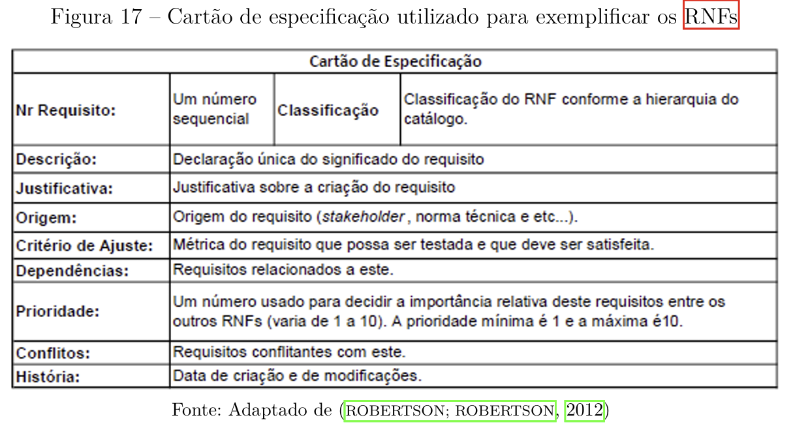

## Introdução

O NFR Framework é uma abordagem utilizada para representar e analisar os Requisitos Não-Funcionais de um projeto.
Ele tem como objetivo ajudar os desenvolvedores na implementação de soluções personalizadas, levando em consideração as características do domínio e do sistema em que está sendo analisado. Tais características incluem Requisitos Não-funcionais, Requisitos funcionais, prioridades e carga de trabalho <a id="anchor_1" href="#REF1">[1]</a>.

## Softgoal Interdependency Graph

O Softgoal Interdependency Graph é um gráfico que registra
as considerações do desenvolvedor sobre os softgoals (um objetivo que não possui uma clara
definição nem critérios de satisfação precisos) e mostra suas interdependências. Os
SIGs armazenam um registro completo das decisões de desenvolvimento além da lógica do
projeto de forma gráfica e concisa. O registro gráfico das decisões tomadas inclui Requisitos Não-funcionais bem como as suas alternativas, decisões e justificativas associadas às decisões <a id="anchor_2" href="#REF2">[2]</a>.

### Tipos de Softgoal

Como dito anteriormente, um softgoal é um objetivo que ainda não possui uma clara definição além de que os critérios de satisfação ainda não são precisos. Eles são classificados em tipos, existindo os softgoals de afirmação, de operacionalização e o NFR softgoal. Eles podem ser vistos na Figura 1.

<b>Figura 1</b> - Tipos de Softgoal

<figure markdown class="usecaseElement">

{width: 300}

</figure>

 Fonte: (SILVA, 2019)

#### Interdependências

As interdependências são definições para as associações que ocorrem entre os softgoals. Essas associações são divididas em decomposições (refinamentos) e contribuições.

##### Decomposições

Existem quatro tipos diferentes de decomposição: decomposição NFR, de Operacionalização, de Afirmação e de Priorização. Nas três primeiras decomposições, os softgoals são divididos em softgoals específicos. A Figura 2 representa esses quatro tipos de decomposição <a id="anchor_3" href="#REF3">[3]</a>.

* Decomposição NFR: Refina ou subdivide um sofgoal NFR em outros softogals específicos, é util para quebrar problemas grandes em problemas menores <a id="anchor_4" href="#REF4">[4]</a>;
* Decomposição de Operacionalização: Refinina ou subdivide um sofgoal de operacionalização em outros do mesmo tipo porém mais específicos, é útil para refinar uma solução geral em soluções mais específicas <a id="anchor_4" href="#REF4">[4]</a>;
* Decomposição de Afirmação(Claims): Refina um sofgoal de afirmação em outros de afirmação, é útil para apoiar ou negar justificavas específicas do projeto que está sendo desenvolvido <a id="anchor_4" href="#REF4">[4]</a>;
* Decomposição de Priorização: É um tipo especial de decomposição, nela ocorre o refinamento de um softgoal em outro do mesmo tipo e tópicos, porém com uma prioridade associada <a id="anchor_4" href="#REF4">[4]</a>.

<b>Figura 2</b> - Tipos de Decomposição

<figure markdown class="usecaseElement">

{width: 300}

</figure>

 Fonte: (SILVA, 2019)

#### Contribuições

Ao longo de um projeto que faz o uso do NFR Framewok, os softgoals são refinados sucessivamente, e nesses refinamentos, um softgoal descendente pode contribuir de forma total ou parcial, além de poder ser algo positivo ou negativo, para a satisfação do ascendente. Assim, cabe destacar esses tipos de contribuição <a id="anchor_5" href="#REF5">[5]</a>.

* AND: Com esse tipo de contribuição, é determinado que se os softgoals descendentes forem satisfeitos, os softgoals ascendentes também serão satisfeitos <a id="anchor_6" href="#REF6">[6]</a>;
* OR: É o oposto da contribuição AND, na OR se algum softgoal descedente for satisfeito, o ascedente também será <a id="anchor_6" href="#REF6">[6]</a>;
* MAKE(++): Fornece uma contribuição suficientemente positiva entre um sofgoal descedente e um outro softgoal ascendente que está concebido em um nível mais alto de satisfação, assim, quando a contribuição MAKE for utilizada, se o softgoal descendente for satisfeito, o softgoal pai também será <a id="anchor_6" href="#REF6">[6]</a>;
* BREAK(--): É o oposto da contribuição MAKE, na BREAK, se o softgoal descendente for suficientemente satisfeito ou softogal pai será negado/não satisfeito <a id="anchor_6" href="#REF6">[6]</a>;
* HELP(+): Fornece uma contribuição parcialmente positiva entre um softgoal descedente e seu softgoal ascendente, assim, ao utilizar a contribuição HELP, se o softgoal descedente for parcialmente satisfeito o softgoal ascendente também será parcialmente satisfeito <a id="anchor_6" href="#REF6">[6]</a>;
* HURT(-): Fornece uma contribuição parcialmente negativa entre um softgoal descendente e seu softgoal ascedente, assim, quando a contribuição HURT é utilizada, se o softgoal descendente é satisfeito, o ascendente será parcialmente negado <a id="anchor_6" href="#REF6">[6]</a>;
* UNKNOWN(?): Fornece uma contribuição desconhecida entre os softgoals, essa contribuição pode ser positiva ou negativa <a id="anchor_6" href="#REF6">[6]</a>;
* EQUALS: Essa contribuição determina que um softgoal descendente só será satisfeito se o softgoal ascendente for satisfeito, e caso o softgoal ascendente não for satisfeito, o softgoal descendente também não será satisfeito <a id="anchor_6" href="#REF6">[6]</a>;
- SOME: É utilizada quando o sinal da contribuição é conhecido, porém a sua extensão, parcial ou total, não é <a id="anchor_6" href="#REF6">[6]</a>.

#### Procedimento de Avaliação

Com o procedimento de avaliação é possível gerar o grau que os requisitos não funcionais são satis-
feitos por um conjunto de decisões. Assim, o procedimento de avaliação determina
se cada softgoal ou interdependência do SIG foi suficientemente satisfeito. Para fazer isso, são
atribuídos rótulos para os softgoals criados no projeto. Os tipos de rótulos utilizados são: satisfeito, fracamente satisfeito, negado, fracamente negado, conflitante, indeterminado <a id="anchor_7" href="#REF7">[7] </a>. 

Esses rótulos estão ilustrados na Figura 3.

<b>Figura 3</b> - Tipos de Rótulos

<figure markdown class="usecaseElement">

{width: 300}

</figure>

 Fonte: (SILVA, 2019)

## Metodologia

## Tabela de Contribuições

| Contribuinte | Descrição                                            | Links                                                                                                                 |
| ------------ | ---------------------------------------------------- | --------------------------------------------------------------------------------------------------------------------- |
| Gabriela     | Criação dos cartões de especificação CNFR01 a CNFR06 | [#CNFR01](#cnfr01) · [#CNFR02](#cnfr02) · [#CNFR03](#cnfr03) · [#CNFR04](#cnfr04) · [#CNFR05](#cnfr05) · [#CNFR06](#cnfr06) |
| Luiz     | Criação dos cartões de especificação CNFR07 a CNFR012 | [#CNFR07](#cnfr07) · [#CNFR08](#cnfr08) · [#CNFR09](#cnfr09) · [#CNFR10](#cnfr10) · [#CNFR11](#cnfr11) · [#CNFR12](#cnfr12) |
| Mateus     | Criação dos cartões de especificação CNFR20 a CNFR22 | [#CNFR20](#cnfr20) · [#CNFR21](#cnfr21) · [#CNFR22](#cnfr22) |
| Fábio     | Criação dos cartões de especificação CNFR26 a CNFR28 | [#CNFR26](#cnfr26) · [#CNFR27](#cnfr27) · [#CNFR28](#cnfr28) |
| Ana Joyce | Criação dos cartões de especificação CNFR14 a CNFR19 |  [#CNFR15](#cnfr15) · [#CNFR16](#cnfr16) . [#CNFR17](#cnfr17) . [#CNFR18](#cnfr18) . [#CNFR19](#cnfr19)|
| Davi   | Criação dos cartões de especificação CNFR23 a CNFR25 | [#CNFR23](#cnfr23) · [#CNFR24](#cnfr24) · [#CNFR25](#cnfr25) |
| Ana Clara | Criação dos cartões de especificação CNFR29 a CNFR31 | [#CNFR29](#cnfr29) · [#CNFR30](#cnfr30) · [#CNFR31](#cnfr31) |

## Lista de Requisitos 

| ID       | Descrição resumida                                                                  | Tipo de Softgoal                  |
| -------- | ----------------------------------------------------------------------------------- | --------------------------------- |
| **RF03** | Upload de arquivos até 10 MB com OCR em < 35 s                                      | Operacionalização (métrica clara) |
| **RF06** | Melhorar capacidades de “deep thinking”                                             | Afirmação (vago, sem métrica)     |
| **RF14** | Exibir citações de fontes (pág., site ou trecho)                                    | Afirmação                         |
| **RF17** | Regenerar resposta em caso de erro sem recarregar a página                          | Afirmação                         |
| **RF19** | Interromper respostas em andamento                                                  | Afirmação                         |
| **RF20** | Deve possuir uma API pública                                                  | Operacionalização                         |
| **RF21** | Autenticação via token de acesso                                                    | Afirmação                         |
| **RF22** | Confirmação para limpar o histórico                                                 | Afirmação                         |
| **RF24** | Criptografia TLS em trânsito e AES-256 em repouso                                   | Afirmação                         |
| **RF25** | Controle de compartilhamento de dados pelo usuário                                  | Afirmação                         |
| **RF26** | Autenticação multifator opcional                                                    | Afirmação                         |
| **RF27** | Modo escuro/claro com sincronização automática ao SO                                | Afirmação                         |
| **RF28** | Tutorial interativo na primeira execução                                            | Afirmação                         |
|**RF29** | Exibição de status do servidor em tempo real                                         | Afirmação                         |
| **RF30** | Melhorar retenção de contexto em diálogos longos                                    | Afirmação                         |
| **RF35** | Tooltip do título ao passar o mouse na barra lateral                                | Afirmação                         |
| **RF36** | Instruções claras de OCR na interface de envio de imagens                           | Afirmação                         |
| **RF37** | Conectar nativamente a ferramentas populares (Google Drive, Outlook, GitHub etc.) via integrações diretas |Operacionalização                         |
| **RF38** | Integração com YouTube para sumarização automática                  | Afirmação                         |
| **RN01** | Uso da arquitetura DeepSeek-V3                                                      | Afirmação                         |
| **RN02** | Versões para Android e iOS                                                          | Afirmação                         |
| **RN03** | Histórico de conversas por 30 dias (não persistente sem salvar)                     | Afirmação                         |
| **RN04** | Exclusão automática de dados de upload                                              | Afirmação                         |
| **RN05** | Interface seguindo diretrizes de usabilidade e acessibilidade                       | Afirmação                         |
| **RN06** | Mensagens de erro claras em caso de falha                                           | Afirmação                         |
| **RN07** | Suportar múltiplas requisições simultâneas sem degradação                           | Afirmação                         |
| **RN08** | Processamento de arquivos grandes (PDF/DOCX/XLSX/CSV) em ≤ 10 s e operações simples em ≤ 2 s | Operacionalização (métrica clara) |
| **RN09** | Informar claramente onde e como os dados são armazenados                            | Afirmação                         |
| **RN10** | Opt-in/out para uso de dados em re-treinamento ou venda de modelos                  | Afirmação                         |
| **RN11** | Especificar e permitir ao usuário optar por participar ou não do uso de seus dados em re-treinamento ou venda de modelos | Softgoal NRF |
| **RN12** | Estabilidade na geração de conteúdo pesado (PDF, cálculos)                          | Afirmação                         |
| **RN13** | ≥ 95 % dos usuários avaliando usabilidade como “Fácil” ou “Muito fácil”             | Operacionalização (métrica clara) |
| **RN14** | ≥ 90 % de concordância em “Interface clara e agradável”                             | Operacionalização (métrica clara) |
| **RN15** | ≤ 5 % dos usuários relatando dificuldade em encontrar opções/ferramentas            | Operacionalização (métrica clara) |

* **Softgoal de Afirmação**: enunciados qualitativos, sem critério de satisfação mensurável definido.
* **Softgoal de Operacionalização**: já vem com métricas precisas que permitem testar sua satisfação.

## Cartões de Especificação

A fim de garantir consistência e rigor na definição e no acompanhamento de requisitos não-funcionais, adotaremos o modelo de cartão de especificação proposto por Silva (2019, p. 45) indicado na Figura 4. Esse padrão organiza cada RNF em campos bem definidos, incluindo número sequencial, classificação hierárquica, descrição, justificativa, origem, critério de ajuste, dependências, prioridade, conflitos e histórico de alterações, o que facilita tanto a rastreabilidade quanto a validação dos requisitos ao longo do ciclo de desenvolvimento.

<b>Figura 4</b> - Cartão de Especificação

## #CNFR01 – Tempo de resposta OCR para arquivos até 10 MB em < 35 s  
**Autor:** [`@Gabriela`](https://github.com/gaubiela)  

| Campo                 | Detalhamento                                                                                           |
|-----------------------|--------------------------------------------------------------------------------------------------------|
| **Nr Requisito**      | CNFR01                                                                                                |
| **Classificação**     | Desempenho                                                                                             |
| **Descrição**         | O sistema deve processar e extrair texto de arquivos de até 10 MB em menos de 35 segundos.             |
| **Justificativa**     | Garante agilidade no fluxo de trabalho do usuário ao lidar com documentos de tamanho moderado.         |
| **Origem**            | [#RF03](../elicitacao/requisitos-gerais.md)                                                                     |
| **Critério de Ajuste**| Tempo de OCR por arquivo ≤ 35 s                                                                        |
| **Dependências**      | [#RN08](../elicitacao/requisitos-gerais.md)                                                              |
| **Prioridade**        | 8                                                                                                      |
| **Conflitos**         | —                                                                                                      |
| **História**          | Criado em 28/05/2025                                                                                   |

---

## #CNFR02 – Autenticação via token de acesso  
**Autor:** [`@Gabriela`](https://github.com/gaubiela)  

| Campo                 | Detalhamento                                                                                           |
|-----------------------|--------------------------------------------------------------------------------------------------------|
| **Nr Requisito**      | CNFR02                                                                                                |
| **Classificação**     | Segurança                                                                                              |
| **Descrição**         | O sistema deve permitir autenticação de clientes e APIs utilizando token de acesso.                     |
| **Justificativa**     | Aumenta segurança e interoperabilidade em integrações entre sistemas.                                  |
| **Origem**            | Requisito funcional original [#RF21](../elicitacao/requisitos-gerais.md)                                                                     |
| **Critério de Ajuste**| Validação de token válido antes de conceder acesso                                                     |
| **Dependências**      | —                                                                                                      |
| **Prioridade**        | 2                                                                                                      |
| **Conflitos**         | —                                                                                                      |
| **História**          | Criado em 28/05/2025                                                                                   |

---

## #CNFR03 – Criptografia TLS em trânsito e AES-256 em repouso  
**Autor:** [`@Gabriela`](https://github.com/gaubiela)  

| Campo                 | Detalhamento                                                                                           |
|-----------------------|--------------------------------------------------------------------------------------------------------|
| **Nr Requisito**      | CNFR03                                                                                                |
| **Classificação**     | Segurança                                                                                              |
| **Descrição**         | Todos os dados sensíveis devem trafegar via TLS e ser armazenados criptografados com AES-256.          |
| **Justificativa**     | Protege confidencialidade e integridade dos dados usuários e sistemas.                                  |
| **Origem**            | [#RF24](../elicitacao/requisitos-gerais.md)                                                                     |
| **Critério de Ajuste**| Conexões HTTPS e criptografia AES-256 confirmadas em auditoria                                        |
| **Dependências**      | —                                                                                                      |
| **Prioridade**        | 2                                                                                                      |
| **Conflitos**         | —                                                                                                      |
| **História**          | Criado em 28/05/2025                                                                                   |

---

## #CNFR04 – Processamento de arquivos grandes em ≤ 10 s e operações simples em ≤ 2 s  
**Autor:** [`@Gabriela`](https://github.com/gaubiela)  

| Campo                 | Detalhamento                                                                                           |
|-----------------------|--------------------------------------------------------------------------------------------------------|
| **Nr Requisito**      | CNFR04                                                                                                |
| **Classificação**     | Desempenho                                                                                             |
| **Descrição**         | Arquivos grandes (PDF/DOCX/XLSX/CSV) devem ser processados em até 10 s; operações simples em até 2 s.             |
| **Justificativa**     | Melhora experiência do usuário com documentos volumosos e tarefas rotineiras.                          |
| **Origem**            | [#RN08](../elicitacao/requisitos-gerais.md)                                                                                                   |
| **Critério de Ajuste**| Tempo de processamento medido em ambiente de produção                                                  |
| **Dependências**      | CNFR01                                                                                                 |
| **Prioridade**        | 8                                                                                                      |
| **Conflitos**         | —                                                                                                      |
| **História**          | Criado em 28/05/2025                                                                                   |

---

## #CNFR05 – Suporte a requisições simultâneas sem degradação  
**Autor:** [`@Gabriela`](https://github.com/gaubiela)  

| Campo                 | Detalhamento                                                                                           |
|-----------------------|--------------------------------------------------------------------------------------------------------|
| **Nr Requisito**      | CNFR05                                                                                                |
| **Classificação**     | Desempenho / Escalabilidade                                                                           |
| **Descrição**         | O sistema deve suportar múltiplas requisições simultâneas sem degradação perceptível de performance.   |
| **Justificativa**     | Fundamental para atender picos de uso e manter SLA de respostas rápidas.                              |
| **Origem**            | [#RN07](../elicitacao/requisitos-gerais.md)                                                                                                   |
| **Critério de Ajuste**| 95% de tempo de resposta permanece dentro do limite sob carga                                  |
| **Dependências**      | CNFR04                                                                                                 |
| **Prioridade**        | 8                                                                                                      |
| **Conflitos**         | —                                                                                                      |
| **História**          | Criado em 28/05/2025                                                                                   |

---

## #CNFR06 – Retenção de contexto em diálogos longos  
**Autor:** [`@Gabriela`](https://github.com/gaubiela)  

| Campo                 | Detalhamento                                                                                           |
|-----------------------|--------------------------------------------------------------------------------------------------------|
| **Nr Requisito**      | CNFR06                                                                                                |
| **Classificação**     | Qualidade de Contexto                                                                                  |
| **Descrição**         | Melhorar retenção de contexto para manter coerência em diálogos longos.                                |
| **Justificativa**     | Evita perda de informação e confusão em interações prolongadas com o assistente.                      |
| **Origem**            | [#RF30](../elicitacao/requisitos-gerais.md)                                                                                                  |
| **Critério de Ajuste**| Contexto relevante preservado em ≥ 90 % dos diálogos com > 100 mensagens                             |
| **Dependências**      | —                                                                                                      |
| **Prioridade**        | 7                                                                                                      |
| **Conflitos**         | —                                                                                                      |
| **História**          | Criado em 28/05/2025                                                                                   |

---

## #CNFR07 – Tooltip do título ao passar o mouse na barra lateral 
**Autor:** [`@Luiz`](https://github.com/luizfaria1989)  

| Campo                 | Detalhamento                                                                                           |
|-----------------------|--------------------------------------------------------------------------------------------------------|
| **Nr Requisito**      | CNFR07                                                                                                |
| **Classificação**     | Afirmação                                                                                             |
| **Descrição**         | Ao passar o cursor do mouse sobre um título de item na barra lateral de conversas, caso o item esteja truncado (parcialmente exibido devido a limitaçõoes de espaço da interface), um tooltip deve ser exibido, apresentando o texto completo daquela conversa com a IA.            |
| **Justificativa**     | Ao implementar esse requisito, a usabilidade do aplicativo e a experiência do usuário são melhoradas, especialmente para interfaces com pouco espaco e que possuem layout compacto.         |
| **Origem**            | [#RF35](../elicitacao/requisitos-gerais.md)                                                                    |
| **Critério de Ajuste**| O usuário deve ser capaz de observar um tooltip ao passar o mouse por cima de um título que não está totalmente visível no menu de conversas. Essa tooltip deve exibir o título completo daquela conversa, além disso, ela deve desaparecer assim que o usuário retira o cursor daquele título. Por fim, a tooltip não deve aparecer caso o título não esteja cortado pelo menu.                                                                       |
| **Dependências**      | [#RN05](../elicitacao/requisitos-gerais.md)                                                             |
| **Prioridade**        | 5                                                                                                      |
| **Conflitos**         | -                                                                                                      |
| **História**          | Criado em 31/05/2025                                                                                   |

---

## #CNFR08 – Exclusão automática de dados de upload
**Autor:** [`@Luiz`](https://github.com/luizfaria1989)  

| Campo                 | Detalhamento                                                                                           |
|-----------------------|--------------------------------------------------------------------------------------------------------|
| **Nr Requisito**      | CNFR08                                                                                               |
| **Classificação**     | Afirmação                                                                                             |
| **Descrição**         | O sistema deve excluir automaticamente os dados de upload que estão armazenados nos servidores do aplicativo imediatamente após a conclusão do processamento dos dados e envio da resposta da IA para o usuário.            |
| **Justificativa**     | Garante maior privacidade e controle dos dados que estão serdo compartilhados. Evita que os dados compartilhados sejam utilizandos futuramente para treinar o modelo sem permissão do usuário.         |
| **Origem**            | [#RN04](../elicitacao/requisitos-gerais.md)                                                                    |
| **Critério de Ajuste**| Após finalizar uma resposta, os dados enviados pelo usuário para a IA não devem mais estar acessíveis através de nenhuma interface do sistema. Além disso, os Logs do servidor devem registrar o evento de exclusão automática de dados enviados pelo usuário.                                                                       |
| **Dependências**      | [#RN09](../elicitacao/requisitos-gerais.md)                                                             |
| **Prioridade**        | 6                                                                                                      |
| **Conflitos**         | -                                                                                                       |
| **História**          | Criado em 31/05/2025                                                                                   |

--- 

## #CNFR09 – Versãoes para Android e IOS
**Autor:** [`@Luiz`](https://github.com/luizfaria1989)  

| Campo                 | Detalhamento                                                                                           |
|-----------------------|--------------------------------------------------------------------------------------------------------|
| **Nr Requisito**      | CNFR09                                                                                               |
| **Classificação**     | Afirmação                                                                                             |
| **Descrição**         | O sistema deve possuir versões para os dois principais sistemas operacionais de smartphones: Android e IOS.            |
| **Justificativa**     | Ao possuir versões para esses dois sistemas operacionais, o número de usuários que poderão baixar e utilizar o aplicativo será maximizado.         |
| **Origem**            | [#RN02](../elicitacao/requisitos-gerais.md)                                                                    |
| **Critério de Ajuste**| O sistema deve estar disponível para versões 5.0 (ou superior) do Android ou IOS 15 (ou superior).                                                                       |
| **Dependências**      | [#RN05](../elicitacao/requisitos-gerais.md)                                                             |
| **Prioridade**        | 10                                                                                                      |
| **Conflitos**         | -                                                                                                      |
| **História**          | Criado em 31/05/2025                                                                                   |

---

## #CNFR10 – Informar claramente onde e como os dados estão sendo armazenados
**Autor:** [`@Luiz`](https://github.com/luizfaria1989)  

| Campo                 | Detalhamento                                                                                           |
|-----------------------|--------------------------------------------------------------------------------------------------------|
| **Nr Requisito**      | CNFR10                                                                                               |
| **Classificação**     | Afirmação                                                                                            |
| **Descrição**         |  O sistema deve informar para o usuário onde (em quais servidores) e como os seus dados estão sendo armazenados ao utilizar o aplicaitvo           |
| **Justificativa**     |  Ao apresentar essas informações para o usuário, ele pode ter um maior controle de que dados serão compartilhados ao criar uma conta e utilzar os serviços da IA.        |
| **Origem**            | [#RN09](../elicitacao/requisitos-gerais.md)                                                                    |
| **Critério de Ajuste**| Ao acessar a aba configurações do aplicativo, na seção Controle de Dados, será possível visualizar pelo usuário, as informações sobre como e onde os seus dados estão sendo armazenados.                                                                      |
| **Dependências**      | [#RN04, #RN03, #RF24, #RN10](../elicitacao/requisitos-gerais.md)                                                              |
| **Prioridade**        | 4                                                                                                      |
| **Conflitos**         | -                                                                                                      |
| **História**          | Criado em 31/05/2025                                                                                   |

---

## #CNFR11 – Histórico de conversas por 30 dias
**Autor:** [`@Luiz`](https://github.com/luizfaria1989)  

| Campo                 | Detalhamento                                                                                           |
|-----------------------|--------------------------------------------------------------------------------------------------------|
| **Nr Requisito**      | CNFR11                                                                                               |
| **Classificação**     | Afirmação                                                                                             |
| **Descrição**         |  O sistema deve manter o histórico de conversas do usuário por 30 dias. Essa informação deve ser válida para usuários que não possuem uma conta no aplicaitvo, mas ainda sim, utilizam os serviços dele.           |
| **Justificativa**     |  Ao ter essa funcionalidade, o usuário não se sente obrigado a criar uma conta no aplicativo para poder acessar uma funcionalidade básica. Assim, o usuário teria maior liberdade de escolha se quer criar uma conta ou não.        |
| **Origem**            | [#RN03](../elicitacao/requisitos-gerais.md)                                                                    |
| **Critério de Ajuste**| Um usuário que não possui uma conta deve ser capaz de iniciar uma conversa, e, ao fechar e abrir novamente o aplicativo, deve ser possível acessar seu histórico de conversas. Para garantir a validade do histórico esse teste pode ser repetido diariamnete a fim de verificar a validade do histórico de 30 dias. Assim, uma conversa iniciada no dia 1 de maio às 13:00 horas deverá estar disponível até o dia 31 daquele mês até às 12:59 horas.                                                                     |
| **Dependências**      | [#RN09](../elicitacao/requisitos-gerais.md)                                                             |
| **Prioridade**        | 5                                                                                                      |
| **Conflitos**         | -                                                                                                       |
| **História**          | Criado em 31/05/2025                                                                                   |

---

## #CNFR12 – Uso da arquitetura DeepSeek-V3
**Autor:** [`@Luiz`](https://github.com/luizfaria1989)  

| Campo                 | Detalhamento                                                                                           |
|-----------------------|--------------------------------------------------------------------------------------------------------|
| **Nr Requisito**      | CNFR12                                                                                               |
| **Classificação**     | Afirmação                                                                                             |
| **Descrição**         | O aplicativo deve utilizar a arquitetura mais recente desenvolvida pela equipe chamada DeepSeek-V3.            |
| **Justificativa**     | Ao utilizar a arquitetura mais recente do DeepSeek, o aplicativo irá fornecer maior performace e confiabilidade nas respostas fornecidas ao usuário.         |
| **Origem**            | [#RN01](../elicitacao/requisitos-gerais.md)                                                                    |
| **Critério de Ajuste**| Análise da documentação do aplicativo e do código fonte que comprovem o uso dessa arquitetura. Além disso, sendo viável, a aplicação de testes no modelo que comprovem essa maior performace e confiabilidade sobre os modelos antigos do DeepSeek                                                                      |
| **Dependências**      | -                                                              |
| **Prioridade**        | 10                                                                                                     |
| **Conflitos**         | -                                                                                                       |
| **História**          | Criado em 31/05/2025                                                                                   |

---

## #CNFR15 – Especificar e permitir ao usuário optar por participar ou não do uso de seus dados em re-treinamento ou venda de modelos

**Autor:** [`@Ana Joyce`](https://github.com/anajoyceamorim) 

| Campo                  | Detalhamento    |
| ---------------------- | ------------------------------------------------------------------ |
| **Nr Requisito**       | CNFR15      |
| **Classificação**      | Legal e Ético    |
| **Descrição**          | O sistema deve permitir que o usuário aceite ou recuse o uso de seus dados em re-treinamento ou venda de modelos. |
| **Justificativa**      | Garante transparência e conformidade com LGPD e princípios éticos.    |
| **Origem**             | [#RN10](../elicitacao/requisitos-gerais.md)        |
| **Critério de Ajuste** | Presença de controle de consentimento visível e funcional       |
| **Dependências**       | [#RF04 (login de usuários)](../elicitacao/requisitos-gerais.md)          |
| **Prioridade**         | 10         |
| **Conflitos**          | —      |
| **História**           | Criado em 01/06/202     |

---

## #CNFR16 – Garantir estabilidade na geração de conteúdos pesados (PDF, cálculos), evitando erros de formatação ou falhas

**Autor:** [`@Ana Joyce`](https://github.com/anajoyceamorim) 

| Campo                  | Detalhamento                                                                                                     |
| ---------------------- | ---------------------------------------------------------------------------------------------------------------- |
| **Nr Requisito**       | CNFR16                                                                                                           |
| **Classificação**      | Desempenho e Confiabilidade                                                                                      |
| **Descrição**          | O sistema deve gerar arquivos pesados (PDFs, cálculos) de forma estável, evitando falhas ou erros de formatação. |
| **Justificativa**      | Evita perdas de tempo e frustrações com conteúdo corrompido ou ilegível.                                         |
| **Origem**             | [#RN12](../elicitacao/requisitos-gerais.md)                                                                                                            |
| **Critério de Ajuste** | Taxa de falhas em geração de documentos ≤ 2%                                                                     |
| **Dependências**       | —                                                                                                                |
| **Prioridade**         | 8                                                                                                                |
| **Conflitos**          | —                                                                                                                |
| **História**           | Criado em 01/06/2025                                                                                             |

---

## #CNFR17 – Atingir ≥ 95 % de usuários avaliando a usabilidade como “Fácil” ou “Muito fácil” em pesquisas futuras

**Autor:** [`@Ana Joyce`](https://github.com/anajoyceamorim) 

| Campo                  | Detalhamento                                                                                           |
| ---------------------- | ------------------------------------------------------------------------------------------------------ |
| **Nr Requisito**       | CNFR17                                                                                                 |
| **Classificação**      | Qualidade de Uso                                                                                       |
| **Descrição**          | Alcançar ≥ 95% de usuários avaliando a usabilidade como “Fácil” ou “Muito fácil” em pesquisas futuras. |
| **Justificativa**      | Indica alta aceitação e facilidade de uso do sistema.                                                  |
| **Origem**             | [#RN13](../elicitacao/requisitos-gerais.md)                                                                                                  |
| **Critério de Ajuste** | Resultado de pesquisa ≥ 95% nas opções “Fácil” ou “Muito fácil”                                        |
| **Dependências**       | #CNFR01                                                                                                |
| **Prioridade**         | 7                                                                                                      |
| **Conflitos**          | —                                                                                                      |
| **História**           | Criado em 01/06/2025                                                                                   |

---

## #CNFR18 – Alcançar ≥ 90 % de concordância em “Interface clara e agradável” em pesquisas futuras

**Autor:** [`@Ana Joyce`](https://github.com/anajoyceamorim) 

| Campo                  | Detalhamento                                                                          |
| ---------------------- | ------------------------------------------------------------------------------------- |
| **Nr Requisito**       | CNFR18                                                                                |
| **Classificação**      | Qualidade da Interface                                                                |
| **Descrição**          | Alcançar ≥ 90% de concordância em “Interface clara e agradável” em pesquisas futuras. |
| **Justificativa**      | Reflete uma boa experiência visual e navegação intuitiva.                             |
| **Origem**             | [#RN14](../elicitacao/requisitos-gerais.md)                                                                                 |
| **Critério de Ajuste** | Resultado de pesquisa ≥ 90% nas opções “Clara” ou “Muito clara”                       |
| **Dependências**       | #CNFR01                                                                               |
| **Prioridade**         | 6                                                                                     |
| **Conflitos**          | —                                                                                     |
| **História**           | Criado em 01/06/2025                                                                  |

---

## #CNFR19 – Reduzir para ≤ 5 % os usuários que relatam dificuldade em encontrar opções/ferramentas em pesquisas futuras

**Autor:** [`@Ana Joyce`](https://github.com/anajoyceamorim) 

| Campo                  | Detalhamento                                                                                                |
| ---------------------- | ----------------------------------------------------------------------------------------------------------- |
| **Nr Requisito**       | CNFR19                                                                                                      |
| **Classificação**      | Usabilidade                                                                                                 |
| **Descrição**          | Reduzir para ≤ 5% os usuários que relatam dificuldade em encontrar opções/ferramentas em pesquisas futuras. |
| **Justificativa**      | Demonstra clareza na disposição das funcionalidades no sistema.                                             |
| **Origem**             | [#RN15](../elicitacao/requisitos-gerais.md)                                                                                                       |
| **Critério de Ajuste** | Resultado de pesquisa: ≤ 5% relatando dificuldade                                                           |
| **Dependências**       | #CNFR01, #CNFR05                                                                                            |
| **Prioridade**         | 6                                                                                                           |
| **Conflitos**          | —                                                                                                           |
| **História**           | Criado em 01/06/2025                                                                                        |

---

## #CNFR20 – Interoperabilidade com YouTube para sumarização automática  
**Autor:** [`@Mateus`](https://github.com/MVConsorte)  

| Campo                 | Detalhamento                                                                                                                                                                                                                                                                      |
|-----------------------|-----------------------------------------------------------------------------------------------------------------------------------------------------------------------------------------------------------------------------------------------------------------------------------|
| **Nr Requisito**      | CNFR20                                                                                                                                                                                                                                                                           |
| **Classificação**     | Interoperabilidade / softgoal de afirmação                                                                                                                                                                                                |
| **Descrição**         | O sistema deve garantir integração adequada e estável com a API do YouTube ou serviços equivalentes, suportando extração de metadados, transcrições (quando disponíveis) e conteúdo de vídeos compartilhados por link, independentemente do idioma, formato ou duração. Deve tolerar indisponibilidades temporárias, limites de API e variações nos formatos de vídeo, fornecendo mensagens de erro claras e informativas ao usuário em caso de falha, vídeo removido, restrito, privado ou link inválido.                                                                             |
| **Justificativa**     | Assegura que a funcionalidade de resumo automático de vídeos seja confiável, escalável e transparente ao usuário, mesmo diante de limitações técnicas do YouTube ou problemas de conectividade, reforçando a confiança do usuário e a qualidade do serviço prestado.    |
| **Origem**            | [#RF38](../elicitacao/requisitos-gerais.md), #RQF23, UC14                                                                                                                                                                                                                                                              |
| **Critério de Ajuste**| - Permitir o resumo de vídeos em diferentes idiomas e formatos via link direto.  - Realizar detecção apropriada de links inválidos, vídeos removidos, indisponíveis ou privados, retornando mensagem compreensível.  - Lidar com erros de integração (limite de requisições, falhas de autenticação, ausência de transcrição, etc.) fornecendo orientações claras.  - Garantir performance estável e feedback de progresso quando processamento for demorado, incluindo sugestões de refinamento quando o resumo não for satisfatório.  - Registrar erros para análise futura de falhas recorrentes. |
| **Dependências**      | - **API YouTube:** Necessária para acesso aos dados de vídeo, metadados e possíveis transcrições.  - **Componentes de NLP (Processamento de Linguagem Natural) e ASR (Reconhecimento Automático de Fala):** Indispensáveis para converter áudio em texto e gerar resumos.  - **#RF30 (Processamento multimídia):** Processo intermediário para extração/análise. - **#RF14 e #RF21 (interface e apresentação de resultados):** Exibição ao usuário do sumário e informações relativas ao vídeo. - **#RN06, #RN07, #RN03, #RN04:** Regras de tratamento de erros, conformidade com limites operacionais e robustez. - **#RN09, #RN10:** Regras para armazenamento de dados e privacidade. - **#RF24, #RF26, #RF25:** Segurança, controle de acesso e política de compartilhamento de dados obtidos/resumidos. |
| **Prioridade**        | 10 – Extremamente alta, pois a capacidade de sumarizar vídeos do YouTube é central ao valor agregado do sistema e, caso indisponível, impacta diretamente no propósito principal da solução para usuários. Por depender de terceiros (YouTube/API), a robustez e tolerância a falhas tornam-se vitais desde a etapa inicial do projeto.                                                                                   |
| **Conflitos**         | - **#RN05 (usabilidade):** Mensagens de erro completas ou processos de fallback podem gerar sobrecarga de informações ou tornar a experiência mais lenta se não forem bem planejadas.  - Dependência de terceiros (YouTube) pode causar atrasos, falhas ou limitações de uso que afetam negativamente a jornada do usuário se não houver boa comunicação dos estados na interface.           |
| **História**          | Criado em 31/05/2025                                                                                                                                                                                                                                                             |

---

## #CNFR21 – Instruções claras e contextualizadas sobre OCR  
**Autor:** [`@Mateus`](https://github.com/MVConsorte)  

| Campo                 | Detalhamento                                                                                                                                                                                                                                                                             |
|-----------------------|------------------------------------------------------------------------------------------------------------------------------------------------------------------------------------------------------------------------------------------------------------------------------------------|
| **Nr Requisito**      | CNFR21                                                                                                                                                                                                                                                                                  |
| **Classificação**     | Orientação / softgoal de afirmação                                                                                                                                                                                                               |
| **Descrição**         | O sistema deve apresentar, na interface de envio de imagens, instruções claras e contextuais sobre OCR, explicando significado da sigla, limitações técnicas e exemplos de uso prático ao usuário final.                                          |
| **Justificativa**     | Facilita o correto uso da funcionalidade, reduz dúvidas e frustrações, aumentando a satisfação do usuário e a eficiência do processo de extração de texto por OCR, especialmente para novos usuários.                                             |
| **Origem**            | [#RF36](../elicitacao/requisitos-gerais.md), #RQF20                                                                                                                                                                                                                                    |
| **Critério de Ajuste**| As instruções devem ser exibidas toda vez que o usuário acessar a funcionalidade de OCR. Devem estar em linguagem simples e incluir exemplos de imagens adequadas e inadequadas para OCR.                                                         |
| **Dependências**      | - **RF36**: Implementação funcional do OCR. - **RN05**: Diretrizes de usabilidade para apresentação clara. - **RN15**: Garantia de facilidade para o usuário encontrar instruções/opções. - **RN13/RN14**: Avaliações de satisfação/interação.    |
| **Prioridade**        | 4 – Relevante para onboarding e qualidade da experiência, mas não bloqueante para operações básicas.                                                                                                       |
| **Conflitos**         | - Pode conflitar com **RN05** (usabilidade) ou **RN15** (facilidade de navegação) caso as instruções sejam extensas ou poluam a interface. - Excesso de informações pode reduzir objetividade do fluxo.                                         |
| **História**          | Criado em 31/05/2025                                                                                                                                                                                      |

---

## #CNFR22 – Exibição de fontes, páginas e referências em respostas  
**Autor:** [`@Mateus`](https://github.com/MVConsorte)  

| Campo                 | Detalhamento                                                                                                                                                                                                                           |
|-----------------------|----------------------------------------------------------------------------------------------------------------------------------------------------------------------------------------------------------------------------------------|
| **Nr Requisito**      | CNFR22                                                                                                                                                                                                                                |
| **Classificação**     | Transparência / softgoal de afirmação                                                                                                                                                                                                 |
| **Descrição**         | O sistema deve exibir citações de fontes e referências em respostas baseadas em documentos, indicando de forma clara página, site e/ou trecho extraído, ou fornecendo link direto para consulta quando aplicável.                     |
| **Justificativa**     | A transparência sobre as fontes utilizadas nas respostas aumenta a confiança do usuário no conteúdo exibido, facilita a verificação e promove maior fidelidade à origem da informação apresentada pelo sistema.                         |
| **Origem**            | [#RF14](../elicitacao/requisitos-gerais.md), #RQF22                                                                                                                                                                                   |
| **Critério de Ajuste**| Quando a resposta for proveniente de consulta a documento ou web, o usuário deve visualizar, ao final da resposta, as referências completas — incluindo link, número da página ou trecho relevante, quando disponível.                 |
| **Dependências**      | - **RF14**: Funcionalidade para exibir citações de fontes. - **RN09/RN10**: Informar e permitir ajuste sobre armazenamento e uso de dados extraídos. - **RN13/RN14**: Avaliações de confiança/percepção do usuário. - **RF25**: Controle sobre compartilhamento de dados.  |
| **Prioridade**        | 4 – Essencial para confiança e auditoria, mas pode ser implementado após funcionalidades básicas de resposta.                                                                                   |
| **Conflitos**         | - Pode conflitar com **RN05** e **RN15** se a exibição de fontes for excessivamente técnica ou poluir a interface. - Risco de exposição indevida de dados caso não haja integração com requisitos de segurança (RF24, RF26).        |
| **História**          | Criado em 31/05/2025                                                                                                                                                                            |

---

## #CNFR23 – Interface com usabilidade e acessibilidade adequadas  
**Autor:** [`@Davi Emanuel`](https://github.com/daviRolvr)  

| Campo                 | Detalhamento                                                                                                                                         |
|-----------------------|------------------------------------------------------------------------------------------------------------------------------------------------------|
| **Nr Requisito**      | CNFR05                                                                                                                                              |
| **Classificação**     | Usabilidade                                                                                                                                         |
| **Descrição**         | A interface deve seguir diretrizes de usabilidade (botões visíveis, texto legível, feedback imediato) e de acessibilidade (alteração no tamanho da fonte, leitura por leitores de tela). |
| **Justificativa**     | Garante inclusão digital e melhora a experiência de todos os usuários.                                                                             |
| **Origem**            | [#RN05](../elicitacao/requisitos-gerais.md)                                                                                                                                              |
| **Critério de Ajuste**| Atende às recomendações WCAG 2.1 e heurísticas de usabilidade de Nielsen.                                                                |
| **Dependências**      | [#RF08 (interface de criação de chats)](../elicitacao/requisitos-gerais.md)                                                                                                                                               |
| **Prioridade**        | 9                                                                                                                                                   |
| **Conflitos**         | —                                                                                                                                                   |
| **História**          | Criado em 01/06/2025                                                                                                                                |

## #CNFR24 – Retorno de mensagens de erro claras em falhas  
**Autor:** [`@Davi Emanuel`](https://github.com/daviRolvr)  

| Campo                 | Detalhamento                                                                                                   |
|-----------------------|----------------------------------------------------------------------------------------------------------------|
| **Nr Requisito**      | CNFR24                                                                                                        |
| **Classificação**     | Confiabilidade                                                                                                 |
| **Descrição**         | Em caso de falha, o sistema deve exibir mensagens de erro claras e compreensíveis para o usuário.              |
| **Justificativa**     | Ajuda na resolução rápida de problemas e reduz frustração do usuário.                                          |
| **Origem**            | [#RN06](../elicitacao/requisitos-gerais.md)                                                                                                          |
| **Critério de Ajuste**| Avaliação de clareza por usuários e testes com mensagens em cenários de erro.                                 |
| **Dependências**      | [RF01](../elicitacao/requisitos-gerais.md)                                                                                                          |
| **Prioridade**        | 8                                                                                                             |
| **Conflitos**         | —                                                                                                               |
| **História**          | Criado em 01/06/2025                                                                                            |

## #CNFR25 – Exibição de status do servidor em tempo real  
**Autor:** [`@Davi Emnauel`](https://github.com/daviRolvr)  

| Campo                 | Detalhamento                                                                                                   |
|-----------------------|----------------------------------------------------------------------------------------------------------------|
| **Nr Requisito**      | CNFR25                                                                                                         |
| **Classificação**     | Confiabilidade / Disponibilidade                                                                               |
| **Descrição**         | O sistema deve exibir o status do servidor em tempo real (Online, Manutenção, Sobrecarga).                    |
| **Justificativa**     | Permite ao usuário entender o funcionamento do sistema e se antecipar a problemas.                            |
| **Origem**            | [#RF29](../elicitacao/requisitos-gerais.md)                                                                                                        |
| **Critério de Ajuste**| Testes com simulações de diferentes estados do servidor.                                                       |
| **Dependências**      |  —                                                                                                         |
| **Prioridade**        | 8                                                                                                               |
| **Conflitos**         | —                                                                                                               |
| **História**          | Criado em 01/06/2025                                                                                            |

## #CNFR26 – Regeneração de resposta sem recarregamento da página 

**Autor:** [`@Fábio`](https://github.com/fabinsz)  

| Campo                 | Detalhamento                                                                                           |
|-----------------------|--------------------------------------------------------------------------------------------------------|
| **Nr Requisito**      | CNFR26                                                                                                |
| **Classificação**     | Usabilidade / Desempenho                                                                         |
| **Descrição**         | O sistema deve permitir regenerar uma resposta em caso de erro sem recarregar a página.  |
| **Justificativa**     | Evita perda de contexto e melhora a experiência do usuário ao lidar com falhas temporárias.                             |
| **Origem**            | [#RF17](../elicitacao/requisitos-gerais.md)                                                                                                   |
| **Critério de Ajuste**| Regeneração de resposta executada sem reload da interface                                 |
| **Dependências**      | —                                                                                              |
| **Prioridade**        | 6                                                                                                      |
| **Conflitos**         | —                                                                                                      |
| **História**          | Criado em 30/05/2025                                                                                  |

---

## #CNFR27 – Interrupção imediata de respostas em andamento

**Autor:** [`@Fábio`](https://github.com/fabinsz)  

| Campo                 | Detalhamento                                                                                           |
|-----------------------|--------------------------------------------------------------------------------------------------------|
| **Nr Requisito**      | CNFR27                                                                                                |
| **Classificação**     | Usabilidade                                                                          |
| **Descrição**         | O sistema deve permitir ao usuário interromper imediatamente uma resposta em andamento.  |
| **Justificativa**     | 	Oferece controle ao usuário sobre a interação, evitando espera desnecessária por respostas indesejadas ou incorretas.                           |
| **Origem**            | [#RF19](../elicitacao/requisitos-gerais.md)                                                                                                   |
| **Critério de Ajuste**| Tempo de interrupção ≤ 1 segundo após ação do usuário                                |
| **Dependências**      | —                                                                                              |
| **Prioridade**        | 3                                                                                                      |
| **Conflitos**         | —                                                                                                      |
| **História**          | Criado em 30/05/2025                                                                                  |

---

## #CNFR28 – Confirmação antes de limpar o histórico

**Autor:** [`@Fábio`](https://github.com/fabinsz)  

| Campo                 | Detalhamento                                                                                           |
|-----------------------|--------------------------------------------------------------------------------------------------------|
| **Nr Requisito**      | CNFR28                                                                                                |
| **Classificação**     | Usabilidade                                                                          |
| **Descrição**         | O sistema deve solicitar confirmação do usuário antes de executar a ação de limpar o histórico de conversas.  |
| **Justificativa**     | 		Evita a exclusão acidental de informações importantes, promovendo segurança nas ações do usuário.                           |
| **Origem**            | [#RF22](../elicitacao/requisitos-gerais.md)                                                                                                   |
| **Critério de Ajuste**| Exibição obrigatória de diálogo de confirmação com opção de cancelar                                |
| **Dependências**      | —                                                                                              |
| **Prioridade**        | 8                                                                                                      |
| **Conflitos**         | —                                                                                                      |
| **História**          | Criado em 30/05/2025                                                                                  |

---

## #CNFR29 – Especificação e permisão ao usuário optar por participar ou não do uso de seus dados em re-treinamento ou venda de modelos

**Autor:** [`Ana Clara`](https://github.com/anabborges)  

| Campo                 | Detalhamento                                                                                           |
|-----------------------|--------------------------------------------------------------------------------------------------------|
| **Nr Requisito**      | CNFR29                                                                                               |
| **Classificação**     | Segurança                                                                          |
| **Descrição**         | Especificar e permitir ao usuário optar por participar ou não do uso de seus dados em re-treinamento ou venda de modelos.  |
| **Justificativa**     | 		Garantir transparência e conformidade com normas de privacidade, como LGPD e GDPR, além de respeitar a autonomia do usuário sobre seus dados.                           |
| **Origem**            | [#RN11](../elicitacao/requisitos-gerais.md)                                                                                                 |
| **Critério de Ajuste**| O sistema deve exibir uma solicitação clara de consentimento para uso dos dados, com opção de aceitar ou recusar.                                |
| **Dependências**      | [#RF24, #RN10](../elicitacao/requisitos-gerais.md)                                                                                          |
| **Prioridade**        | 10                                                                                                      |
| **Conflitos**         | —                                                                                                      |
| **História**          | Criado em 31/05/2025                                                                                  |

## #CNFR30 – Conexão nativa a ferramentas populares (Google Drive, Outlook, GitHub etc.) via integrações diretas

**Autor:** [`Ana Clara`](https://github.com/anabborges)  

| Campo                 | Detalhamento                                                                                           |
|-----------------------|--------------------------------------------------------------------------------------------------------|
| **Nr Requisito**      | CNFR30                                                                                            |
| **Classificação**     | Interoperabilidade                                                                           |
| **Descrição**         | Conectar nativamente a ferramentas populares (Google Drive, Outlook, GitHub etc.) via integrações diretas.  |
| **Justificativa**     | 		Melhorar a experiência do usuário e ampliar a utilidade do sistema por meio da interoperabilidade com plataformas amplamente utilizadas.                           |
| **Origem**            | [#RF37](../elicitacao/requisitos-gerais.md)                                                                                                 |
| **Critério de Ajuste**| O sistema deve permitir autenticação e troca de dados com ferramentas populares, de forma estável e segura.                                |
| **Dependências**      | -                                                                                      |
| **Prioridade**        | 6                                                                                                    |
| **Conflitos**         | Possíveis mudanças nas políticas de terceiros (ex: Google API updates)                                                                                                     |
| **História**          | Criado em 31/05/2025                                                                                  |

## #CNFR31 – Uso a partir de API Pública

**Autor:** [`Ana Clara`](https://github.com/anabborges)  

| Campo                 | Detalhamento                                                                                           |
|-----------------------|--------------------------------------------------------------------------------------------------------|
| **Nr Requisito**      | CNFR31                                                                                              |
| **Classificação**     | Usabilidade                                                                           |
| **Descrição**         | Deve possuir uma API pública.  |
| **Justificativa**     | 	Permitir que desenvolvedores externos criem extensões, automações e integrações, aumentando o alcance e flexibilidade do sistema.                           |
| **Origem**            | [#RF20](../elicitacao/requisitos-gerais.md)                                                                                                 |
| **Critério de Ajuste**| Disponibilizar uma documentação pública e funcional para a API com autenticação segura e endpoints principais acessíveis.                                |
| **Dependências**      | [#RF21](../elicitacao/requisitos-gerais.md)                                                                                      |
| **Prioridade**        | 10                                                                                                   |
| **Conflitos**         | —                                                                                                 |
| **História**          | Criado em 31/05/2025   

## Referência Bibliográfica

> <a id="REF1" href="#anchor_1">1.</a> SILVA, Reinaldo Antônio. NFR4ES: Um Catálogo de Requisitos Não-Funcionais para Sistemas Embarcados. Centro de Informática UFPE, Recife, p. 30, 2019. Disponível em: https://repositorio.ufpe.br/handle/123456789/34150. Acesso em: 23/05/2025. [`Foto da referência`](../images/nfr-framework/definicao-nfr-framework.png)

> <a id="REF2" href="#anchor_2">2.</a> SILVA, Reinaldo Antônio. NFR4ES: Um Catálogo de Requisitos Não-Funcionais para Sistemas Embarcados. Centro de Informática UFPE, Recife, p. 30-31, 2019. Disponível em: https://repositorio.ufpe.br/handle/123456789/34150. Acesso em: 23/05/2025. [`Foto da referência`](../images/nfr-framework/definicao-sig.png)

> <a id="REF3" href="#anchor_3">3.</a> SILVA, Reinaldo Antônio. NFR4ES: Um Catálogo de Requisitos Não-Funcionais para Sistemas Embarcados. Centro de Informática UFPE, Recife, p. 32, 2019. Disponível em: https://repositorio.ufpe.br/handle/123456789/34150. Acesso em: 23/05/2025. [`Foto da referência`](../images/nfr-framework/decomposicoes.png)

> <a id="REF4" href="#anchor_4">4.</a> SILVA, Reinaldo Antônio. NFR4ES: Um Catálogo de Requisitos Não-Funcionais para Sistemas Embarcados. Centro de Informática UFPE, Recife, p. 32-33, 2019. Disponível em: https://repositorio.ufpe.br/handle/123456789/34150. Acesso em: 23/05/2025. [`Foto da referência`](../images/nfr-framework/tipos-de-decomposicao.png)

> <a id="REF5" href="#anchor_5">5.</a> SILVA, Reinaldo Antônio. NFR4ES: Um Catálogo de Requisitos Não-Funcionais para Sistemas Embarcados. Centro de Informática UFPE, Recife, p. 33, 2019. Disponível em: https://repositorio.ufpe.br/handle/123456789/34150. Acesso em: 23/05/2025. [`Foto da referência`](../images/nfr-framework/contribuicoes.png)

> <a id="REF6" href="#anchor_6">6.</a> SILVA, Reinaldo Antônio. NFR4ES: Um Catálogo de Requisitos Não-Funcionais para Sistemas Embarcados. Centro de Informática UFPE, Recife, p. 33-34, 2019. Disponível em: https://repositorio.ufpe.br/handle/123456789/34150. Acesso em: 23/05/2025. [`Foto da referência`](../images/nfr-framework/tipos-de-contribuicao.png)

> <a id="REF7" href="#anchor_7">7.</a> SILVA, Reinaldo Antônio. NFR4ES: Um Catálogo de Requisitos Não-Funcionais para Sistemas Embarcados. Centro de Informática UFPE, Recife, p. 33-34, 2019. Disponível em: https://repositorio.ufpe.br/handle/123456789/34150. Acesso em: 23/05/2025. [`Foto da referência`](../images/nfr-framework/procedimento-de-avaliacao.png)

## Histórico de Versões

 Data       | Versão | Descrição                                 | Autor                                      | Revisor                                     |
| :--------: | :----: | :---------------------------------------- | :----------------------------------------: | :----------------------------------------: |
| 22/05/2025 |  1.0   | (#NFR01) Criação do documento NFR Framework.| [`@Luiz`](https://github.com/luizfaria1989)   | [@Mateus](https://github.com/MVConsorte)  |
| 23/05/2025 |  1.1  | (#NFR01) Adição da introdução e do texto explicando o NFR Framework.| [`@Luiz`](https://github.com/luizfaria1989)   | [@Mateus](https://github.com/MVConsorte)  |
| 27/05/2025 |  1.2  | (#NFR01) Identifica requisitos alvo para NFR Framework.| [`@Gabriela`](https://github.com/gaubiela)   | --  |
| 28/05/2025 |  1.3  | (#NFR01) Criação de cards 01 a 06 e definição do padrão para os cards.| [`@Gabriela`](https://github.com/gaubiela)   | [`@Luiz`](https://github.com/luizfaria1989)  |
| 30/05/2025 |  1.4  | (#NFR01) Criação de cards 26 a 28 | [`@Fábio`](https://github.com/fabinsz)   | [`@Luiz`](https://github.com/luizfaria1989)  |
| 31/05/2025 |  1.5  | (#NFR01) Criação de cards 07 a 12 | [`@Luiz`](https://github.com/luizfaria1989)   | [`@Mateus`](https://github.com/MVConsorte)  |
| 31/05/2025 |  1.6  | (#NFR01) Criação de cards 20 a 22 e modificação na lista de requistos (remoção do #RF18 e adição do #RF38) | [`@Mateus`](https://github.com/MVConsorte)   | [`@Luiz`](https://github.com/luizfaria1989)  |
| 01/06/2025 |  1.7  | (#NFR01) Criação de cards 14 a 19 | [`@Ana Joyce`](https://github.com/anajoyceamorim)   | [`@Luiz`](https://github.com/luizfaria1989)  |
| 01/06/2025 |  1.8  | (#NFR01) Criação de cards 23 a 25 | [`@Davi Emanuel`](https://github.com/daviRolvr)   | [`@Luiz`](https://github.com/luizfaria1989)  |
| 01/06/2025 |  1.9  | (#NFR01) Criação de cards 29 a 31 | [`@Ana Clara`](https://github.com/anabborges)   | [`@Luiz`](https://github.com/luizfaria1989)  |
| 05/06/2025 |  2.0  | (#NFR01) Adição dos ids dos cartões de especifição | [`Luiz`](https://github.com/luizfaria1989)   | [`@Fabio`](https://github.com/fabinsz)  |
| 19/06/2025 |  2.1   | (#NFR01) Adição dos hiperlinks para a tabela de requisitos gerais elicitados.| [`@Luiz`](https://github.com/luizfaria1989)   |   |