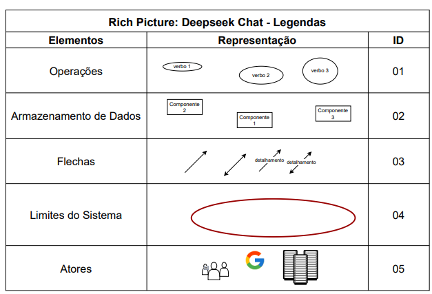
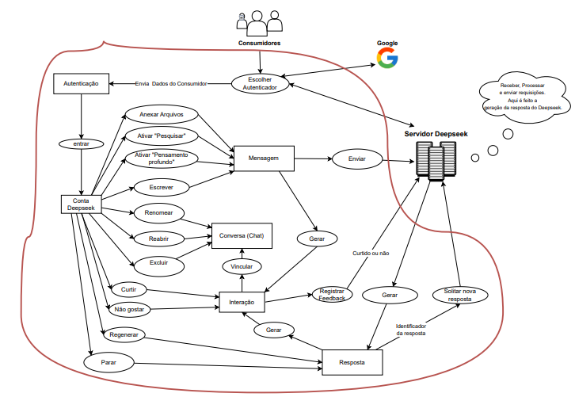

# Rich Picture

## Introdução

O *Rich Picture* ou Imagem Rica (tradução literal), trata-se de um modelo de representação informal com ênfase na expressão de ideias e na analise de problemas ([[1](#ref-bib)], [p.1](../../assets/imgs/rich-picture/p1-intro.jpeg); [[2](#ref-bib)] [Video](https://youtu.be/NxEPxW_Ku8M?si=i6NyNt4-98b7CJX1&t=8)). Em geral, essa modelagem auxilia a identificar: processos de negócios e seus requisitos, atores envolvidos e suas responsabilidades, relacionamentos entre processos e atores, aspectos de persistencia dos dados no processo e potenciais problema e conflitos que possam existir ([[2](#ref-bib)] [Video](https://youtu.be/NxEPxW_Ku8M?si=vwPd6gIWocqoVX2O&t=30)). Enfim, trata-se de uma representação com alto nível de abstração com o objetivo de delinear o domínio da aplicação.

## Metodologia

Para a adequada execução de pre-rastreablidade utilizando o método Rich Picture, vale ressaltar cada etapa:

1. Busca de potenciais aplicativos a serem escolhidos.
2. Elaboração dos Rich Pictures seguindo o [Guia CTEC2402](../../assets/pdfs/rich-pictures/RichPictureRefBib.pdf) [[1](#ref-bib)].
3. Seleção do Aplicativo a ser desenvolvido pela equipe (pode ser encontrado em: [Lista de Apps Avaliados](../../planejamento/lista-de-apps-avaliados)).
4. Fazer uma revisão e correções do Rich Picture do aplicativo selecionado (opcional).
5. Validação do Rich Picture do aplicativo selecionado com o cliente.

Além disso, segue uma lista de ferramentas utilizadas nesse procesos:

- [WhatsAPP](../../planejamento/ferramentas/): Para comunicação entre os participantes, seja na etapa de busca dos aplicativos, atualizando a equipe de que aplciativo cada um está analisando, seja na comunicação nas etapas e potenciais problemas.

- Por escrito (Papel, lapis/caneta e borracha) ou [Draw.io](../../planejamento/ferramentas/): Para a execução dos rich pictures.

- [Microsoft Teams](../../planejamento/ferramentas/): para a reunião de seleção do aplicativo e como plataforma de gravação da validação.

- [Youtube](../../planejamento/ferramentas/): para hospedar o vídeo da validação do Rich Picture.

Em síntese, essa metodologia alinhada as ferramentas esclarece as etapas e facilitam a execução da pré-rastreabilidade.

## Resultados

Antes de ir propriamente para os resultados, é importante ressaltar que houve um entrave durante a execução e foi necessário, mesmo após a entrega vinculada a pré-rastreabilidade, a execução da escolha de um novo aplicativo a ser trabalhado e, por consequência, seu Rich Picture e validação. Mesmo assim, a metodologia antes posta se mantém, mas com o ajuste de que a reunião de decisão do novo aplicativo substituto veio primeiro do que a elaboração do Rich Picture, para agilizar o processo das entregas posteriores, que dependiam do mesmo. Enfim, com isso esclarecido, segue abaixo o detalhamento dos resultados obtidos.

Para a primeira etapa, foram selecionados 7 aplicativos, um para cada integrante, os quais foram julgados como adequados e propícios a serem desenvolvidos:

- [ConnectSUS](../../planejamento/lista-de-apps-avaliados/#connectsus)
- [Open Food Facts](../../planejamento/lista-de-apps-avaliados/#open-food-facts)
- [Carteira Digital de Trânsito](../../planejamento/lista-de-apps-avaliados/#cdt)
- [Meu INSS](../../planejamento/lista-de-apps-avaliados/#meu-inss)
- [Detran DF](../../planejamento/lista-de-apps-avaliados/#detran-df)
- [Neoenergia](../../planejamento/lista-de-apps-avaliados/#neoenergia)
- [Guardiões da Saúde](../../planejamento/lista-de-apps-avaliados/#guardioes-da-saude)

Em seguida, para a segunda etapa, cada um dos integrantes, após evidenciar o aplicativo que estavam analisando, partiram para execução dos seus Rich Pictures, que pode ser visto na tabela 1 abaixo:

<strong>Tabela 1:</strong> <em>Tabela dos potenciais aplicativos</em>

<table>
    <thead>
        <tr>
            <th>Integrante</th>
            <th>Aplicativo</th>
            <th>Rich picture</th>
        </tr>
    </thead>
    <tbody>
        <tr>
            <td><a href="https://github.com/anabborges">Ana Clara</a></td>
            <td>ConnectSUS</td>
            <td><a href="../../assets/pdfs/rich-pictures/RichPictureProj01_AnaBorges.pdf">Rich picture</a></td>
        </tr>
        <tr>
            <td><a href="https://github.com/anajoyceamorim">Ana Joyce</a></td>
            <td>Open Foof Facts</td>
            <td><a href="../../assets/pdfs/rich-pictures/RichPictureProj01_AnaJoyce.pdf">Rich picture</a></td>
        </tr>
        <tr>
            <td><a href="https://github.com/daviRolvr">Davi</a></td>
            <td>Carteira Digital de Trânsito</td>
            <td><a href="../../assets/pdfs/rich-pictures/RichPictureProj01_Davi.pdf">Rich picture</a></td>
        </tr>
        <tr>
            <td><a href="https://github.com/fabinsz">Fabio</a></td>
            <td>Meu INSS</td>
            <td><a href="../../assets/pdfs/rich-pictures/RichPictureProj01_Fabio.pdf">Rich picture</a></td>
        </tr>
        <tr>
            <td><a href="https://github.com/gaubiela">Gabriela</a></td>
            <td>Detran DF</td>
            <td><a href="../../assets/pdfs/rich-pictures/RichPictureProj01_Gabriela.pdf">Rich picture</a></td>
        </tr>
        <tr>
            <td><a href="https://github.com/luizfaria1989">Luiz</a></td>
            <td>Neoenergia</td>
            <td><a href="../../assets/pdfs/rich-pictures/RichPictureProj01_Luiz.pdf">Rich picture</a></td>
        </tr>
        <tr>
            <td><a href="https://github.com/MVConsorte">Mateus</a></td>
            <td>Guardiões da Saúde</td>
            <td><a href="../../assets/pdfs/rich-pictures/RichPictureProj01_Mateus.pdf">Rich picture</a></td>
        </tr>
    </tbody>
</table>

<em>Fonte: autores</em>

Na terceira etapa, a equipe executou uma reunião que, dentre os tópicos a serem discutidos da ata de reunião, possuia o objetivo de selcionar o aplicativo a ser desenvolvido. Contúdo, dentre os aplicativos elaborados pela equipe, durante a reunião, foi descoberto que outro grupo já tinha o escolhido, logo, não podendo ser mais uma opção. Mesmo assim, um dos integrantes já havia pesquisado uma segunda possibilidade - o aplicativo *Tesouro Direto* -, mas não possuia um Rich Picture para o mesmo. Assim, foi adicionado tal aplicativo às possibilidades a serem escolhidos, mas com a necessidade, se escolhido, de executar o rich picture e seguir os demais passos.

Nesse contexto, foi feito uma votação, considerando os critérios de seleção do aplicativo, se já havia sido escolhido o aplicativo em outro momento ou por outro grupo. O resultado da votação foi: 4 votos para *Guardiões da Saúde*, 2 votos para *Tesouro Direto* e 1 voto nulo (integrante ausente na reunião). Portanto, o aplicativo selecionado foi o *Guardiões da Saúde* por maior número de votos, o qual seria, a princípio, o aplicativo trabalhado durante o projeto vigente.

| Ata da Reunião de seleção do aplicativo | vídeo |
| :-: | :-: |
| [Ata do dia 10/04/2025](../../gravacoes/reunioes/ata-dia-10-04-2025) | [Gravação](https://youtu.be/CxXMLqTFt5A?si=S_jOyFWu5IJjOyDp) |

Na quarta etapa e quinta etapa, para o projeto do Guardiões da Saúde, acabou que por atraso, deixou-se para coreeção em entregas posteriores, já que ja esta sendo produzido os artefatos da etapa de elicitação. Todavia, durante essa segunda entrega, já com alguns artefatos desenvolvidos, foi encontrado na planilha disponibilizada pelo professor, um grupo da turma de 10 semestres atrás que já havia feito o Guardiões da Saúde. Assim, tendo em vista essa identificação, o professor indicou que a equipe mudasse o aplicativo e, consequêntemente, refizéssemos o artefatos da etapa 1 para o novo aplicativo, seguido das demais entregas a posteriori.

Para a seleção do novo aplicativo, no contexto do projeto, a substituir o *Guardiões da Saúde* ([Projeto Obsoleto](../../doc-guardioes-da-saude/)), foi proposto para a equipe que fosse buscado outros potenciais aplicativos para, em seguida, fazer uma votação. Nesse sentido, foi proposto, nessa ordem, a terceira etapa e a segunda etapa, visando agilizar o processo de entrega de tal etapa em atraso. Assim, no dia 24/04/2025, ocorreu a reunião para a seleção do novo aplicativo a ser desenolvido, seguindo o exposto na tabela 2 abaixo.

**Tabela 2**: Tabela de aplicativos e número de votos executado em 24/04/2025.

| Aplicativo | Votos |
| :-: | :-: |
|Tinder| 0 |
|Deepseek|6|
|Stellarium|0|
|Responde Aí|0|
|Duolingo|0|

**Fonte**: *Autores*

Por unanimidade, para a etapa 3, foi escolhido o *Deepseek Chat* como o novo aplicativo a ser desenvolvido pela equipe. Esse fato pode ser verificado na ata da reunião junto com a gravação no [Link](../../gravacoes/reunioes/ata-dia-24-04-2025.md). Em síntese, ele cumpre todos os critérios, inclusive o de permissão de análise e engenharia reversa para fins acadêmicos, além de que se tratar de um aplicativo de código aberto.

Seguindo para a etapa 2, tem-se a formulação do Rich Picture do aplicativo selecionado, que pode ser visto nas figuras abaixo (1 e 2):

<strong>Figura 1</strong>: Legendas do Rich Picture

<em>Fonte: Mateus</em>

<strong>Figura 2</strong>: Rich Picture Deepseek

<em>Fonte: Mateus</em>

*Para melhor visualização das Figuras: [clique aqui](../../assets/pdfs/rich-pictures/RichPictureDeepseekV1.pdf)*

Para a quarta etapa, no caso do Rich Picture supracitado (Figura 2), não houve necessidade, pois foi executado já considerando os potenciais erros dos primeiros Rich Pictures. De qualquer modo, houve uma revisão informal pelo integrante [Luiz](https://github.com/luizfaria1989) baseado na [lista de verificação do Rich Picture](../../verificacao/primeira-entrega/), o qual , via [WhatsApp](../../planejamento/ferramentas/), constatou conformidade em todos os itens. 

Enfim, para a quinta e última etapa do processo, foi executado a validação do Rich Picture com um usuário/consumidor do *Deepseek* em modalidade presencial, o qual pode ser verificado no vídeo logo abaixo:

**Vídeo de Validação**: Rich Picture do Deepseek Chat

<iframe width="560" height="315" src="https://www.youtube.com/embed/C5W0F_lWlmk" title="YouTube video player" frameborder="0" allow="accelerometer; autoplay; clipboard-write; encrypted-media; gyroscope; picture-in-picture; web-share" allowfullscreen></iframe>

**Fonte**: *[Mateus](https://github.com/MVConsorte)*
### Informações e Anexos

| Item                      | Detalhes                                                                                      |
|---------------------------|-----------------------------------------------------------------------------------------------|
| **Entrevistador**         | Mateus Villela Consorte                                                                      |
| **Usuário entrevistado**  | Luíza Mandali de Figueredo Marques  *(Estudante de Engenharia Eletrônica pela UnB)*       |
| **Anexo**                 | [Termo de Consentimento assinado pelo entrevistado](../../assets/pdfs/assinaturas/termo-de-consentimento-assinado.pdf) |
| **Local** | UnB - Faculdade do Gama, Prédio UAC, Sala I02.|
| **Data/Hora** | 07/07/2025 - 16h |

Logo, o Rich picture apresentado foi validado pelo usuário, foi considerado condizente e relevante, expressando bem o contexto da aplicação, com certo grau de aprofundamento, mas não em demasiado. Com isso, ratifica-se o rich picture do aplicativo selecionado para o artefato relacionado à pré-rastrabilidade.

## Conclusão

Em síntese, foi visto que o Rich Picture, ou Imagem Rica, é uma técnica de representação informal que visa expressar ideias e analisar problemas de forma visual e colaborativa, facilitando a identificação de processos, requisitos, atores, relacionamentos e possíveis conflitos dentro de um domínio de aplicação. No contexto deste trabalho, sua elaboração seguiu uma metodologia estruturada, que envolveu desde a busca e análise de potenciais aplicativos, passando pela produção individual dos Rich Pictures pelos integrantes da equipe, até a seleção e validação do aplicativo final a ser desenvolvido. O uso de ferramentas como WhatsApp, Draw.io, Microsoft Teams e YouTube foi fundamental para a comunicação, produção e validação dos artefatos. Mesmo diante de desafios, como a necessidade de trocar o aplicativo escolhido durante o processo, a equipe conseguiu adaptar-se e garantir a continuidade do projeto, evidenciando a importância do Rich Picture como instrumento de pré-rastreabilidade e de alinhamento entre todos os envolvidos. Por consequência, tem-se o Rich Picture do *Deepseek Chat* como artefato de pré-rastreabilidade e o mesmo validado.

## Referência Biliográfica {#ref-bib}
> **[1]** CTEC2402 - Software Development Project. Introducing Rich Pictures. Disponível em: [Repositório](../../assets/pdfs/rich-pictures/RichPictureRefBib.pdf). Acesso em: 5 abr. 2025.
>
> **[2]** SALES, André Barros de. Rich Picture. [S. l.]: YouTube, 2019. Disponível em: <https://www.youtube.com/watch?v=NxEPxW_Ku8M>. Acesso em: 5 jul. 2025.

## Bibliografia

>  MONK, Andrew; HOWARD, Steve. The Rich Picture: A Tool for Reasoning About Work Context. 1998. Disponível em: <https://ics.uci.edu/~wscacchi/Software-Process/Readings/RichPicture.pdf>. Acesso em: 05/07/2025. ([PDF](../../assets/pdfs/rich-pictures/RichPictureBibliografia.pdf))
>
> **Carteira Digital de Trânsito (CDT)**. Disponível em: [Carteira Digital de Trânsito](https://play.google.com/store/search?q=Carteira+digital+de+transito&c=apps). Acesso em: 05 jul. 2025.
>
> **Detran DF**. Disponível em: [Detran DF](https://play.google.com/store/search?q=Detran+DF&c=apps). Acesso em: 05 jul. 2025.
>
> **Neoenergia Brasília**. Disponível em: [Neoenergia Brasília](https://play.google.com/store/apps/details?id=br.com.CEB.Ceb). Acesso em: 05 jul. 2025.
>
> **Open Food Facts**. Disponível em: [Open Food Facts](https://play.google.com/store/search?q=Open+Food+Facts&c=apps). Acesso em: 05 jul. 2025.
>
> **ConectSUS**. Disponível em: [ConnectSUS/Meu SUS Digital](https://play.google.com/store/search?q=ConectSUS&c=apps). Acesso em: 05 jul. 2025.
>
> **Meu INSS**. Disponível em: [Meu INSS](https://play.google.com/store/search?q=Meu+INSS&c=apps). Acesso em: 05 jul. 2025.
>
> **Guardiões da Saúde**. Disponível em: [Guardiões da Saúde](https://play.google.com/store/search?q=Guardi%C3%B5es+da+Sa%C3%BAde&c=apps). Acesso em: 05 jul. 2025.
>
> **DeepSeek Chat**. Disponível em: [Deepseek Chat](https://play.google.com/store/search?q=DeepSeek+Chat&c=apps). Acesso em: 05 jul. 2025.

## Tabela de Versionamento

| Data       | Versão | Descrição                                 | Autor             | Revisor          |
| :--------: | :----: | :----------:                              | :---------------: | :---------------:|
| 05/07/2025 |  1.0   | (#D010) Elaboração da página do Rich Picture e Rich Picture do Deepseek. | [Mateus](https://github.com/MVConsorte)| [@Ana Clara](https://github.com/anabborges) |