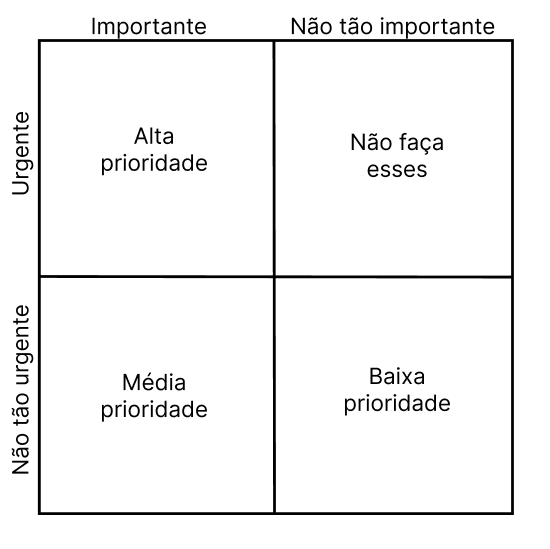

# Técnica de priorização de requisitos: Three Level Scale

Uma forma comum de priorizar os requisitos é dividi-los em três grandes categorias de prioridade: alta, média e baixa, contudo para que ela possa funcionar da forma correta os stakeholders devem concordar em quais são essas prioridades (WIEGERS; BEATTY,  p. 319).
A técnica three level scale transforma essa categorização de requisitos em uma matriz 2x2 que avalia a urgência e a importância de um requisito.

Figura 1: Priorização de requisitos com base na importância e urgência. Fonte: eleboração prórpria.

Assim, os requisitos na técnica three level scale se dividem em:
* Alta prioridade: são requisitos que são importantes, pois os consumidores precisam daquela função, e também urgentes, dado que os consumidores precisam dela na próxima release, assim, pela definição, se o requisito pode ser implementado em uma release futura ele não é de alta prioridade (WIEGERS; BEATTY,  p. 319).
* Média prioridade: são requisitos que são importantes, mas os consumidores não precisam deles de forma tão urgente (WIEGERS; BEATTY,  p. 319).
* Baixa prioridade: são requisitos que não são tão importantes e também tão urgentes.
* Os requisitos no quarto quadrante podem ser considerados urgentes para um determinado stakeholder, talvez por razões políticas, mas eles são importantes para atingir os objetivos de negócio (WIEGERS; BEATTY,  p. 319).. Assim, não é ideal que um tempo seja gasto trabalhando no desenvolvimento deles, pois eles não adicionam valor suficiente para o produto (WIEGERS; BEATTY,  p. 319).

# Aplicando a técnica

Conhecendo como a técnica funciona, ela foi aplicada em reunião online gravada com 4 stakeholders a fim de decidir a prioridade dos requisitos elicitados anteriormente no projeto
Estavam presentes na reunião
* Gabriela: integrante do grupo;
* Luiz: aplicando a técnica de priorização Three Level Scale;
* Fábio: aplicando a técnica de priorização in or out;
* Mateus: aplicando a técnica de priorização QFD;
* Pedro Bueno: estudante de medicina em Buenos Aires, 20 anos de idade, stakeholder 1;
* Janaina: estudante de arquitetura em Barra do Bugres, 20 anos de idade, stakeholder 2;
*  Kamila Dutra: estudante de medicina em Buenos Aires, 20 anos de idade, stakeholder 3.

#### Observações:

As técnicas de produção in or out e three level scale foram aplicadas em conjunto, em que ao passar por um requisito, os stakeholders decidiam se aquele requisito era in ou out mas também o grau de importância, sendo eles: alta, média, baixa ou também optaram por não fazer o desenvolvimento dele (quarto quadrante). Ao fazer isso, foi possível poupar tempo dos integrantes do grupo e dos stakeholders.

## Requisitos Priorizados

| Código do requisito | Descrição | Tipo | Status | Categoria de priorização |
| ------------------- | --------- | ---- | ------ | -------------------------| 
| | Deve oferecer a possibilidade do usuário acionar a pesquisa na web | Funcional | Implementado | Alta prioridade | 
| | Deve haver a possibilidade de uso do pensamento profundo para solução de problemas (Deep Thinking) | Funcional | Implementado | Alta prioridade |
| | O sistema deve aceitar uploads de arquivos de até 10MB nos formatos PDF, DOCX, TXT e imagens (com OCR) com tempo de resposta < 35s | Funcional | Implementado | Alta prioridade |
| | Deve fazer o uso da arquitetura DeepSeek-V3 | Não funcional | Implementado | Baixa prioridade |
| | Deve possuir versões para Android e IOS | Não funcional | Implementado | Alta prioridade |
| | Deve possuir a opção de login com conta Google/Apple ID | Funcional | Implementado | Alta prioridade |
| | Deve salvar chats entre plataformas | Funcional | Implementado | Média prioridade |
| | Melhorar as capacidades de "deep thinking" | Funcional | Não implementado | Média prioridade |
| | Deve haver um campo para a interação com a IA | Funcional | Não implementado | Alta prioridade |
| | Deve ser possível criar novos chats | Funcional | Implementado | Alta prioridade |
| | Deve ser possível renomear um chat | Funcional | Implementado | Média prioridade |
| | Os chats já utilizados devem poder se acessados posteriormente | Funcional | Implementado | Média prioridade |
| | Deve ser possível dar dislike em uma resposta da IA | Funcional | Implementado | Não fazer |
| | Deve ser possível dar like em uma resposta da IA | Funcional | Implementado | Não fazer | 
| | Deve ser possível copiar uma resposta da IA | Funcional | Implementado | Alta prioridade |
| | Deve exibir citações de fontes e referências em respostas baseadas em documentos, indicando página, site e/ou trecho extraído. | Funcional | Parcialmente implementado | Baixa prioridade|
| | Deve ser possível alterar o idioma do sistema | Funcional | Implementado | Alta prioridade |
| | Deve ser possível apagar conversas individuais ou de forma geral | Funcional | Implementado | Baixa prioridade |
| | Deve ser possível regenar uma resposta da IA de forma manual ou de forma automática no caso de erro de servidor ou sobrecargado sistema | Funcional | Parcialmente implementado | Média prioridade |
| | O sistema deve exibir respostas formatadas em Markdown em respostas para tabelas ou listas complexas Markdown (títulos, listas, código) com a possibilidade de edição do Markdown pelo usuário | Funcional | Parcialmente implementado | Baixa prioridade |
| | Deve ser possível interromper respostas em andamento | Funcional | Não implementado | Baixa prioridade |
| | Deve possuir uma API Pública | Funcional | Não implementado | Alta prioridade |
| | Deve aceitar autenticação via token de acesso | Funcional | Implementado | Não fazer | 
| | Deve guardar um histórico de conversas por 30 dias - O histórico não é persistente se o usuário sair sem salvar | Não funcional | Não implementado | Baixa prioridade |
| | Deve fazer a exclusão automática de dados de upload | Não funcional | Não implementado | Média prioridade |
| | A interface deve seguir diretrizes de usabilidade (botões visíveis, texto legível, feedback imediato) e de acessibilidade (alteração no tamanho da fonte, leitura) | Não funcional | Não implementado | Alta prioridade |
| | Deve haver uma confirmação para limpar o histórico | Funcional | Não implementado | Alta prioridade |
| | Em caso de falha, deve retornar mensagens de erro claras | Não funcional | Implementado | Não fazer |
| | O sistema deve suportar múltiplas requisições simultâneas sem degradação | Não funcional | Implementado | Média prioridade |
| | O processamento de arquivos grandes (PDF/DOCX) deve ocorrer em ≤10 segundos e o tempo médio de resposta deve ser <= 2 s em operações simples | Não funcional | Parcialmente implementado | Baixa prioridade |
| | Deve suportar busca incremental (exibição de sugestões em tempo real conforme o usuário digita) | Funcional | Não implementado | Baixa prioridade |
| | Todos os dados sensíveis do usuário devem ser criptografados em trânsito (TLS) e em repouso (AES-256) | Funcional | Implementado | Alta prioridade |
| | O usuário deve poder controlar quais dados são compartilhados (chat, histórico de buscas, localização) | Funcional | Não implementado | Média prioridade | 
| | Deve haver autenticação multifator opcional para acesso a funcionalidades avançadas | Funcional | Não implementado | Não fazer |
| | Deve oferecer modo escuro e modo claro, com configuração manual e sincronização automática com o sistema operacional | Funcional | Implementado | Alta prioridade |
| | Deve incluir tutorial interativo na primeira execução, explicando as principais funcionalidades. / Implementar tutorial interativo (tour guiado) destacando recursos avançados (DeepThink, Reason etc.) no onboarding | Funcional | Não implementado | Baixa prioridade |
| | Disponibilizar, no próprio app, informações claras e acessíveis sobre como e onde os dados são armazenados e utilizados. | Não funcional |  Não funcional | Não implementado | Não fazer |
| |  Especificar e permitir ao usuário optar por participar ou não do uso de seus dados em processos de re-treinamento ou venda de modelos | Não funcional | Não implementado | Alta prioridade |
| | Exibir status do servidor em tempo real (Online, Manutenção, Sobrecarga) | Funcional | Não implementado | Não fazer |
| | Melhorar retenção de contexto em diálogos longos para evitar “esquecimento” ou mistura de informações previamente dadas | Funcional | Parcialmente implementado | Média prioridade |
| |  Garantir estabilidade na geração de conteúdos pesados (PDF, cálculos), evitando erros de formatação ou falhas | Não funcional | Parcialmente implementado | Média prioridade |
| | Implementar memória de contexto persistente entre conversas | Funcional | Não implementado | Média prioridade |
| | Permitir escolha de modelos (seleção de diferentes versões/modelos de IA) | Funcional | Não implementado | Média prioridade |
| | Permitir organização de conversas em pastas ou listas por tema ou projeto | Funcional | Não implementado | Média prioridade |
| | Implementar comandos de voz para entrada e saída de informações | Funcional | Não implementado | Alta prioridade |
| | Atingir ≥ 95 % de usuários avaliando a usabilidade como “Fácil” ou “Muito fácil” em pesquisas futuras | Não funcional | Parcialmente implementado | Baixa prioridade |
| |  Alcançar ≥ 90 % de concordância em “Interface clara e agradável” em pesquisas futuras | Não funcional | Não implementado | Baixa prioridade |
| |  Reduzir para ≤ 5 % os usuários que relatam dificuldade em encontrar opções/ferramentas em pesquisas futuras | Não funcional | Não implementado | Baixa prioridade |
| | Ajustar visualização do título ao passar o mouse sobre o nome do chat na barra lateral de histórico para que não cubra outros elementos e posicione em local adequado | Funcional | Não implementado | Não fazer |
| | Fornecer, na interface de envio de imagens, instruções claras e contextualizadas sobre OCR (explicar siglas e limitações) | Funcional | Não implementado | Média prioridade |
| | Conectar nativamente a ferramentas populares (Google Drive, Google Agendas, Outlook, GitHub etc.) via integrações diretas | Funcional | Não implementado | Média prioridade |
| | Disponibilizar resumo automático de vídeos (importação de links do YouTube para sumarização) | Funcional | Não implementado | Alta prioridade |

# Considerações finais

Com base na técnica de priorização de requisitos foram capaz de classificar os 52 requisitos elicitados anteriormente em quatro categorias, 17 requisitos foram classificados como muito importantes e de alta prioridade, 15 requisitos foram considerados pelos stakeholders como requisitos de média prioridade, 12 requisitos foram de baixa prioridade, não sendo tão urgentes para os consumidores e não tão importantes. Além disso, 8 requisitos foram para a quarta categoria, que não apresentam valor para o produto final desenvolvido.

# Bibliografia

1. WIEGERS, K; BEATTY, J. Software Requirements. 3. ed. Redmond: Microsoft Press, 2013.

# Link para o documento em versão PDF

[Documento](https://docs.google.com/document/d/1Xos-q7mQ_vuDQqeCBLC7N5xdxEBLVYF27pExJdWrvOg/edit?usp=sharing)

| Data       | Versão | Descrição                                 | Autor                                      | Revisor                       |
| :--------: | :----: | :---------------------------------------- | :----------------------------------------: | :----------------------------------------: |
| 02/05/2025 |  0.1   | (#Q04) Documentação referente a aplicação da técnica de priorização Three Level Scale.| [@Luiz](https://github.com/luizfaria1989)   | [@Ana Borges](https://github.com/anabborges) |
| 20/06/2025 |  1.0   | (#Q04) Transformando os requisitos priorizados em uma tabela para melhor visualização.| [@Luiz](https://github.com/luizfaria1989)   | [@](https://github.com/) |
  

 

    

 

 

