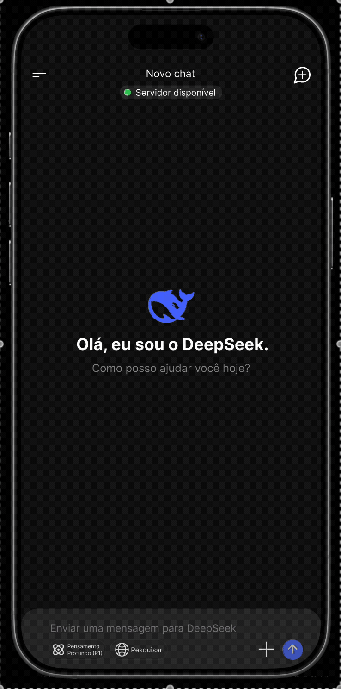
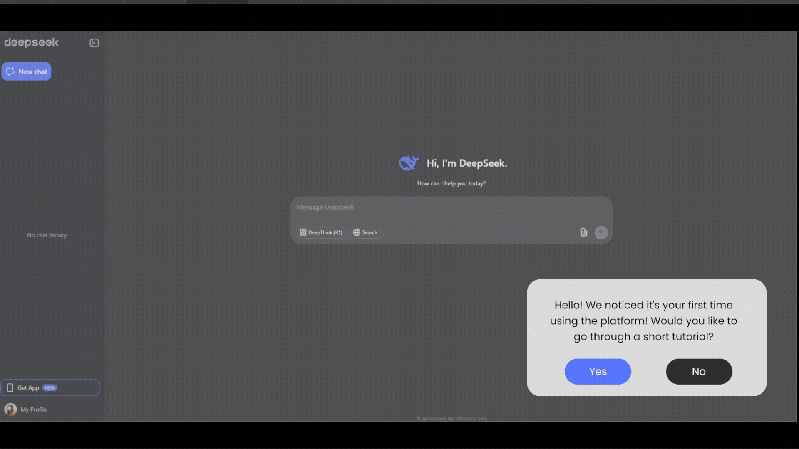
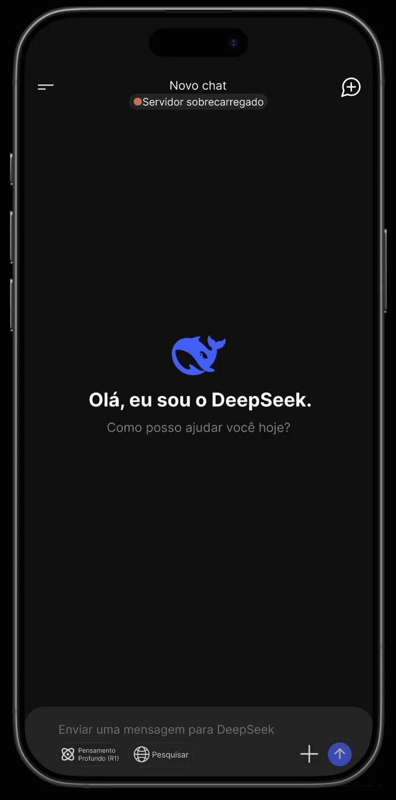
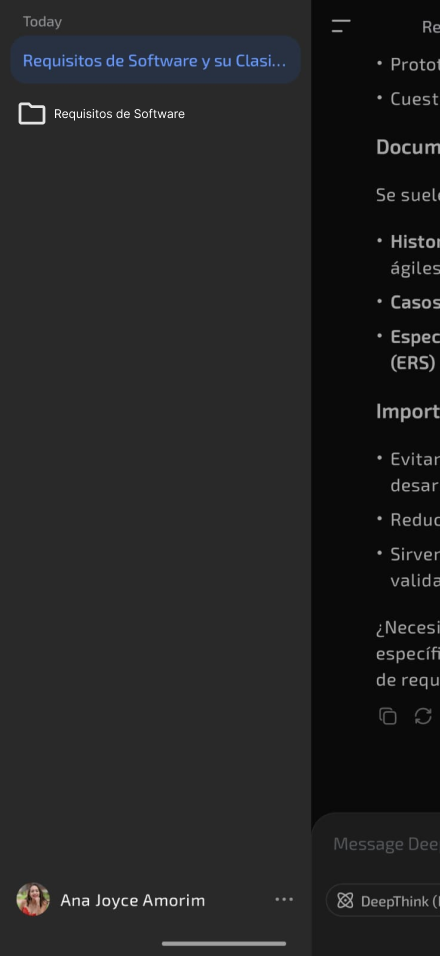
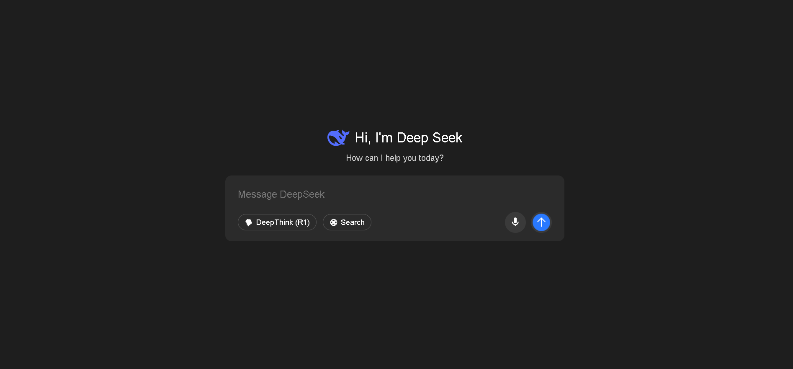
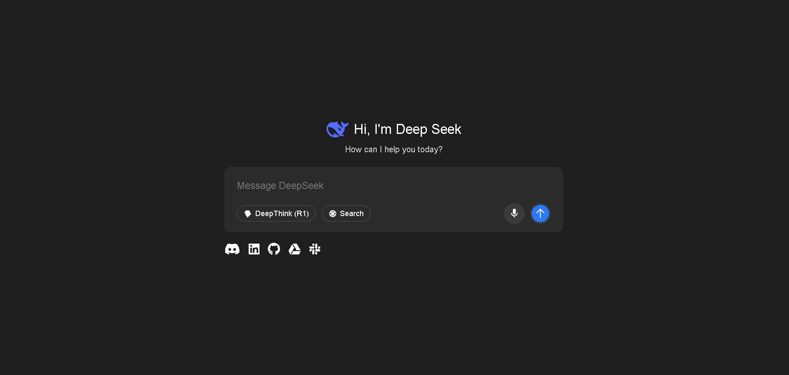
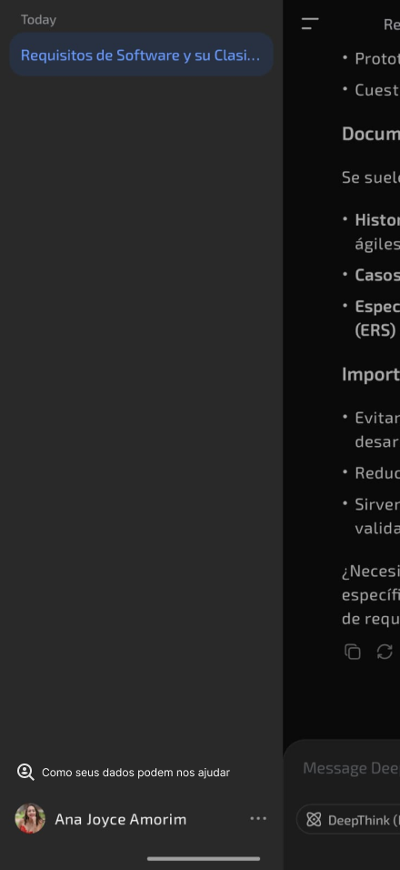

# Prototipação

## Introdução

A prototipação é uma fase crucial no desenvolvimento de sistemas, produtos ou aplicações, pois permite a construção de modelos iniciais que antecipam como a solução final deve se comportar [<a href="#REF1">1</a>] [<a href="#REF2">2</a>]. Esses protótipos servem como ferramenta para validar requisitos, testar funcionalidades e garantir que as expectativas dos usuários estejam sendo atendidas [<a href="#REF2">2</a>]. Ao longo desse processo, é possível coletar feedback constante, detectar erros de forma antecipada e fazer ajustes rapidamente — o que impacta positivamente na qualidade, na experiência do usuário e na eficiência do projeto final [<a href="#REF1">1</a>]. Além disso, a prototipação facilita o diálogo entre as equipes técnicas e os stakeholders, minimiza retrabalho em etapas posteriores e ajuda a manter os custos sob controle [<a href="#REF1">1</a>] [<a href="#REF2">2</a>]. Por fim, ao comparar os resultados esperados com os obtidos nos testes, reforça-se a confiabilidade da solução e seu valor real para o público-alvo [<a href="#REF2">2</a>].

A classificação da prototipagem discerne em diferentes níveis de fidelidade, variando desde esboços em papel (low-fidelity) até simulações altamente interativas (high-fidelity), dependendo do objetivo e do estágio do projeto [<a href="#REF2">2</a>]. Prototótipos de baixa fidelidade são eficazes nas fases iniciais de ideação, pois permitem explorar possibilidades de forma rápida e com baixo custo [<a href="#REF2">2</a>]. Já os protótipos de alta fidelidade são utilizados em momentos mais avançados, permitindo testes próximos da experiência real do usuário. A escolha adequada do tipo de prototipagem influencia diretamente a qualidade das decisões de design, usabilidade e engenharia durante o desenvolvimento da solução [<a href="#REF2">2</a>].

## Metodologia

Para o desenvolvimento dos protótipos dos requisitos não implementados, foi utilizado o software de design Figma e o uso das linguagems de marcação e estilzação de texto HTML e CSS. Cada protótipo possui um card, o qual contém o ID do requisito que originou aquele protótipo bem como a descrição do requisito, por fim, é apresentado o protótipo de alta fidelidade daquele requisito.

**Tabela 1** - Template para a organização dos protótipos.

| Item | Explicação |
| ---- | :--------: |
| ID do requisito | - |
| Descrição do requisito | - | 
| Representação | - |

Autor: [Luiz](https://github.com/luizfaria1989)

## Validação com Usuário

A validação com o usuário foi feita de forma presencial, no dia 25 de junho.

<iframe width="560" height="315" src="https://www.youtube.com/embed/mHm4HD8cjXc?si=C_NmppAX1RV_D80g" title="YouTube video player" frameborder="0" allow="accelerometer; autoplay; clipboard-write; encrypted-media; gyroscope; picture-in-picture; web-share" referrerpolicy="strict-origin-when-cross-origin" allowfullscreen></iframe>

### Participantes da validação

| Participante | Papel |
| ------------ | ----- |
| Luiz | Integrante do grupo, responsável por coordenar a validação com o usuário. |
| Luisa Mel | Estudante de engenharia aeroespacial de 20 anos de idade, responsável por validar os protótipos desenvolvidos para o artefato. |

* [Termo de consentimento para gravação](../gravacoes/termos-de-consentimento/termo-de-consentimento-luisa_assinado_250626_185541_assinado.pdf)

## Tabela de Contribuições

| Integrante | Atividade | Links |
| --- | --- | -- |
| Ana Clara | Desenvolvimento dos protótipos para os requisitos não implementados #RF28 | [#RF28](../validacao/prototipacao.md#rf28) |
| Ana Joyce | Desenvolvimento dos protótipos para os requisitos não implementados #RF33, #RN10| [#RF33](../validacao/prototipacao.md#rf28), [#RN10](../validacao/prototipacao.md#rn10) |
| Davi | Desenvolvimento dos protótipos para os requisitos não implementados #RF34, #RF37 | [#RF34](../validacao/prototipacao.md#rf34), [#RF37](../validacao/prototipacao.md#rf37) |
| Luiz | Desenvolvimento dos protótipos para os requisitos não implementados #RF25, #RF26, #RF29 | [#RF25](../validacao/prototipacao.md#rf25), [#RF26](../validacao/prototipacao.md#rf26), [#RF29](../validacao/prototipacao.md#rf29) |

## Protótipos Desenvolvidos

### #RF25 - O usuário deve poder controlar quais dados são compartilhados (chat, histórico de buscas, localização)

| Item | Explicação |
| ---- | ---------- |
| ID do requisito | #RF25 |
| Descrição do requisito | O usuário deve poder controlar quais dados são compartilhados (chat, histórico de buscas, localização) | 
| Representação |  |

Autor: [Luiz](https://github.com/luizfaria1989)

### #RF26 - Deve haver autenticação multifator opcional para acesso a funcionalidades avançadas

| Item | Explicação |
| ---- | ---------- |
| ID do requisito | #RF26 |
| Descrição do requisito | Deve haver autenticação multifator opcional para acesso a funcionalidades avançadas | 
| Representação |  |

Autor: [Luiz](https://github.com/luizfaria1989)

### #RF28 - Deve incluir tutorial interativo na primeira execução, explicando as principais funcionalidades

| Item | Explicação |
| ---- | ---------- |
| ID do requisito | #RF28 |
| Descrição do requisito | Deve incluir tutorial interativo na primeira execução, explicando as principais funcionalidades | 
| Representação |  |

Autor: [Ana Clara](https://github.com/anabborges)

### #RF29 - Exibir status do servidor em tempo real (Online, Manutenção, Sobrecarga)

| Item | Explicação |
| ---- | ---------- |
| ID do requisito | #RF29 |
| Descrição do requisito | Exibir status do servidor em tempo real (Online, Manutenção, Sobrecarga) | 
| Representação |  |

Autor: [Luiz](https://github.com/luizfaria1989)

### #RF33 - Permitir organização de conversas em pastas ou listas por tema ou projeto

| Item | Explicação |
| ---- | ---------- |
| ID do requisito | #RF33 |
| Descrição do requisito | Permitir organização de conversas em pastas ou listas por tema ou projeto | 
| Representação |  |

Autor: [Ana Joyce](https://github.com/anajoyceamorim)

### #RF34 - Implementar comandos de voz para entrada e saída de informações

| Item | Explicação |
| ---- | ---------- |
| ID do requisito | #RF34 |
| Descrição do requisito | Implementar comandos de voz para entrada e saída de informações | 
| Representação |  |

Autor: [Davi Emanuel](https://github.com/daviRolvr)

### #RF37 - Conectar nativamente a ferramentas populares (Google Drive, Outlook, GitHub etc.) via integrações diretas

| Item | Explicação |
| ---- | ---------- |
| ID do requisito | #RF37 |
| Descrição do requisito | Conectar nativamente a ferramentas populares (Google Drive, Outlook, GitHub etc.) via integrações diretas | 
| Representação |  |

Autor: [Davi Emanuel](https://github.com/daviRolvr)

### #RN10 - Especificar e permitir ao usuário optar por participar ou não do uso de seus dados em re-treinamento ou venda de modelos

| Item | Explicação |
| ---- | ---------- |
| ID do requisito | |
| Descrição do requisito | Especificar e permitir ao usuário optar por participar ou não do uso de seus dados em re-treinamento ou venda de modelos | 
| Representação |  |

Autor: [Ana Joyce](https://github.com/anajoyceamorim)

## Referências Bibliográficas

> <a id="REF1">1.</a> SERRANO, Milene; SERRANO, Maurício. Requisitos – Aula 23. Brasília, DF: Universidade de Brasília, Campus Gama, [s.d.]. Disponível em: https://aprender3.unb.br/pluginfile.php/3096017/mod_resource/content/2/Requisitos%20-%20Aula%20023.pdf. Acesso em: 18 jun. 2025.

> <a id="REF2">2.</a> UNIVERSIDADE VIRTUAL DO ESTADO DE SÃO PAULO (UNIVESP). Projeto e desenvolvimento do produto – Aula 12 – Prototipagem. YouTube, 21 jun. 2018. Disponível em: https://youtu.be/SBCNKHU37ZQ?si=hbDPHrf6FooMss_2. Acesso em: 20 jun. 2025.

## Histórico de Versões 📅

| Versão | Data | Descrição | Autor(es) | Revisor(es) |
| --- | --- | --- | --- | --- |
| 18/06/2025 | 1.0 | (#P01) Criação da Página, Introdução e Referências | [@Mateus](https://github.com/MVConsorte) | [@](https://github.com/luizfaria1989) |
| 26/06/2025 | 2.0 | (#P01) Adição da gravação da validação com o usuário | [@Luiz](https://github.com/luizfaria1989) | [@](https://github.com/) |
| 26/06/2025 | 2.1 | (#P01) Adição da metodologia e dos protótipos desenvolvidos | [@Luiz](https://github.com/luizfaria1989) | [@](https://github.com/) |
| 27/06/2025 | 2.2 | (#P01) Adiciona o termo de consetimento da gravação da validação dos protótipos.| [@Luiz](https://github.com/luizfaria1989)  | [@](https://github.com/)  |