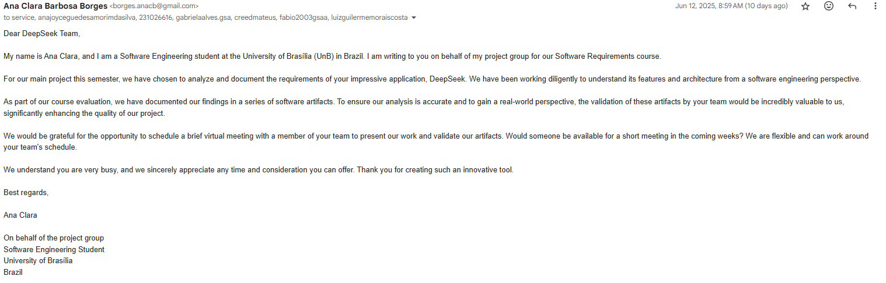
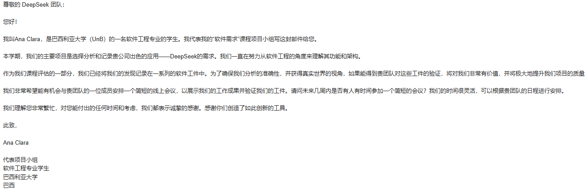

# Introdução

Na etapa de validação dos artefatos produzidos na disciplina, tal como os requistos gerados e refinados, faz-se necessário o envio do trabalho desenvolvido para uma equipe técnica responsável pelo app - no caso o Deepseek - ou que tenha domínio da aplicação. Mesmo que não haja a resposta por parte da equipe, pois concerne a fator externo a completude de tal etapa, uma alternativa, não excludente com a anterior, mas complementar, com ênfase na investigação das ferramentas de IA, trata-se da validação informal com o próprio Deepseek. Ou seja, pelo fato do Deepseek ser uma ferramenta de processamento de linguagem natural, pode ser feito uma especie de validação com o mesmo para verificar a coerência e corretude de suas respostas e o quão eficaz ele pode ser utilzado para validação de artefatos. Enfim, mesmo que não haja a reciproca por parte da equipe do deepseek, seria interessante uma abordagem exploratória da validação de artefatos por ferramenta de IA - como é o caso do modelo de linguagem de grande escala (LLM) Deepseek.

# Objetivo

A validação dos artefatos produzidos envolve o envio do material à equipe técnica responsável pelo DeepSeek, por meio de contato inicial via e-mail. Ainda que a ausência de resposta não comprometa o andamento do processo, propõe-se como complemento uma validação exploratória utilizando o próprio DeepSeek a fim de verificar a coerência, clareza e utilidade das respostas geradas frente aos artefatos desenvolvidos.

# E-mail

    

    

# Bilbiografia
> DEEPSEEK. DeepSeek: Plataforma de inteligência artificial. 2025. Disponível em: https://www.deepseek.com. Acesso em: 12 jun. 2025.

## Histórico de versão

| Versão |    Data    |       Descrição        |                     Autor                      |                  Revisor                   |
| :----: | :--------: | :--------------------: | :--------------------------------------------: | :----------------------------------------: |
|  1.0   | 12/06/2025 | Criação da base da pagina, Introdução, Objetivo e Bibliografia e afins|  [@Mateus](https://github.com/MVConsorte)   | [@](https://github.com/) |
|  1.1   | 22/06/2025 | Adição da foto do email enviado|  [@Mateus](https://github.com/anabborges)   | [@](https://github.com/) |