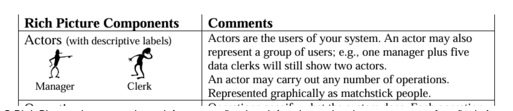
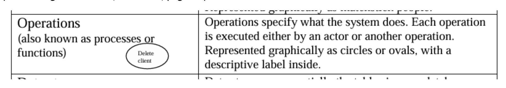
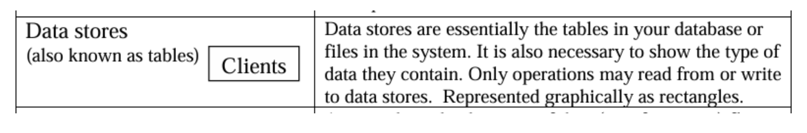
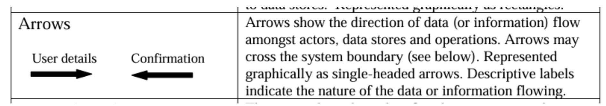
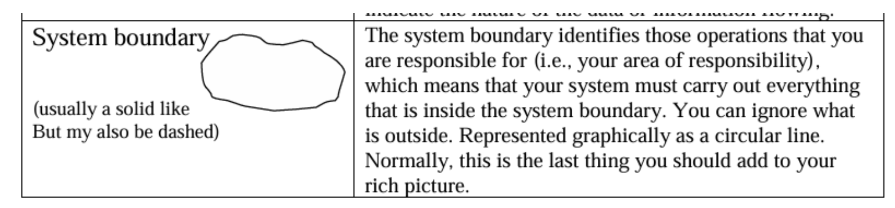
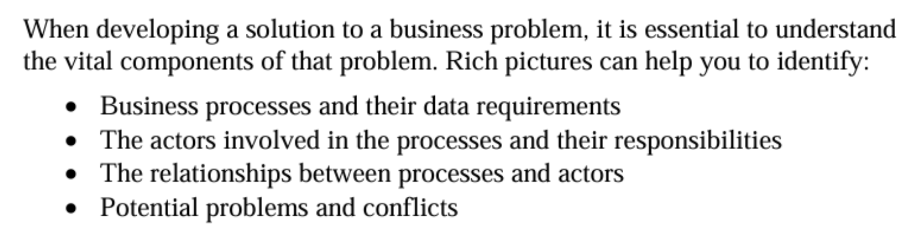

# Verificação

## Introdução

Esta página é dedicada à lista de verificação criada para os artefatos da primeira entrega.

## Listas de Verificação

### Tabela 1 - Verificação do Rich Picture

**Tabela 1** - Lista de verificação para o artefato rich picture.

| Nº  | Descrição                          | Autor                  | Referência                |
|-----|------------------------------------|------------------------|---------------------------|
| 01  | O Rich Picture deve possuir atores como um de seus componentes. Esses atores devem possuir seus respectivos rótulos. Os atores representam os usuários (ou grupo deles) do sistema. Eles são representados com desenho de pessoas palito. | Luiz  |  |
| 02  | O Rich Picture deve possuir também operações (também chamadas de processos ou funções). As operações especificação o que o sistema faz. Cada operação é executada ou por um ator ou por outra operação. Elas são representadas graficamente por círculos ou elipses. | Luiz  | ! |
| 03  | O Rich Picture deve possuir armazéns de dados. Eles são as tabelas da base de dados ou os arquivos daquele sistema. Eles devem ser representados por retângulos e devem mostrar o tipo de dado que eles contêm. As únicas operações que devem ser feita com eles são as de ler ou escrever neles. | Luiz  | ! |
| 04  | O Rich Picture deve possuir setas, elas mostram a direção em que os dados ou informação se comunicação entre os atores, as operações e os armazéns de dados. As setas podem ultrapassar a barreira do sistema. | Luiz  |  |
| 05  | O último componente do Rich Picture é a barreira do sistema, ela identifica as operações que o sistema é responsável por realizar e portanto devem ser construídas pelo engenheiro de software. Assim, as operações que ocorrem de fora da barreira podem ser ignoradas, pois não serão implementadas. | Luiz  |  |
| 06  | Ao analisar o Rich Picture, deve ser possível analisar os processos de negócio e os dados que eles exigem | Luiz  |  |
| 07  | Deve ser possível identificar os atores envolvidos nos processos e as suas responsabilidades. | Luiz  | |
| 08  | Deve ser possível identificar as relações entre os processos e os atores representados no Rich Picture | Luiz  |  |
| 09  | É possível encontrar possíveis problemas e conflitos ao analisar o Rich Picture. | Luiz  |  |

**Autor:** [Luiz](https://github.com/luizfaria1989)  

# Histórico de versões

| Data       | Versão | Descrição                                 | Autor                                      | Revisor                                     |
| :--------: | :----: | :---------------------------------------- | :----------------------------------------: | :----------------------------------------: |
| 05/07/2025 |  1.0   | (#V01) Criação da página das listas de verificação com as listas de verificação.| [Luiz](https://github.com/luizfaria1989)   | [Mateus](https://github.com/MVConsorte) |
