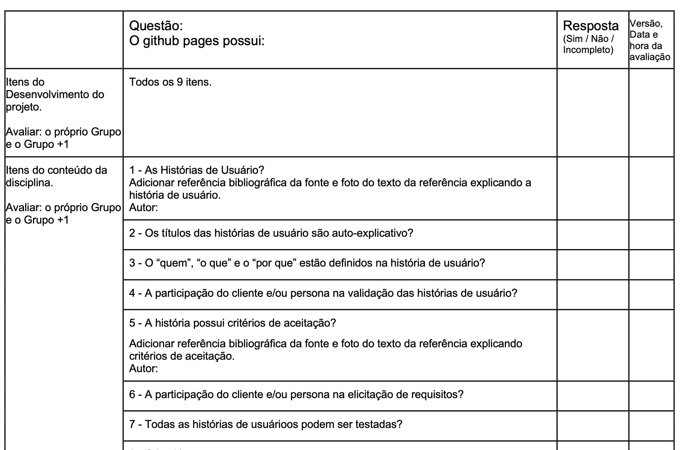
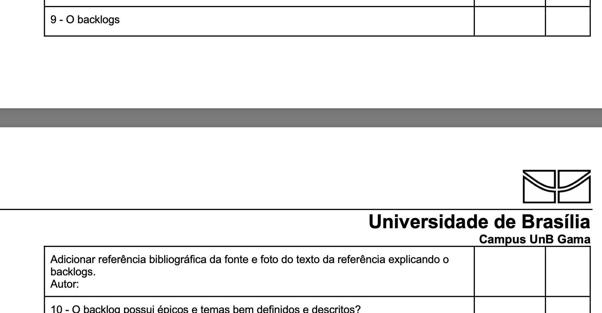
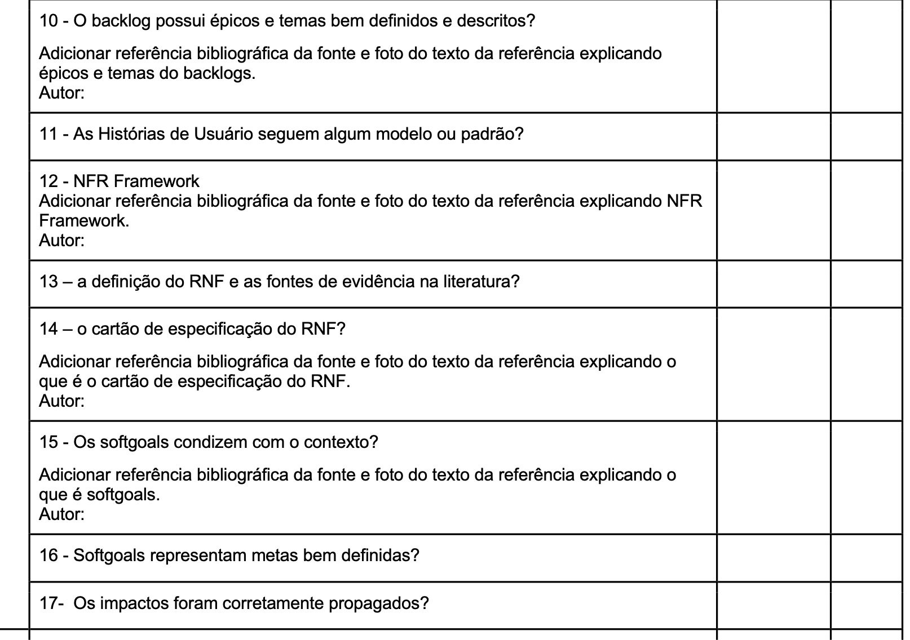
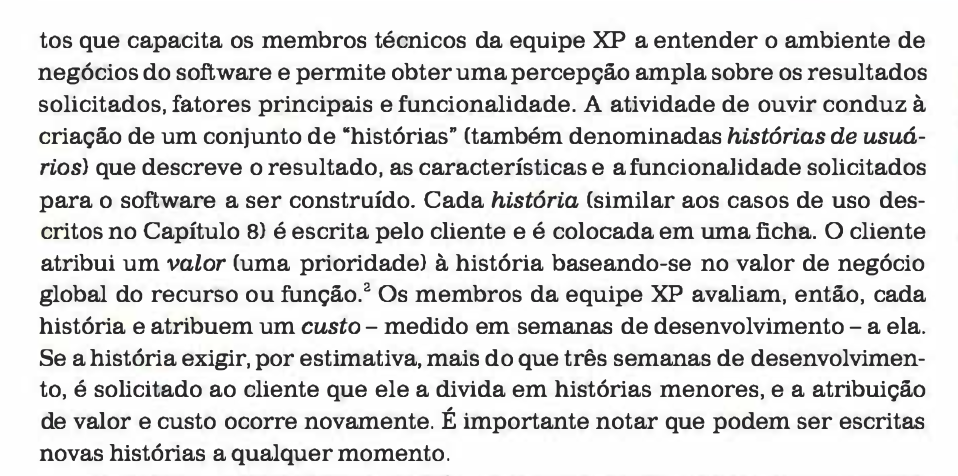
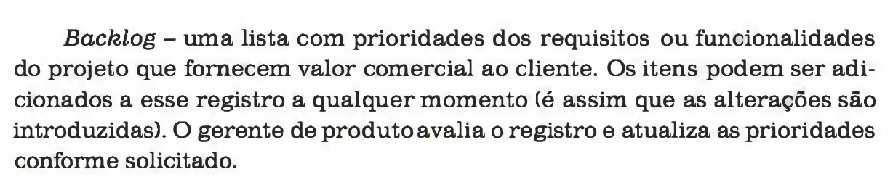
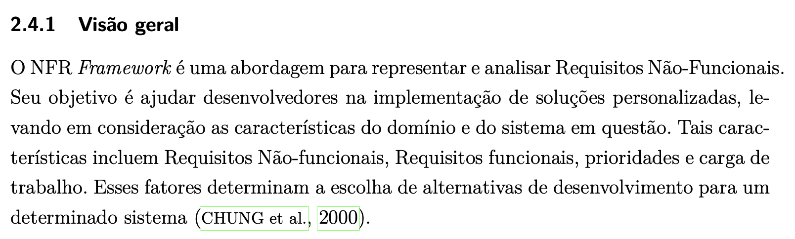
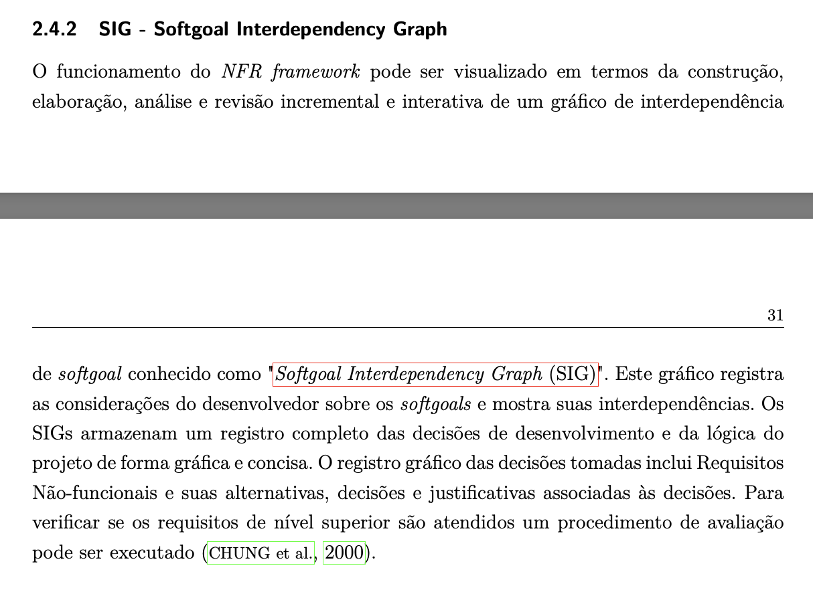
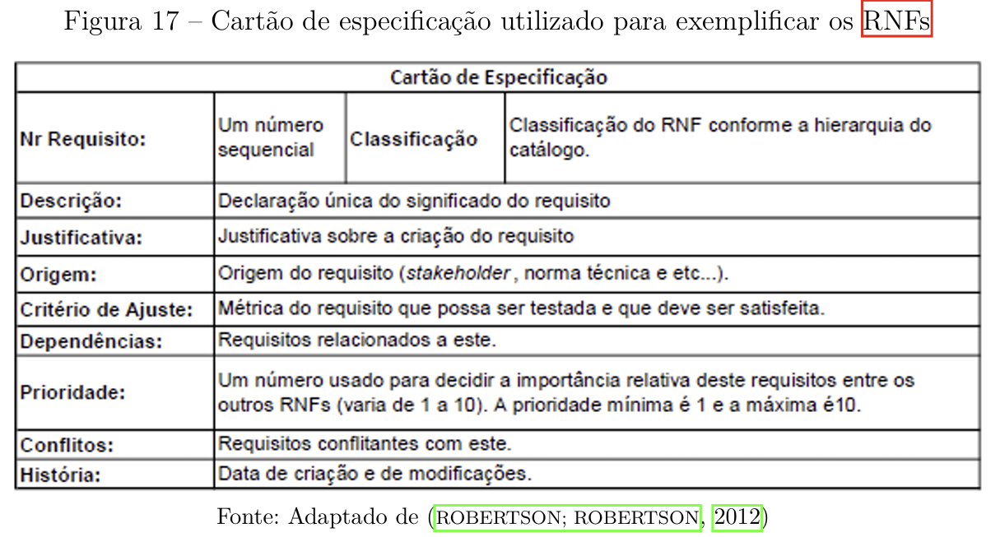

# Verificação

## Introdução

Esta página é dedicada à lista de verificação criada para os artefatos da quarta entrega.

## Lista de Verificação

### Tabela 1 - Verificação recomendada pelo professor

**Tabela 1** - Lista de verificação recomendada pelo professor.

| Nº  | Descrição                          | Autor                  | Referência                |
|-----|------------------------------------|------------------------|---------------------------|
| 01  | As Histórias de Usuário possuem referência bibliográfica da fonte e foto do texto da referência explicando a história de usuário ? | André Barros de Sales  |    |
| 02  | Os títulos das histórias de usuário são auto-explicativo? | André Barros de Sales  |                            |
| 03  | O “quem”, “o que” e o “por que” estão definidos na história de usuário? | André Barros de Sales  |                            |
| 04  | A participação do cliente e/ou persona na validação das histórias de usuário? | André Barros de Sales  |                            |
| 05  | A história possui critérios de aceitação? Existe referência bibliográfica da fonte e foto do texto da referência explicando critérios de aceitação ? | André Barros de Sales  |                            |
| 06  | A participação do cliente e/ou persona na elicitação de requisitos? | André Barros de Sales  |                            |
| 07  | Todas as histórias de usuários podem ser testadas? | André Barros de Sales  |                            |
| 08  | Os backlogs possuem referência bibliográfica da fonte e foto do texto da referência explicando o backlogs ? | André Barros de Sales  |                            |
| 09  | O backlog possui épicos e temas bem definidos e descritos? Existe referência bibliográfica da fonte e foto do texto da referência explicando épicos e temas do backlogs ? | André Barros de Sales  |                            |
| 10  | As Histórias de Usuário seguem algum modelo ou padrão? | André Barros de Sales  |                            |
| 11  | NFR Framework possui referência bibliográfica da fonte e foto do texto da referência explicando NFR Framework?  | André Barros de Sales  |                            |
| 12  | Existe definição do RNF e as fontes de evidência na literatura?  | André Barros de Sales  |                            |
| 13  | Existe referência bibliográfica da fonte e foto do texto da referência explicando o que é o cartão de especificação do RNF.  | André Barros de Sales  |                            |
| 14  | Os softgoals condizem com o contexto? Existe referência bibliográfica da fonte e foto do texto da referência explicando o que é softgoals?  | André Barros de Sales  |                            |
| 15  | Os Softgoals representam metas bem definidas?  | André Barros de Sales  |                            |
| 16  | Os impactos foram corretamente propagados?  | André Barros de Sales  |                            |

### Tabela 2 - Verificação das histórias de usuário

**Tabela 2** - Lista de verificação para o artefato histórias de usuário.

| Nº  | Descrição                          | Autor                  | Referência                |
|-----|------------------------------------|------------------------|---------------------------|
| 01  | As histórias de usuário descrevem o resultado, as características e as funcionalidades solicitadas para o software a ser construído? | Luiz  |  |
| 02  | A história de usuário está representada em uma ficha? | Luiz  |  |
| 03  | A história de usuário possui uma prioridade ou valor de negócio? | Luiz  |  |
| 04  | A história de usuário possui título? | Luiz  | [Reposiório de requisitos: Bilheteria digital](https://requisitos-de-software.github.io/2023.1-BilheteriaDigital/modelagem/agil/historia-de-usuario/) |
| 05  | A história de usuário possui descrição? | Luiz  | [Reposiório de requisitos: Bilheteria digital](https://requisitos-de-software.github.io/2023.1-BilheteriaDigital/modelagem/agil/historia-de-usuario/) |
| 06  | A história de usuário possui critérios de aceitação? | Luiz  | [Reposiório de requisitos: Bilheteria digital](https://requisitos-de-software.github.io/2023.1-BilheteriaDigital/modelagem/agil/historia-de-usuario/) |

**Autor:** Luiz  

### Tabela 3 - Verificação do backlog

**Tabela 3** - Lista de verificação para o artefato backlog.

| Nº  | Descrição                          | Autor                  | Referência                |
|-----|------------------------------------|------------------------|---------------------------|
| 01  | O backlog está representado por uma lista com os requisitos ou funcionalidades do projeto? | Luiz  |  |
| 02  | Os requisitos do backlog possuem uma prioridade? | Luiz  |   |

**Autor:** Luiz  

### Tabela 4 - Verificação do NFR Framewok

**Tabela 4** - Lista de verificação para o artefato NFR Framework.

| Nº  | Descrição                          | Autor                  | Referência                |
|-----|------------------------------------|------------------------|---------------------------|
| 01  | O NFR Framework está analisando os requisitos não funcionais do projeto? | Luiz  |  |
| 02  | O NFR Framework possui um softgoal independency graph | Luiz  |  |
| 03  | Os requisitos não funcionais estão representados no cartão de especificação? | Luiz  |  |
| 04  | O cartão de especificação possui a descrição daquele requisito trabalhado? | Luiz  |  |
| 05  | O cartão de especificação possui a justificativa daquele requisito trabalhado? | Luiz  |  |
| 06  | O cartão de especificação possui a origem daquele requisito trabalhado? | Luiz  |  |
| 07  | O cartão de especificação possui critério de ajuste daquele requisito trabalhado? | Luiz  |  |
| 08  | O cartão de especificação possui as dependências daquele requisito trabalhado? | Luiz  |  |
| 09  | O cartão de especificação possui a prioridade daquele requisito trabalhado? | Luiz  |  |
| 10  | O cartão de especificação possui os conflitos daquele requisito trabalhado? | Luiz  |  |
| 11  | O cartão de especificação possui a história daquele requisito trabalhado? | Luiz  |  |

**Autor:** Luiz  

# Histórico de versões

| Data       | Versão | Descrição                                 | Autor                                      | Revisor                                     |
| :--------: | :----: | :---------------------------------------- | :----------------------------------------: | :----------------------------------------: |
| 01/06/2025 |  1.0   | (#V01) Criação da página das listas de verificação com as listas de verificação.| [Luiz](https://github.com/luizfaria1989)   | [Ana Joyce](https://github.com/anajoyceamorim) |
| 05/06/2025 |  2.0   | (#V01) Adição das legendas das tabelas e seus autores.| [Luiz](https://github.com/luizfaria1989)   |  |
