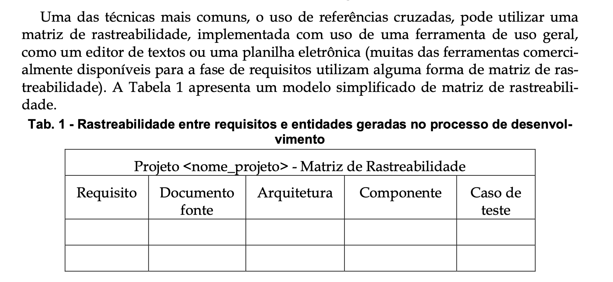
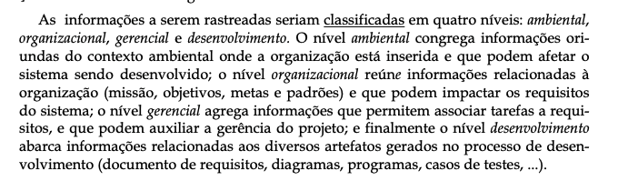
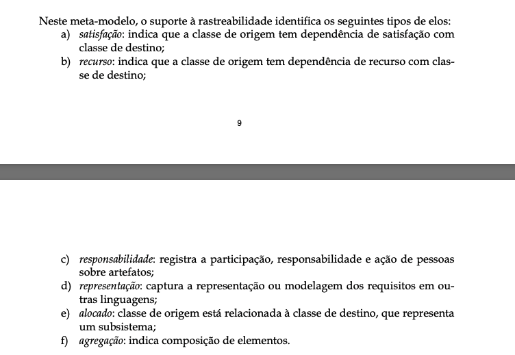

# Verificação

## Introdução

Esta página é dedicada à lista de verificação criada para os artefatos da sexta entrega.

## Lista de Verificação

### Tabela 1 - Verificação da matriz de rastreabilidade

| Nº  | Descrição                          | Autor                  | Referência                |
|-----|------------------------------------|------------------------|---------------------------|
| 01  | O documento da matriz de rastreabilidade possui a definição da matriz de rastreabilidade | Luiz |    |
| 02  | A matriz de rastreabilidade possui uma coluna para o identificador daquele requisito ? | Luiz | [Repositório Bilheteira Digital](https://requisitos-de-software.github.io/2023.1-BilheteriaDigital/rastreabilidade/matriz-geral/) |
| 03  | A matriz de rastreabilidade possui uma coluna para a descrição daquele requisito ? | Luiz | [Repositório Bilheteira Digital](https://requisitos-de-software.github.io/2023.1-BilheteriaDigital/rastreabilidade/matriz-geral/) |
| 04  | A matriz de rastreabilidade possui uma coluna apresentando qual técnica de elictação foi utilizada para elicitar aquele requisito ? | Luiz | [Repositório Bilheteira Digital](https://requisitos-de-software.github.io/2023.1-BilheteriaDigital/rastreabilidade/matriz-geral/) |
| 05  | A matriz de rastreabilidade possui uma coluna para para indentificar se aquele requisito está implementado ou não ? | Luiz | [Repositório Bilheteira Digital](https://requisitos-de-software.github.io/2023.1-BilheteriaDigital/rastreabilidade/matriz-geral/) |
| 06  | A matriz de rastreabilidade possui uma coluna para indetificar os artefatos que foram produzidos com base naquele requisito ? | Luiz | [Repositório Bilheteira Digital](https://requisitos-de-software.github.io/2023.1-BilheteriaDigital/rastreabilidade/matriz-geral/) |
| 07  | A matriz de rastreabilidade possui uma coluna para o identificador os elos daquele requisito ? | Luiz | [Repositório Bilheteira Digital](https://requisitos-de-software.github.io/2023.1-BilheteriaDigital/rastreabilidade/matriz-geral/) |
| 08  | A matriz de rastreabilidade possui hiperlinks para a navegação para os artefatos daquele requisito ? | Luiz | [Repositório Bilheteira Digital](https://requisitos-de-software.github.io/2023.1-BilheteriaDigital/rastreabilidade/matriz-geral/) |
| 09  | A matriz de rastreabilidade possui hiperlinks para a navegação dos elos daquele requisito ? | Luiz | [Repositório Bilheteira Digital](https://requisitos-de-software.github.io/2023.1-BilheteriaDigital/rastreabilidade/matriz-geral/) |
| 10  | A matriz de rastreabilidade possui hiperlinks para os documentos de elicitação daquele requisito ? | Luiz | [Repositório Bilheteira Digital](https://requisitos-de-software.github.io/2023.1-BilheteriaDigital/rastreabilidade/matriz-geral/) |

### Tabela 2 - Verificação do documento de pós-rastreabilidade

| Nº  | Descrição                          | Autor                  | Referência                |
|-----|------------------------------------|------------------------|---------------------------|
| 01  | O documento de pós rastreabilidade cita e explica cada um dos quatro tipos de informação (ambiental, organizacional, gerencial, desenvolvimento) segundo Toranzo ? | Luiz |    |
| 02  | O documento de pós rastreabilidade cita e explica o elo de satisfação ? | Luiz |    |
| 03  | O documento de pós rastreabilidade cita e explica o elo de recurso ? | Luiz |    |
| 04  | O documento de pós rastreabilidade cita e explica o elo de responsabilidade ? | Luiz |    |
| 05  | O documento de pós rastreabilidade cita e explica o elo de alocado ? | Luiz |    |
| 06  | O documento de pós rastreabilidade cita e explica o elo de agregação ? | Luiz |    |
| 07  | O documento de pós rastreabilidade possui um template e tabelas contendo os tipos de elo daquele requisto ? | Luiz |   |

# Histórico de versões

| Data       | Versão | Descrição                                 | Autor                                      | Revisor                                     |
| :--------: | :----: | :---------------------------------------- | :----------------------------------------: | :----------------------------------------: |
| 07/06/2025 |  1.0   | (#V01) Criação da página das listas de verificação com as listas de verificação.| [Luiz](https://github.com/luizfaria1989)   | [`@Fabio`](https://github.com/fabinsz)  |