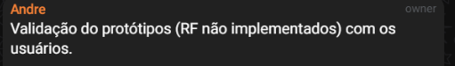
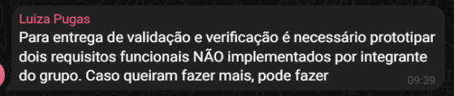
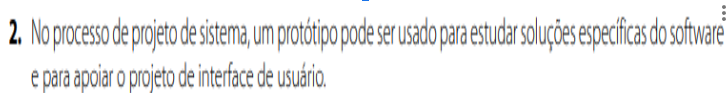
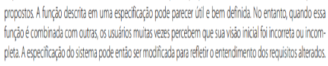

# Verificação

## Introdução

Esta página é dedicada à lista de verificação criada para os artefatos da quinta entrega.

## Lista de Verificação

| Nº  | Descrição                                                                                                                                                                                                                      | Autor                  | Referência                |
|-----|--------------------------------------------------------------------------------------------------------------------------------------------------------------------------------------------------------------------------------|------------------------|----------------------------|
| 1 | Foram adicionadas fotos dos requisitos implementados? | Ana Clara | Professor André Barros de Sales (Em sala) |
| 2 | Foi adicionada uma foto do email de validação enviado para a equipe técnica? | Ana Clara, Mateus | Professor André Barros de Sales (Grupo do Telegram e em sala)  |
| 3 | Os usuários estão envolvidos no uso e avaliação do protótipo? | Mateus e Davi| Professor André Barros de Sales (Grupo do Telegram e em sala)  e engenharia de sofware de ia  sommervillle  |
| 4 | Cada integrante do grupo fez ao menos 2 protótipos de 2 requistos não implementados. | Mateus | Professor André Barros de Sales e monitores (Grupo do Telegram e em sala)  |
| 5 | O protótipo está ajudando na elicitação e validação de requisitos com o usuário? | Davi | engenharia de sofware de ia  sommervillle   |
| 6 | O protótipo está apoiando o projeto da interface de usuário? | Davi | engenharia de sofware de ia  sommervillle  |
| 7 | As funcionalidades simuladas no protótipo estão bem definidas? | Davi | engenharia de sofware de ia  sommervillle  |

# Histórico de versões

| Data       | Versão | Descrição                                 | Autor                                      | Revisor                                     |
| :--------: | :----: | :---------------------------------------- | :----------------------------------------: | :----------------------------------------: |
| 22/06/2025 |  1.0   | (#V011) Criação da página das listas de verificação com as listas de verificação.| [Ana Clara](https://github.com/anabborges)   | [`@`](https://github.com/)  |