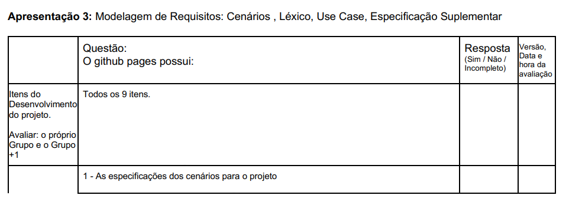
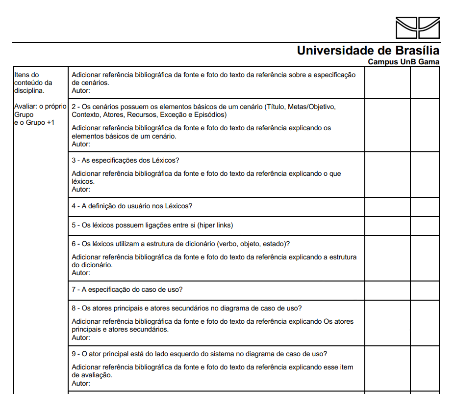
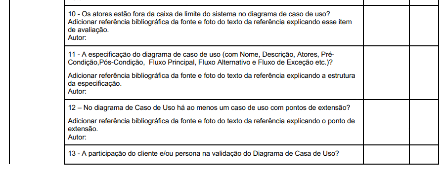
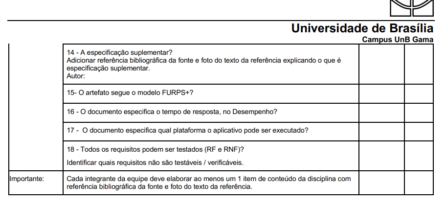
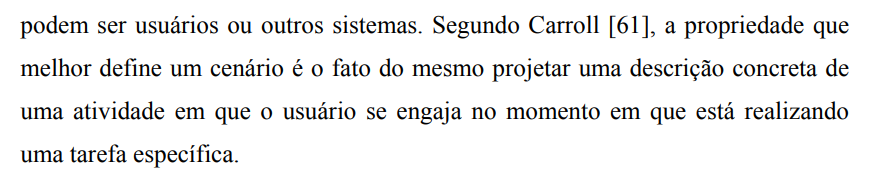
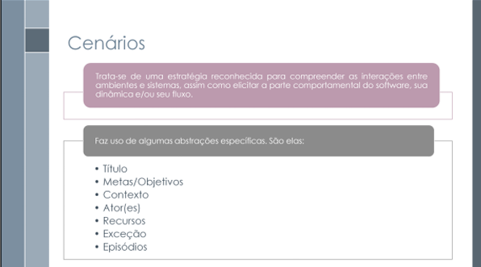
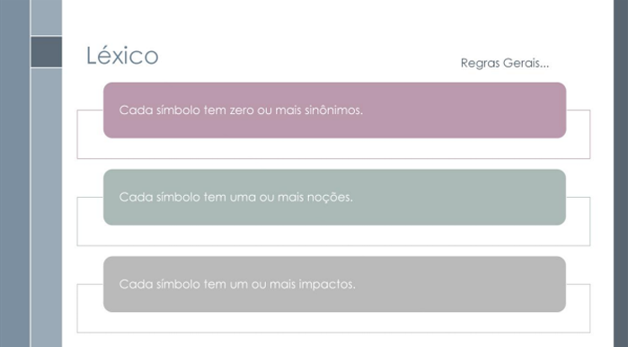
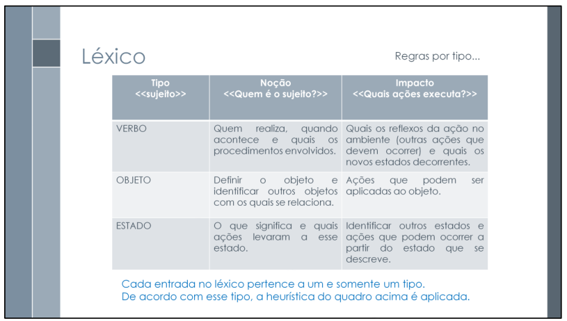
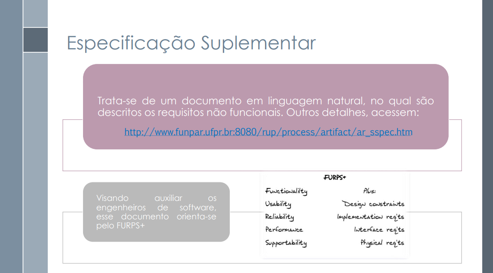

# Verificação

## Introdução

Esta página é dedicada à lista de verificação criada para os artefatos da terceira entrega.

## Lista de Verificação

### Tabela 1 - Verificação recomendada pelo professor

| Nº  | Descrição                                                                                                                                                                                                                      | Autor                  | Referência                |
|-----|--------------------------------------------------------------------------------------------------------------------------------------------------------------------------------------------------------------------------------|------------------------|----------------------------|
| 01  | O Github pages possui as especificações dos cenários para o projeto ?                                                                                                                                                       | André Barros de Sales  |                            |
| 02  | Os cenários possuem elementos básicos de um cenário (Título, Metas/Objetivo, Contexto, Atores, Recursos, Exceção e Episódios) ?                                                                                                  | André Barros de Sales  |                            |
| 03  | Os cenários possuem referência bibliográfica da fonte e foto do texto ?                                                                                                                                                          | André Barros de Sales  |                              |
| 04  | Os léxicos possuem referência bibliográfica da fonte e foto do texto ?                                                                                                                                                           | André Barros de Sales  |                              |
| 05  | A definição do usuário nos léxicos ?                                                                                                                                                                                            | André Barros de Sales  |                              |
| 06  | Os léxicos possuem ligações entre si (hiper links) ?                                                                                                                                                                            | André Barros de Sales  |                              |
| 07  | Os léxicos utilizam estrutura de dicionário (verbo, objeto, estado) ?                                                                                                                                                           | André Barros de Sales  |                              |
| 08  | Existe referência bibliográfica da fonte e foto da referência explicando a estrutura do dicionário ?                                                                                                                             | André Barros de Sales  |                              |
| 09  | A especificação dos casos de uso ?                                                                                                                                                                                              | André Barros de Sales  |                              |
| 10  | Os atores principais e atores secundários no diagrama de casos de uso com referência bibliográfica explicando os tipos de atores ?                                                                                              | André Barros de Sales  |                              |
| 11  | O ator principal está do lado esquerdo sistema no diagrama de caso de uso com referência explicando esse item de avaliação  ?                                                                                                   | André Barros de Sales  |                              |
| 12  | Os atores estão foram da caixa de limite do sistema no diagrama de caso de uso? Possui referência explicando esse item de avaliação?                                                                                           | André Barros de Sales  |                              |
| 13  | A especificação do diagrama de caso de uso (com Nome, Descrição, Atores, PréCondição,Pós-Condição, Fluxo Principal, Fluxo Alternativo e Fluxo de Exceção etc.) com referência bibliográfica explicando a estrtura da especificação ?                                                                                              | André Barros de Sales  |                            |
| 14  | No diagrama de Caso de Uso há ao menos um caso de uso com pontos de extensão?                                                                                                                                                  | André Barros de Sales  |                             |
| 15  | Existe referência bibliográfica da fonte e foto do texto explicando o ponto de extensão?                                                                                                                                       | André Barros de Sales  |                              |
| 16  | A participação do cliente e/ou persona na validação do Diagrama de Caso de Uso ?                                                                                                                                                | André Barros de Sales  |                              |
| 17  | A especificação suplementar com referência bibliográfica da fonte e foto do texto explicando o que é especificação suplementar ?                                                                                                | André Barros de Sales  |                              |
| 18  | O artefato segue o modelo FURPS+?                                                                                                                                                                                              | André Barros de Sales  |                               |
| 19  | O documento especifica o tempo de resposta, no Desempenho?                                                                                                                                                                     | André Barros de Sales  |                               |
| 20  | O documento especifica qual plataforma o aplicativo pode ser executado?                                                                                                                                                        | André Barros de Sales  |                               |
| 21  | Todos os requisitos podem ser testados (RF e RNF) ? Identificar quais requisitos não testaáveis/verificáveis ?                                                                                                                  | André Barros de Sales  |                               |

### Tabela 2 - Verificação do diagrama de casos de uso

| Nº    | Descrição                                                                                                                                                         | Autor | Referência |
|-------|-------------------------------------------------------------------------------------------------------------------------------------------------------------------|-------|------------|
| LUC01  | O sistema do diagrama está representado por um retângulo?                                                                                                         | Luiz  | Lucid Software Portugês - Tutorial de Casos de Uso UML - minuto [01:49](https://youtu.be/ab6eDdwS3rA?si=XaCIshHWRZauoAI4) |
| LUC02  | O nome do sistema está representado no topo do retângulo?                                                                                                         | Luiz  | Lucid Software Portugês - Tutorial de Casos de Uso UML - minuto [01:51](https://youtu.be/ab6eDdwS3rA?si=XaCIshHWRZauoAI4) |
| LUC03  | Tudo que acontece dentro do aplicativo está dentro do sistema?                                                                                                   | Luiz  | Lucid Software Portugês - Tutorial de Casos de Uso UML - minuto [02:04](https://youtu.be/ab6eDdwS3rA?si=XaCIshHWRZauoAI4) |
| LUC04  | Tudo que está fora da barreira do sistema não acontece dentro do aplicativo?                                                                                     | Luiz  | Lucid Software Portugês - Tutorial de Casos de Uso UML - minuto [02:08](https://youtu.be/ab6eDdwS3rA?si=XaCIshHWRZauoAI4) |
| LUC05  | O ator é uma pessoa, organização ou um sistema?                                                                                                                   | Luiz  | Lucid Software Portugês - Tutorial de Casos de Uso UML - minuto [02:22](https://youtu.be/ab6eDdwS3rA?si=XaCIshHWRZauoAI4) |
| LUC06  | O ator está representado por um boneco palito?                                                                                                                    | Luiz  | Lucid Software Portugês - Tutorial de Casos de Uso UML - minuto [02:15](https://youtu.be/ab6eDdwS3rA?si=XaCIshHWRZauoAI4) |
| LUC07  | Os atores estão fora do sistema?                                                                                                                                   | Luiz  | Lucid Software Portugês - Tutorial de Casos de Uso UML - minuto [02:52](https://youtu.be/ab6eDdwS3rA?si=XaCIshHWRZauoAI4) |
| LUC08  | Os nomes dos atores não são específicos?                                                                                                                          | Luiz  | Lucid Software Portugês - Tutorial de Casos de Uso UML - minuto [03:05](https://youtu.be/ab6eDdwS3rA?si=XaCIshHWRZauoAI4) |
| LUC09  | Os atores primários estão representados do lado esquerdo do sistema?                                                                                             | Luiz  | Lucid Software Portugês - Tutorial de Casos de Uso UML - minuto [03:50](https://youtu.be/ab6eDdwS3rA?si=XaCIshHWRZauoAI4) |
| LUC10  | Os atores secundários estão representados do lado direito do sistema?                                                                                            | Luiz  | Lucid Software Portugês - Tutorial de Casos de Uso UML - minuto [03:54](https://youtu.be/ab6eDdwS3rA?si=XaCIshHWRZauoAI4) |
| LC11  | O caso de uso está representado por uma elipse?                                                                                                                  | Luiz  | Lucid Software Portugês - Tutorial de Casos de Uso UML - minuto[04:10](https://youtu.be/ab6eDdwS3rA?si=XaCIshHWRZauoAI4) |
| LUC12  | O caso de uso representa uma ação que é feita dentro do sistema?                                                                                                 | Luiz  | Lucid Software Portugês - Tutorial de Casos de Uso UML - minuto [04:16](https://youtu.be/ab6eDdwS3rA?si=XaCIshHWRZauoAI4) |
| LUC13  | A descrição de cada caso de uso começa com um verbo?                                                                                                             | Luiz  | Lucid Software Portugês - Tutorial de Casos de Uso UML - minuto[04:50](https://youtu.be/ab6eDdwS3rA?si=XaCIshHWRZauoAI4) |
| LUC14  | Os casos de uso estão representados de forma lógica (ordenada)?                                                                                                  | Luiz  | Lucid Software Portugês - Tutorial de Casos de Uso UML - minuto [05:05](https://youtu.be/ab6eDdwS3rA?si=XaCIshHWRZauoAI4) |
| LUC15  | Cada ator interage com pelo menos um caso de uso do sistema?                                                                                                     | Luiz  | Lucid Software Portugês - Tutorial de Casos de Uso UML - minuto [05:20](https://youtu.be/ab6eDdwS3rA?si=XaCIshHWRZauoAI4) |
| LUC16  | As associações estão representadas por uma linha sólida?                                                                                                         | Luiz  | Lucid Software Portugês - Tutorial de Casos de Uso UML - minuto [05:30](https://youtu.be/ab6eDdwS3rA?si=XaCIshHWRZauoAI4) |
| LUC17  | As inclusões estão representadas por uma linha tracejada com seta voltada para o caso de uso incluído e com o texto <<incluir>>?                                | Luiz  | Lucid Software Portugês - Tutorial de Casos de Uso UML - minuto [07:40](https://youtu.be/ab6eDdwS3rA?si=XaCIshHWRZauoAI4) |
| LUC18  | As extensões estão representadas por uma linha tracejada com seta voltada para o caso de uso base e com o texto <<estender>>?                                   | Luiz  | Lucid Software Portugês - Tutorial de Casos de Uso UML - minuto [08:47](https://youtu.be/ab6eDdwS3rA?si=XaCIshHWRZauoAI4) |
| LUC19  | As generalizações estão representadas por uma seta do caso secundário para o primário?                                                                          | Luiz  | Lucid Software Portugês - Tutorial de Casos de Uso UML - minuto [11:00](https://youtu.be/ab6eDdwS3rA?si=XaCIshHWRZauoAI4) |
| LUC20  | O caso de uso com pontos de extensão leva para casos de uso estendidos?                                                                                          | Luiz  | Lucid Software Portugês - Tutorial de Casos de Uso UML - minuto [11:50](https://youtu.be/ab6eDdwS3rA?si=XaCIshHWRZauoAI4) |

### Tabela 3 - Verificação dos cenários

| Nº  | Descrição                                                                                                                                                                                                                      | Autor                  | Referência                |
|-----|--------------------------------------------------------------------------------------------------------------------------------------------------------------------------------------------------------------------------------|------------------------|----------------------------|
| LC01  | O cenário projeta uma descrição concteta de uma atividade que o usuário engaja no momento em que está realizando uma tarefa ?específica                                                                                                                                                            | Luiz  |                            |
| LC02  | O cenário possui título ?                                                                                                                                                           | Luiz  |                            |
| LC03  | O cenário possui metas ou objetivos ?                                                                                                                                                           | Luiz  |                            |
| LC04  | O cenário possui contexto ?                                                                                                                                                           | Luiz  |                            |
| LC05  | O cenário possui ator(es) ?                                                                                                                                                           | Luiz  |                            |
| LC06  | O cenário possui recursos ?                                                                                                                                                           | Luiz  |                            |
| LC07  | O cenário possui exceção ?                                                                                                                                                           | Luiz  |                            |
| LC08  | O cenário possui episódios ?                                                                                                                                                           | Luiz  |                            |

### Tabela 4 - Verificação dos léxicos

| Nº  | Descrição                                                                                                                                                                                                                      | Autor                  | Referência                |
|-----|--------------------------------------------------------------------------------------------------------------------------------------------------------------------------------------------------------------------------------|------------------------|----------------------------|
| LL01  | Os léxicos buscam de forma geral explicar palavras ou frases peculiares ao meio social da aplicação sob estudo ?                                                                                                                                                        | Luiz  |                            |
| LL02  | Cada símbolo possui sua noção ?                                                                                                                                                   | Luiz  |                            |
| LL03  | Cada símbolo possui seu impacto ?                                                                                                                                                        | Luiz  |                            |
| LL04  | Cada símbolo possui zero ou mais sinônimos?                                                                                                                                                        | Luiz  |                            |
| LL05  | Cada símbolo está classficicado como verbo, objeto ou estado?                                                                                                                                                        | Luiz  |                            |

### Tabela 5 - Verificação da especificação suplementar

| Nº  | Descrição                                                                                                                                                                                                                      | Autor                  | Referência                |
|-----|--------------------------------------------------------------------------------------------------------------------------------------------------------------------------------------------------------------------------------|------------------------|----------------------------|
| LES01  | A especificação suplmentar está escrita em linguagem natural descrevendo os requisitos não funcionais?                                                                                                                                                        | Luiz  |                            |
| LES02  | A especificação suplmentar segue a FURPS+ ?                                                                                                                                                       | Luiz  |                            |

| Data       | Versão | Descrição                                 | Autor                                      | Revisor                                     |
| :--------: | :----: | :---------------------------------------- | :----------------------------------------: | :----------------------------------------: |
| 12/05/2025 |  1.0   | (#D04) Criação da página das listas de verificação com as listas de verificação.| [Luiz](https://github.com/luizfaria1989)   | [`@Ana Borges`](https://github.com/anabborges), [`@Ana Joyce`](https://github.com/anajoyceamorim), [`@Fabio`](https://github.com/fabinsz), [`@Gabriela`](https://github.com/gaubiela), [`@Luiz`](https://github.com/luizfaria1989), [`@Mateus`](https://github.com/MVConsorte), [@Davi Emanuel](https://github.com/daviRolvr) |