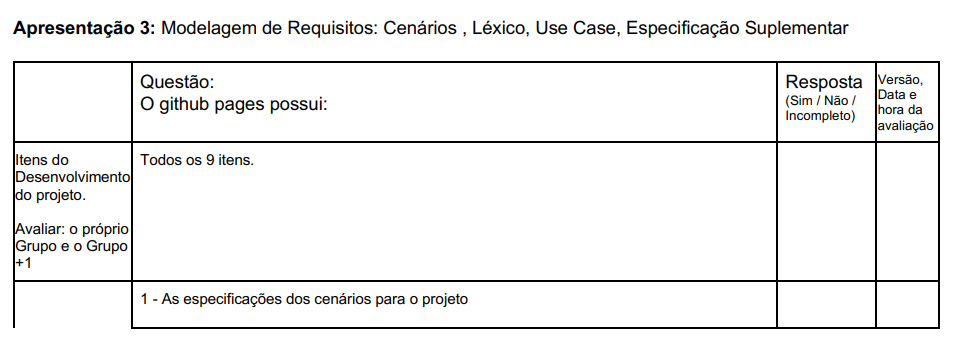
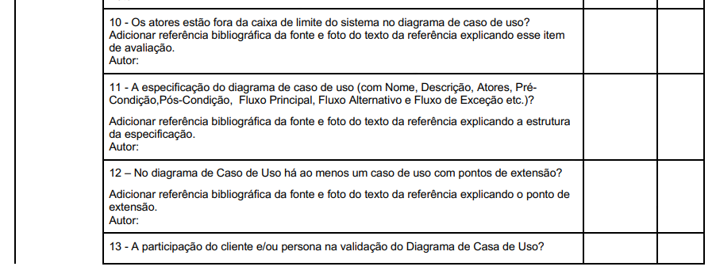
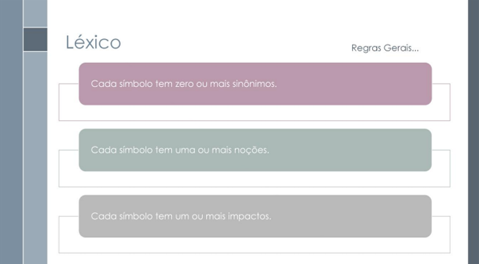
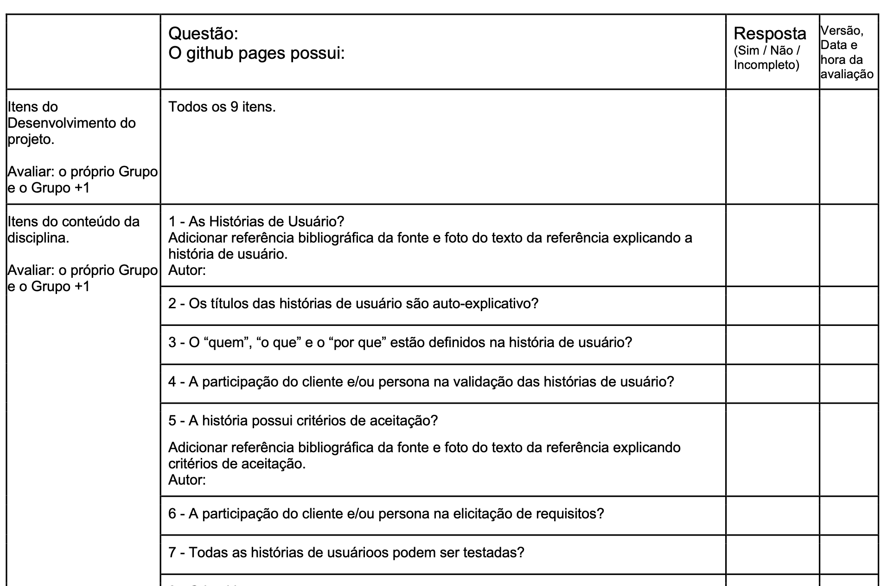
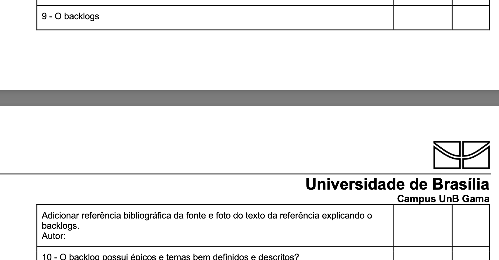
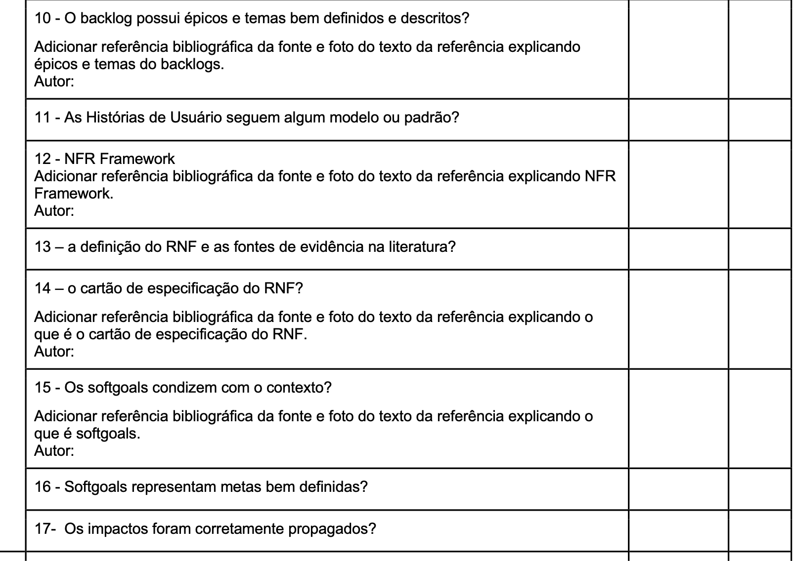
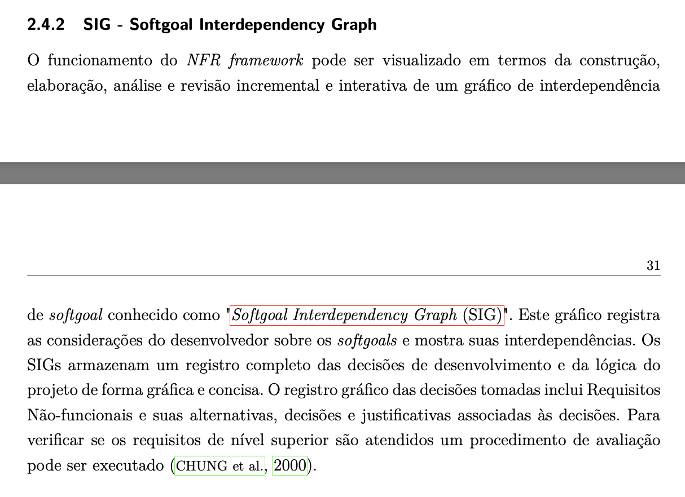

# Verificação

## Introdução

Esta página é dedicada à lista de verificação criada para todos os artefatos produzidos ao longo do projeto.

## Lista de Verificação

### Entrega 2

#### Tabela 1 - Verificação recomendada pelo professor

| Nº  | Descrição                                                                                                                                                                                                                      | Autor                  | Referência                |
|-----|--------------------------------------------------------------------------------------------------------------------------------------------------------------------------------------------------------------------------------|------------------------|----------------------------|
| 1   | A Especificação do Perfil do usuário possui informação de: idade (criança, jovem, adulto, terceira idade etc.); experiência (leigo/novato, especialista); atitudes (tecnófilos, tecnófobos); e tarefas primárias (compra, venda). | André Barros de Sales  |                            |
| 2   | Um cronograma (data e horário) e local para realização da elicitação de requisitos com o cliente e/ou persona do projeto.                                                                                                      | André Barros de Sales  |                            |
| 3   | No mínimo quatro técnicas de elicitação foram utilizadas (quanto mais, melhor)? Técnica(s): Análise de Documentos; Observação; Entrevista; Análise de protocolo; Prototipação; Brainstorming; Entrevista em grupo; Storytelling; Análise de discurso; Introspecção; Etnografia; JAD; Questionários; Reuniões; Grupo Focal; Workshops; Outra técnica? | André Barros de Sales  |                            |
| 4   | A participação do cliente e/ou persona na elicitação de requisitos.                                                                                                                                                           | André Barros de Sales  |                            |
| 5   | A gravação e o(s) registro(s) da elicitação de requisitos (pré-rastreabilidade).                                                                                                                                               | André Barros de Sales  |                            |
| 6   | Cada requisito possui ao menos uma fonte de origem?                                                                                                                                                                            | André Barros de Sales  |                            |
| 7   | São apresentados requisitos implementados e não implementados para a aplicação?                                                                                                                                               | André Barros de Sales  |                            |
| 8   | Está sendo apresentado como requisito pode ser verificado na aplicação (critério de aceitação).                                                                                                                               | André Barros de Sales  |                            |
| 9   | Um cronograma (data e horário) e local para realização da priorização de requisitos com o cliente e/ou persona do projeto.                                                                                                    | André Barros de Sales  |                            |
| 10  | No mínimo quatro técnicas de priorização (quanto mais, melhor)? MoSCoW; 100 $; First Thing First; ROI; QFD; TQM; Outra técnica? (MoSCoW/100 $ só após uso de outras duas técnicas.)                                           | André Barros de Sales  |                            |
| 11  | A participação do cliente e/ou persona no processo de priorização.                                                                                                                                                            | André Barros de Sales  |                            |
| 12  | A gravação e o(s) registro(s) da atividade de priorização de requisitos. Importante: cada integrante deve elaborar ao menos um item de conteúdo da disciplina com referência bibliográfica e foto do texto da referência.      | André Barros de Sales  |                            |

#### Tabela 2 - Verificação Pesquisa/Questionário

| Código | Descrição | Autor         | Referência |
|--------|----------|---------------|------------|
| LQ1 | O questionário deve ser um formulário impresso ou on-line com perguntas estruturadas para coletar dados de pesquisa, análise ou avaliação.  “Um questionário é um formulário impresso ou on-line com perguntas que os usuários e demais participantes devem responder, a fim de fornecer os dados necessários em uma pesquisa, análise ou avaliação.” | Gabriela Alves |  BARBOSA, Simone D. J.; SANTANA DA SILVA, Bruno; SILVEIRA, Milene S.; GASPARINI, Isabela; DARIN, Ticianne; BARBOSA, Gabriel D. J. *Interação Humano-Computador e Experiência do Usuário*. p. 149. |
| LQ2 | As perguntas devem ser formuladas com cuidado para evitar ambiguidades, indicando claramente se admitem resposta única ou múltipla.  “Como o respondente não terá como tirar dúvidas sobre as perguntas no momento de responder ao questionário, a formulação da pergunta (e das respostas) deve ser ainda mais cuidadosa do que no caso de entrevistas, evitando ambiguidades e mal-entendidos.” | Gabriela Alves |  BARBOSA, Simone D. J.; SANTANA DA SILVA, Bruno; SILVEIRA, Milene S.; GASPARINI, Isabela; DARIN, Ticianne; BARBOSA, Gabriel D. J. *Interação Humano-Computador e Experiência do Usuário*. p. 149. |
| LQ3 | O questionário deve oferecer opções neutras ou “outros” para evitar vieses e dar voz a respostas não previstas.  “Assim como entrevistas, questionários podem conter perguntas abertas e fechadas, mas costumam privilegiar as perguntas fechadas, de preenchimento rápido e de fácil análise.” “Perguntas fechadas geralmente incluem respostas neutras ou alternativas, como ‘não sei’, ‘não quero responder’ ou ‘outros’.” | Gabriela Alves |  BARBOSA, Simone D. J.; SANTANA DA SILVA, Bruno; SILVEIRA, Milene S.; GASPARINI, Isabela; DARIN, Ticianne; BARBOSA, Gabriel D. J. *Interação Humano-Computador e Experiência do Usuário*. p. 149–150. |
| LQ5 | Perguntas sobre valores (por exemplo, idade ou renda) devem usar faixas de resposta sem sobreposição, garantindo ambiguidade zero.  “É comum oferecermos faixas de valores como opções de resposta. Nesse tipo de pergunta, é importante evitar a sobreposição de valores (e.g., 20–30 e 30–40), para que a ambiguidade não prejudique a acurácia dos dados coletados.” | Gabriela Alves |  BARBOSA, Simone D. J.; SANTANA DA SILVA, Bruno; SILVEIRA, Milene S.; GASPARINI, Isabela; DARIN, Ticianne; BARBOSA, Gabriel D. J. *Interação Humano-Computador e Experiência do Usuário*. p. 150. |
| LQ6 | Escalas de Likert devem usar um número ímpar de pontos (geralmente 5 ou 7) e incluir opção neutra (“não sei”) para medir opiniões, atitudes ou satisfação.  “Em geral, utilizamos um número ímpar de valores, a menos que queiramos evitar que os usuários fiquem ‘em cima do muro’. Em escalas Likert, costumamos utilizar 5 ou 7 pontos, e em escalas de diferencial semântico utilizamos 5, 7 ou mesmo 9 pontos.” | Gabriela Alves |  BARBOSA, Simone D. J.; SANTANA DA SILVA, Bruno; SILVEIRA, Milene S.; GASPARINI, Isabela; DARIN, Ticianne; BARBOSA, Gabriel D. J. *Interação Humano-Computador e Experiência do Usuário*. p. 151. |
| LQ7 | A sequência das perguntas deve seguir estrutura lógica e ser agrupada por temas, para evitar que uma questão influencie a outra.  “A ordem das perguntas deve ser cuidadosamente projetada, pois a resposta a uma pergunta pode ser influenciada por uma das perguntas anteriores. Quando um questionário é longo, suas perguntas podem ser agrupadas em tópicos relacionados, formando uma estrutura lógica e de preenchimento mais fácil.” | Gabriela Alves |  BARBOSA, Simone D. J.; SANTANA DA SILVA, Bruno; SILVEIRA, Milene S.; GASPARINI, Isabela; DARIN, Ticianne; BARBOSA, Gabriel D. J. *Interação Humano-Computador e Experiência do Usuário*. p. 151. |

#### Tabela 3 - Verificação Análise de Documentos

| Código | Descrição | Autor       | Referência |
|--------|----------|-------------|------------|
| LD1 | Os documentos analisados incluem especificações de requisitos, processos de negócio, manuais do usuário ou semelhantes?  “Document analysis entails examining any existing documentation for potential software requirements. The most useful documentation includes requirements specifications, business processes, lessons learned collections, and user manuals for existing or similar applications.” | Luiz Morais | WIEGERS, K.; BEATTY, J. *Software Requirements*. 3. ed. Redmond: Microsoft Press, 2013. p. 128. |
| LD2 | Os documentos analisados são documentos recentes?  “A risk with this technique is that the available documents might not be up to date. Requirements might have changed without the specifications being updated, or functionality might be documented that is not needed in a new system.” | Luiz Morais |  WIEGERS, K.; BEATTY, J. *Software Requirements*. 3. ed. Redmond: Microsoft Press, 2013. p. 129. |

#### Tabela 4 - Verificação Observação

| Código | Descrição | Autor             | Referência |
|--------|----------|-------------------|------------|
| LO1 | Há um observador  “O observador imerge no ambiente de trabalho onde a solução será usada observando o trabalho cotidiano e tirando notas das tarefas nas quais as partes interessadas estão envolvidas.” | Ana Clara Borges |  VAZQUEZ, Carlos Eduardo; SIMÕES, Guilherme Siqueira. *Engenharia de requisitos: software orientado ao negócio*. Rio de Janeiro: Brasport Livros e Multimídia, 2016. p. 159. |
| LO2 | Há uma pessoa ou um grupo de pessoas sendo observada(s)  “... pela condução de uma avaliação no ambiente de trabalho das partes interessadas apropriadas.” | Ana Clara Borges |  VAZQUEZ, Carlos Eduardo; SIMÕES, Guilherme Siqueira. *Engenharia de requisitos: software orientado ao negócio*. Rio de Janeiro: Brasport Livros e Multimídia, 2016. p. 159. |
| LO3 | As atitudes da pessoa sendo observada contribuem para a elicitação dos requisitos funcionais  “... para ver problemas no sistema atual e para identificar maneiras para que o novo sistema possa contribuir no fluxo de trabalho.” | Ana Clara Borges |  WIEGERS, Karl E.; BEATTY, Joy. *Software Requirements*. 3. ed. Redmond: Microsoft Press, 2013. p. 126. |
| LO4 | O observador assume uma postura passiva ou ativa  “Também se deve definir qual tipo de postura o observador assumirá: Passiva ou Ativa.” | Ana Clara Borges |  VAZQUEZ, Carlos Eduardo; SIMÕES, Guilherme Siqueira. *Engenharia de requisitos: software orientado ao negócio*. Rio de Janeiro: Brasport Livros e Multimídia, 2016. p. 160. |
| LO5 | Há uma apresentação às pessoas que vão ser observadas  “... apresenta-se às pessoas que serão observadas.” | Ana Clara Borges |  VAZQUEZ, Carlos Eduardo; SIMÕES, Guilherme Siqueira. *Engenharia de requisitos: software orientado ao negócio*. Rio de Janeiro: Brasport Livros e Multimídia, 2016. p. 161. |
| LO6 | Os objetivos da técnica foram explicados anteriormente aos usuários observados  “Esclarece que as informações resultantes servirão como insumo para análise dos requisitos.” | Ana Clara Borges |  VAZQUEZ, Carlos Eduardo; SIMÕES, Guilherme Siqueira. *Engenharia de requisitos: software orientado ao negócio*. Rio de Janeiro: Brasport Livros e Multimídia, 2016. p. 161. |
| LO7 | Os usuários observados foram definidos  “usuários cujo trabalho deve ser observado, como, por exemplo, especialistas e novatos.” | Ana Clara Borges |  VAZQUEZ, Carlos Eduardo; SIMÕES, Guilherme Siqueira. *Engenharia de requisitos: software orientado ao negócio*. Rio de Janeiro: Brasport Livros e Multimídia, 2016. p. 160. |

#### Tabela 5 - Verificação Análise de Interface

| Código   | Descrição | Autor      | Referência |
|----------|----------|------------|------------|
| LVAI01 | Foram identificados requisitos funcionais relacionados à troca de dados e serviços entre o sistema em desenvolvimento e sistemas externos com os quais ele se conecta.  “System interface analysis reveals functional requirements regarding the exchange of data and services between systems.” | Ana Joyce |  WIEGERS, Karl; BEATTY, Joy. *Software Requirements*. 3. ed. [S. l.]: Microsoft Press, 2013. p. 127. |
| LVAI02 | Para cada sistema externo identificado, foram analisadas funcionalidades que possam gerar requisitos para o sistema em desenvolvimento?  “For each system that interfaces with yours, identify functionality in the other system that might lead to requirements for your system.” | Ana Joyce |  WIEGERS, Karl; BEATTY, Joy. *Software Requirements*. 3. ed. [S. l.]: Microsoft Press, 2013. p. 127. |

#### Tabela 6 - Verificação Perfil de Usuário

| Código | Descrição | Autor        | Referência |
|--------|----------|--------------|------------|
| LP1 | Definir quem são os usuários (ex.: professores, estudantes, profissionais de saúde). | Fábio Gabriel |  BARBOSA, Simone D. J.; SANTANA DA SILVA, Bruno; SILVEIRA, Milene S.; GASPARINI, Isabela; DARIN, Ticianne; BARBOSA, Gabriel D. J. *Interação Humano-Computador e Experiência do Usuário*. p. 165. |
| LP2 | Cargo/função (ex.: professor, gerente, estudante). Nível de instrução (ex.: ensino médio, graduação, pós-graduação). Faixa etária (ex.: 18-25, 26-40, 41-60). | Fábio Gabriel |  BARBOSA, Simone D. J.; SANTANA DA SILVA, Bruno; SILVEIRA, Milene S.; GASPARINI, Isabela; DARIN, Ticianne; BARBOSA, Gabriel D. J. *Interação Humano-Computador e Experiência do Usuário*. p. 166. |
| LP3 | Classificar familiaridade tecnológica (leigo, intermediário, especialista). | Fábio Gabriel |  BARBOSA, Simone D. J.; SANTANA DA SILVA, Bruno; SILVEIRA, Milene S.; GASPARINI, Isabela; DARIN, Ticianne; BARBOSA, Gabriel D. J. *Interação Humano-Computador e Experiência do Usuário*. p. 166. |
| LP4 | Nível de expertise no assunto (iniciante, intermediário, avançado). | Fábio Gabriel |  BARBOSA, Simone D. J.; SANTANA DA SILVA, Bruno; SILVEIRA, Milene S.; GASPARINI, Isabela; DARIN, Ticianne; BARBOSA, Gabriel D. J. *Interação Humano-Computador e Experiência do Usuário*. p. 166. |
| LP5 | Listar tarefas principais que o usuário realizará no sistema (ex.: comprar, cadastrar dados). | Fábio Gabriel |  BARBOSA, Simone D. J.; SANTANA DA SILVA, Bruno; SILVEIRA, Milene S.; GASPARINI, Isabela; DARIN, Ticianne; BARBOSA, Gabriel D. J. *Interação Humano-Computador e Experiência do Usuário*. p. 166. |
| LP6 | Agrupar usuários por similaridade (ex.: faixa etária, experiência, objetivos). | Fábio Gabriel |  BARBOSA, Simone D. J.; SANTANA DA SILVA, Bruno; SILVEIRA, Milene S.; GASPARINI, Isabela; DARIN, Ticianne; BARBOSA, Gabriel D. J. *Interação Humano-Computador e Experiência do Usuário*. p. 166. |
| LP7 | Definir critérios mais relevantes para o projeto (ex.: em um app acadêmico, priorizar "nível de instrução"). | Fábio Gabriel |  BARBOSA, Simone D. J.; SANTANA DA SILVA, Bruno; SILVEIRA, Milene S.; GASPARINI, Isabela; DARIN, Ticianne; BARBOSA, Gabriel D. J. *Interação Humano-Computador e Experiência do Usuário*. p. 166. |
| LP8 | Coletar dados reais (entrevistas, questionários, observação). | Fábio Gabriel |  BARBOSA, Simone D. J.; SANTANA DA SILVA, Bruno; SILVEIRA, Milene S.; GASPARINI, Isabela; DARIN, Ticianne; BARBOSA, Gabriel D. J. *Interação Humano-Computador e Experiência do Usuário*. p. 166. |

#### Tabela 7 - Verificação Three Level Scale

| Código | Descrição | Autor        | Referência |
|--------|----------|--------------|------------|
| LT1 | A técnica de priorização deve ser feita com stakeholders concordando com as prioridades dos requisitos.  “To make the scale useful, the stakeholders must agree on what each level means in the scale they use.” | Luiz Morais |  WIEGERS, K; BEATTY, J. *Software Requirements*. 3. ed. Redmond: Microsoft Press, 2013. p. 319. |
| LT2 | A técnica deve separar os requisitos em quatro categorias de prioridade: alta, média, baixa, não fazer.  Figura: Requirements prioritization based on importance and urgency | Luiz Morais |  WIEGERS, K; BEATTY, J. *Software Requirements*. 3. ed. Redmond: Microsoft Press, 2013. p. 319. |

#### Tabela 8 - Verificação Moscow

| Código | Descrição | Autor | Referência |
|--------|----------|-------|------------|
| LM1 | Os requisitos Must realmente são essenciais para o sucesso do projeto? | Davi Emanuel |  *Software Requirements*, Third edition - Tópico MoSCow |
| LM2 | Os requisitos Should são importantes, mas não impedem o sucesso do projeto caso não sejam incluídos? | Davi Emanuel |  *Software Requirements*, Third edition - Tópico MoSCow |
| LM3 | Os requisitos Could foram identificados como desejáveis e viáveis apenas se houver tempo e recursos? | Davi Emanuel |  *Software Requirements*, Third edition - Tópico MoSCow |
| LM4 | Os requisitos Won’t foram conscientemente excluídos por não serem prioritários neste momento? | Davi Emanuel |  *Software Requirements*, Third edition - Tópico MoSCow |
| LM5 | Todos os stakeholders participaram da classificação dos requisitos? | Davi Emanuel |  Requisitos – Aula 07 - Milene Serrano e Mauricio Serrano |
| LM6 | Os itens classificados como Could foram avaliados quanto à sua relação com a satisfação do cliente? | Davi Emanuel |  Requisitos – Aula 07 - Milene Serrano e Mauricio Serrano |
| LM7 | A técnica foi usada com linguagem simples e acessível a todos os envolvidos? | Davi Emanuel |  Requisitos – Aula 07 - Milene Serrano e Mauricio Serrano |
| LM8 | As decisões sobre o que será Won’t foram baseadas em retorno sobre investimento ou impacto estratégico? | Davi Emanuel |  Requisitos – Aula 07 - Milene Serrano e Mauricio Serrano |
| LM9 | A classificação foi feita com base no conhecimento real do negócio pelos interessados? | Davi Emanuel |  Requisitos – Aula 07 - Milene Serrano e Mauricio Serrano |
| LM10 | A exclusão dos requisitos não compromete a entrega ou o uso do produto? | Davi Emanuel |  Requisitos – Aula 07 - Milene Serrano e Mauricio Serrano |

#### Tabela 9 - Verificação In Or Out

| Código | Descrição | Autor        | Referência |
|--------|----------|--------------|------------|
| LI1 | Fazer decisão binária de todos os requisitos elicitados (in ou out) | Fábio Gabriel |  *Software Requirements*, 3. ed. Redmond: Microsoft Press, 2013. p. 318 |
| LI2 | Basear-se nos objetivos do negócio | Fábio Gabriel |  *Software Requirements*, 3. ed. Redmond: Microsoft Press, 2013. p. 318 |
| LI3 | Reduzir à quantidade mínima para o primeiro release | Fábio Gabriel |  *Software Requirements*, 3. ed. Redmond: Microsoft Press, 2013. p. 318 |
| LI4 | Guardar requisitos “out” para o próximo release | Fábio Gabriel |  *Software Requirements*, 3. ed. Redmond: Microsoft Press, 2013. p. 318 |
| LI5 | Facilitar reunião com stakeholders para decisão coletiva | Fábio Gabriel |  *Software Requirements*, 3. ed. Redmond: Microsoft Press, 2013. p. 318 |
| LI6 | Designar um stakeholder para decisão final em caso de conflito | Fábio Gabriel |  *Software Requirements*, 3. ed. Redmond: Microsoft Press, 2013. p. 318 |
| LI7 | Criar um ambiente leve e motivador | Fábio Gabriel |  *Software Requirements*, 3. ed. Redmond: Microsoft Press, 2013. p. 318 |

#### Tabela 10 - Verificação QFD

| Código  | Descrição                                                                 | Autor          | Referência                                                                                                      |
|---------|--------------------------------------------------------------------------|----------------|-----------------------------------------------------------------------------------------------------------------|
| LQFD1   | É definido os Requisitos do consumidor à esquerda da Casa da Qualidade. | Mateus Villela | SHORT, Michael. Lecture 4: Quality Function Deployment (QFD) and House of Quality. MIT OpenCourseWare, 2011. Disponível em: YouTube. Acesso em: 02 maio 2025. (4 min 16s) |
| LQFD2   | Há um ranking de importância para o consumidor, respectivamente aos requisitos do consumidor. | Mateus Villela | SHORT, Michael. Lecture 4: Quality Function Deployment (QFD) and House of Quality. MIT OpenCourseWare, 2011. Disponível em: YouTube. Acesso em: 02 maio 2025. (5 min 58s) |
| LQFD3   | O ranking de importância para o consumidor possui uma delimitação de intervalos (uma escala). | Mateus Villela | SHORT, Michael. Lecture 4: Quality Function Deployment (QFD) and House of Quality. MIT OpenCourseWare, 2011. Disponível em: YouTube. Acesso em: 02 maio 2025. (6 min 50s) |
| LQFD4   | O ranking de importância para o consumidor também é representado em termos de porcentagem (%). | Mateus Villela | SHORT, Michael. Lecture 4: Quality Function Deployment (QFD) and House of Quality. MIT OpenCourseWare, 2011. Disponível em: YouTube. Acesso em: 02 maio 2025. (8 min 30s) |
| LQFD5   | Há a definição dos requisitos técnicos na parte superior da Casa da Qualidade. | Mateus Villela | SHORT, Michael. Lecture 4: Quality Function Deployment (QFD) and House of Quality. MIT OpenCourseWare, 2011. Disponível em: YouTube. Acesso em: 02 maio 2025. (9 min 00s) |
| LQFD6   | Possui uma linha na parte superior da Casa da Qualidade associando os requisitos técnicos com a direção desejada da melhoria. | Mateus Villela | SHORT, Michael. Lecture 4: Quality Function Deployment (QFD) and House of Quality. MIT OpenCourseWare, 2011. Disponível em: YouTube. Acesso em: 02 maio 2025. (12 min 00s) |
| LQFD7   | Há o 'telhado' da Casa da Qualidade com a expressão das correlações entre os requisitos técnicos. | Mateus Villela | SHORT, Michael. Lecture 4: Quality Function Deployment (QFD) and House of Quality. MIT OpenCourseWare, 2011. Disponível em: YouTube. Acesso em: 02 maio 2025. (13 min 32s) |
| LQFD8   | Contém a legenda dos símbolos para a correlação utilizada no 'telhado' da Casa da Qualidade. | Mateus Villela | SHORT, Michael. Lecture 4: Quality Function Deployment (QFD) and House of Quality. MIT OpenCourseWare, 2011. Disponível em: YouTube. Acesso em: 02 maio 2025. (14 min 52s) |
| LQFD9   | Há a delimitação do corpo de relações da Casa da Qualidade entre os requisitos técnicos e os requisitos dos consumidores. | Mateus Villela | SHORT, Michael. Lecture 4: Quality Function Deployment (QFD) and House of Quality. MIT OpenCourseWare, 2011. Disponível em: YouTube. Acesso em: 02 maio 2025. (21 min 20s) |
| LQFD10  | Contém a legenda dos símbolos utilizados no corpo de relação da Casa da Qualidade, em que associa o valor numérico a seus símbolos (forte, médio, fraco ou nulo). | Mateus Villela | SHORT, Michael. Lecture 4: Quality Function Deployment (QFD) and House of Quality. MIT OpenCourseWare, 2011. Disponível em: YouTube. Acesso em: 02 maio 2025. (21 min 50s) |
| LQFD11  | A atribuição dos pesos dos requisitos do consumidor foi realizada em conjunto com os Stakeholders: consumidores/clientes. | Mateus Villela | SHORT, Michael. Lecture 4: Quality Function Deployment (QFD) and House of Quality. MIT OpenCourseWare, 2011. Disponível em: YouTube. Acesso em: 02 maio 2025. (4 min 30s) |
| LQFD12  | O preenchimento do 'Telhado' e da linha de direções do aprimoramento dos requisitos técnicos foi executado por Stakeholders especialistas. | Mateus Villela | SHORT, Michael. Lecture 4: Quality Function Deployment (QFD) and House of Quality. MIT OpenCourseWare, 2011. Disponível em: YouTube. Acesso em: 02 maio 2025. (12 min 50s e 15 min 10s) |
| LQFD13  | O preenchimento do Corpo de relações da Casa da Qualidade foi executado por Stakeholders especialistas com a atribuição dos símbolos. | Mateus Villela | SHORT, Michael. Lecture 4: Quality Function Deployment (QFD) and House of Quality. MIT OpenCourseWare, 2011. Disponível em: YouTube. Acesso em: 02 maio 2025. (21 min 22s e 22 min 40s) |
| LQFD14  | No 'piso' (parte inferior) da Casa da Qualidade, contém os valores obtidos na linha do fator Importância, associado ao cálculo da soma dos produtos entre o Corpo de relações e os pesos dos consumidores. | Mateus Villela | SHORT, Michael. Lecture 4: Quality Function Deployment (QFD) and House of Quality. MIT OpenCourseWare, 2011. Disponível em: YouTube. Acesso em: 02 maio 2025. (31 min 00s) |
| LQFD15  | Há a representação em termos de porcentagem (%) do fator Importância. | Mateus Villela | SHORT, Michael. Lecture 4: Quality Function Deployment (QFD) and House of Quality. MIT OpenCourseWare, 2011. Disponível em: YouTube. Acesso em: 02 maio 2025. (31 min 16s) |
| LQFD16  | Contém à direita da Casa da Qualidade o Benchmark (análise comparativa com produtos concorrentes) preenchidos pelos stakeholders. | Mateus Villela | SHORT, Michael. Lecture 4: Quality Function Deployment (QFD) and House of Quality. MIT OpenCourseWare, 2011. Disponível em: YouTube. Acesso em: 02 maio 2025. (34 min 48s) |

### Entrega 3

#### Tabela 1 - Verificação recomendada pelo professor

| Nº  | Descrição                                                                                                                                                                                                                      | Autor                  | Referência                |
|-----|--------------------------------------------------------------------------------------------------------------------------------------------------------------------------------------------------------------------------------|------------------------|----------------------------|
| 01  | O Github pages possui as especificações dos cenários para o projeto ?                                                                                                                                                       | André Barros de Sales  |                            |
| 02  | Os cenários possuem elementos básicos de um cenário (Título, Metas/Objetivo, Contexto, Atores, Recursos, Exceção e Episódios) ?                                                                                                  | André Barros de Sales  |                            |
| 03  | Os cenários possuem referência bibliográfica da fonte e foto do texto ?                                                                                                                                                          | André Barros de Sales  |                              |
| 04  | Os léxicos possuem referência bibliográfica da fonte e foto do texto ?                                                                                                                                                           | André Barros de Sales  |                              |
| 05  | A definição do usuário nos léxicos ?                                                                                                                                                                                            | André Barros de Sales  |                              |
| 06  | Os léxicos possuem ligações entre si (hiper links) ?                                                                                                                                                                            | André Barros de Sales  |                              |
| 07  | Os léxicos utilizam estrutura de dicionário (verbo, objeto, estado) ?                                                                                                                                                           | André Barros de Sales  |                              |
| 08  | Existe referência bibliográfica da fonte e foto da referência explicando a estrutura do dicionário ?                                                                                                                             | André Barros de Sales  |                              |
| 09  | A especificação dos casos de uso ?                                                                                                                                                                                              | André Barros de Sales  |                              |
| 10  | Os atores principais e atores secundários no diagrama de casos de uso com referência bibliográfica explicando os tipos de atores ?                                                                                              | André Barros de Sales  |                              |
| 11  | O ator principal está do lado esquerdo sistema no diagrama de caso de uso com referência explicando esse item de avaliação  ?                                                                                                   | André Barros de Sales  |                              |
| 12  | Os atores estão foram da caixa de limite do sistema no diagrama de caso de uso? Possui referência explicando esse item de avaliação?                                                                                           | André Barros de Sales  |                              |
| 13  | A especificação do diagrama de caso de uso (com Nome, Descrição, Atores, PréCondição,Pós-Condição, Fluxo Principal, Fluxo Alternativo e Fluxo de Exceção etc.) com referência bibliográfica explicando a estrtura da especificação ?                                                                                              | André Barros de Sales  |                            |
| 14  | No diagrama de Caso de Uso há ao menos um caso de uso com pontos de extensão?                                                                                                                                                  | André Barros de Sales  |                             |
| 15  | Existe referência bibliográfica da fonte e foto do texto explicando o ponto de extensão?                                                                                                                                       | André Barros de Sales  |                              |
| 16  | A participação do cliente e/ou persona na validação do Diagrama de Caso de Uso ?                                                                                                                                                | André Barros de Sales  |                              |
| 17  | A especificação suplementar com referência bibliográfica da fonte e foto do texto explicando o que é especificação suplementar ?                                                                                                | André Barros de Sales  |                              |
| 18  | O artefato segue o modelo FURPS+?                                                                                                                                                                                              | André Barros de Sales  |                               |
| 19  | O documento especifica o tempo de resposta, no Desempenho?                                                                                                                                                                     | André Barros de Sales  |                               |
| 20  | O documento especifica qual plataforma o aplicativo pode ser executado?                                                                                                                                                        | André Barros de Sales  |                               |
| 21  | Todos os requisitos podem ser testados (RF e RNF) ? Identificar quais requisitos não testaáveis/verificáveis ?                                                                                                                  | André Barros de Sales  |                               |

#### Tabela 2 - Verificação do diagrama de casos de uso

| Nº    | Descrição                                                                                                                                                         | Autor | Referência |
|-------|-------------------------------------------------------------------------------------------------------------------------------------------------------------------|-------|------------|
| LUC01  | O sistema do diagrama está representado por um retângulo?                                                                                                         | Luiz  | Lucid Software Portugês - Tutorial de Casos de Uso UML - minuto [01:49](https://youtu.be/ab6eDdwS3rA?si=XaCIshHWRZauoAI4) |
| LUC02  | O nome do sistema está representado no topo do retângulo?                                                                                                         | Luiz  | Lucid Software Portugês - Tutorial de Casos de Uso UML - minuto [01:51](https://youtu.be/ab6eDdwS3rA?si=XaCIshHWRZauoAI4) |
| LUC03  | Tudo que acontece dentro do aplicativo está dentro do sistema?                                                                                                   | Luiz  | Lucid Software Portugês - Tutorial de Casos de Uso UML - minuto [02:04](https://youtu.be/ab6eDdwS3rA?si=XaCIshHWRZauoAI4) |
| LUC04  | Tudo que está fora da barreira do sistema não acontece dentro do aplicativo?                                                                                     | Luiz  | Lucid Software Portugês - Tutorial de Casos de Uso UML - minuto [02:08](https://youtu.be/ab6eDdwS3rA?si=XaCIshHWRZauoAI4) |
| LUC05  | O ator é uma pessoa, organização ou um sistema?                                                                                                                   | Luiz  | Lucid Software Portugês - Tutorial de Casos de Uso UML - minuto [02:22](https://youtu.be/ab6eDdwS3rA?si=XaCIshHWRZauoAI4) |
| LUC06  | O ator está representado por um boneco palito?                                                                                                                    | Luiz  | Lucid Software Portugês - Tutorial de Casos de Uso UML - minuto [02:15](https://youtu.be/ab6eDdwS3rA?si=XaCIshHWRZauoAI4) |
| LUC07  | Os atores estão fora do sistema?                                                                                                                                   | Luiz  | Lucid Software Portugês - Tutorial de Casos de Uso UML - minuto [02:52](https://youtu.be/ab6eDdwS3rA?si=XaCIshHWRZauoAI4) |
| LUC08  | Os nomes dos atores não são específicos?                                                                                                                          | Luiz  | Lucid Software Portugês - Tutorial de Casos de Uso UML - minuto [03:05](https://youtu.be/ab6eDdwS3rA?si=XaCIshHWRZauoAI4) |
| LUC09  | Os atores primários estão representados do lado esquerdo do sistema?                                                                                             | Luiz  | Lucid Software Portugês - Tutorial de Casos de Uso UML - minuto [03:50](https://youtu.be/ab6eDdwS3rA?si=XaCIshHWRZauoAI4) |
| LUC10  | Os atores secundários estão representados do lado direito do sistema?                                                                                            | Luiz  | Lucid Software Portugês - Tutorial de Casos de Uso UML - minuto [03:54](https://youtu.be/ab6eDdwS3rA?si=XaCIshHWRZauoAI4) |
| LC11  | O caso de uso está representado por uma elipse?                                                                                                                  | Luiz  | Lucid Software Portugês - Tutorial de Casos de Uso UML - minuto[04:10](https://youtu.be/ab6eDdwS3rA?si=XaCIshHWRZauoAI4) |
| LUC12  | O caso de uso representa uma ação que é feita dentro do sistema?                                                                                                 | Luiz  | Lucid Software Portugês - Tutorial de Casos de Uso UML - minuto [04:16](https://youtu.be/ab6eDdwS3rA?si=XaCIshHWRZauoAI4) |
| LUC13  | A descrição de cada caso de uso começa com um verbo?                                                                                                             | Luiz  | Lucid Software Portugês - Tutorial de Casos de Uso UML - minuto[04:50](https://youtu.be/ab6eDdwS3rA?si=XaCIshHWRZauoAI4) |
| LUC14  | Os casos de uso estão representados de forma lógica (ordenada)?                                                                                                  | Luiz  | Lucid Software Portugês - Tutorial de Casos de Uso UML - minuto [05:05](https://youtu.be/ab6eDdwS3rA?si=XaCIshHWRZauoAI4) |
| LUC15  | Cada ator interage com pelo menos um caso de uso do sistema?                                                                                                     | Luiz  | Lucid Software Portugês - Tutorial de Casos de Uso UML - minuto [05:20](https://youtu.be/ab6eDdwS3rA?si=XaCIshHWRZauoAI4) |
| LUC16  | As associações estão representadas por uma linha sólida?                                                                                                         | Luiz  | Lucid Software Portugês - Tutorial de Casos de Uso UML - minuto [05:30](https://youtu.be/ab6eDdwS3rA?si=XaCIshHWRZauoAI4) |
| LUC17  | As inclusões estão representadas por uma linha tracejada com seta voltada para o caso de uso incluído e com o texto <<incluir>>?                                | Luiz  | Lucid Software Portugês - Tutorial de Casos de Uso UML - minuto [07:40](https://youtu.be/ab6eDdwS3rA?si=XaCIshHWRZauoAI4) |
| LUC18  | As extensões estão representadas por uma linha tracejada com seta voltada para o caso de uso base e com o texto <<estender>>?                                   | Luiz  | Lucid Software Portugês - Tutorial de Casos de Uso UML - minuto [08:47](https://youtu.be/ab6eDdwS3rA?si=XaCIshHWRZauoAI4) |
| LUC19  | As generalizações estão representadas por uma seta do caso secundário para o primário?                                                                          | Luiz  | Lucid Software Portugês - Tutorial de Casos de Uso UML - minuto [11:00](https://youtu.be/ab6eDdwS3rA?si=XaCIshHWRZauoAI4) |
| LUC20  | O caso de uso com pontos de extensão leva para casos de uso estendidos?                                                                                          | Luiz  | Lucid Software Portugês - Tutorial de Casos de Uso UML - minuto [11:50](https://youtu.be/ab6eDdwS3rA?si=XaCIshHWRZauoAI4) |

#### Tabela 3 - Verificação dos cenários

| Nº  | Descrição                                                                                                                                                                                                                      | Autor                  | Referência                |
|-----|--------------------------------------------------------------------------------------------------------------------------------------------------------------------------------------------------------------------------------|------------------------|----------------------------|
| LC01  | O cenário projeta uma descrição concteta de uma atividade que o usuário engaja no momento em que está realizando uma tarefa ?específica                                                                                                                                                            | Luiz  |                            |
| LC02  | O cenário possui título ?                                                                                                                                                           | Luiz  |                            |
| LC03  | O cenário possui metas ou objetivos ?                                                                                                                                                           | Luiz  |                            |
| LC04  | O cenário possui contexto ?                                                                                                                                                           | Luiz  |                            |
| LC05  | O cenário possui ator(es) ?                                                                                                                                                           | Luiz  |                            |
| LC06  | O cenário possui recursos ?                                                                                                                                                           | Luiz  |                            |
| LC07  | O cenário possui exceção ?                                                                                                                                                           | Luiz  |                            |
| LC08  | O cenário possui episódios ?                                                                                                                                                           | Luiz  |                            |

#### Tabela 4 - Verificação dos léxicos

| Nº  | Descrição                                                                                                                                                                                                                      | Autor                  | Referência                |
|-----|--------------------------------------------------------------------------------------------------------------------------------------------------------------------------------------------------------------------------------|------------------------|----------------------------|
| LL01  | Os léxicos buscam de forma geral explicar palavras ou frases peculiares ao meio social da aplicação sob estudo ?                                                                                                                                                        | Luiz  |                            |
| LL02  | Cada símbolo possui sua noção ?                                                                                                                                                   | Luiz  |                            |
| LL03  | Cada símbolo possui seu impacto ?                                                                                                                                                        | Luiz  |                            |
| LL04  | Cada símbolo possui zero ou mais sinônimos?                                                                                                                                                        | Luiz  |                            |
| LL05  | Cada símbolo está classficicado como verbo, objeto ou estado?                                                                                                                                                        | Luiz  |                            |

#### Tabela 5 - Verificação da especificação suplementar

| Nº  | Descrição                                                                                                                                                                                                                      | Autor                  | Referência                |
|-----|--------------------------------------------------------------------------------------------------------------------------------------------------------------------------------------------------------------------------------|------------------------|----------------------------|
| LES01  | A especificação suplmentar está escrita em linguagem natural descrevendo os requisitos não funcionais?                                                                                                                                                        | Luiz  |                            |
| LES02  | A especificação suplmentar segue a FURPS+ ?                                                                                                                                                       | Luiz  |                            |

### Entrega 4

#### Tabela 1 - Verificação recomendada pelo professor

| Nº  | Descrição                          | Autor                  | Referência                |
|-----|------------------------------------|------------------------|---------------------------|
| 01  | As Histórias de Usuário possuem referência bibliográfica da fonte e foto do texto da referência explicando a história de usuário ? | André Barros de Sales  |    |
| 02  | Os títulos das histórias de usuário são auto-explicativo? | André Barros de Sales  |                            |
| 03  | O “quem”, “o que” e o “por que” estão definidos na história de usuário? | André Barros de Sales  |                            |
| 04  | A participação do cliente e/ou persona na validação das histórias de usuário? | André Barros de Sales  |                            |
| 05  | A história possui critérios de aceitação? Existe referência bibliográfica da fonte e foto do texto da referência explicando critérios de aceitação ? | André Barros de Sales  |                            |
| 06  | A participação do cliente e/ou persona na elicitação de requisitos? | André Barros de Sales  |                            |
| 07  | Todas as histórias de usuários podem ser testadas? | André Barros de Sales  |                            |
| 08  | Os backlogs possuem referência bibliográfica da fonte e foto do texto da referência explicando o backlogs ? | André Barros de Sales  |                            |
| 09  | O backlog possui épicos e temas bem definidos e descritos? Existe referência bibliográfica da fonte e foto do texto da referência explicando épicos e temas do backlogs ? | André Barros de Sales  |                            |
| 10  | As Histórias de Usuário seguem algum modelo ou padrão? | André Barros de Sales  |                            |
| 11  | NFR Framework possui referência bibliográfica da fonte e foto do texto da referência explicando NFR Framework?  | André Barros de Sales  |                            |
| 12  | Existe definição do RNF e as fontes de evidência na literatura?  | André Barros de Sales  |                            |
| 13  | Existe referência bibliográfica da fonte e foto do texto da referência explicando o que é o cartão de especificação do RNF.  | André Barros de Sales  |                            |
| 14  | Os softgoals condizem com o contexto? Existe referência bibliográfica da fonte e foto do texto da referência explicando o que é softgoals?  | André Barros de Sales  |                            |
| 15  | Os Softgoals representam metas bem definidas?  | André Barros de Sales  |                            |
| 16  | Os impactos foram corretamente propagados?  | André Barros de Sales  |                            |

#### Tabela 2 - Verificação das hisórias de usuário

| Nº  | Descrição                          | Autor                  | Referência                |
|-----|------------------------------------|------------------------|---------------------------|
| 01  | As histórias de usuário descrevem o resultado, as características e as funcionalidades solicitadas para o software a ser construído? | Luiz  |  |
| 02  | A história de usuário está representada em uma ficha? | Luiz  |  |
| 03  | A história de usuário possui uma prioridade ou valor de negócio? | Luiz  |  |
| 04  | A história de usuário possui título? | Luiz  | [Reposiório de requisitos: Bilheteria digital](https://requisitos-de-software.github.io/2023.1-BilheteriaDigital/modelagem/agil/historia-de-usuario/) |
| 05  | A história de usuário possui descrição? | Luiz  | [Reposiório de requisitos: Bilheteria digital](https://requisitos-de-software.github.io/2023.1-BilheteriaDigital/modelagem/agil/historia-de-usuario/) |
| 06  | A história de usuário possui critérios de aceitação? | Luiz  | [Reposiório de requisitos: Bilheteria digital](https://requisitos-de-software.github.io/2023.1-BilheteriaDigital/modelagem/agil/historia-de-usuario/) |

#### Tabela 3 - Verificação do backlog

| Nº  | Descrição                          | Autor                  | Referência                |
|-----|------------------------------------|------------------------|---------------------------|
| 01  | O backlog está representado por uma lista com os requisitos ou funcionalidades do projeto? | Luiz  |  |
| 02  | Os requisitos do backlog possuem uma prioridade? | Luiz  |   |

#### Tabela 4 - Verificação do NFR Framewok

| Nº  | Descrição                          | Autor                  | Referência                |
|-----|------------------------------------|------------------------|---------------------------|
| 01  | O NFR Framework está analisando os requisitos não funcionais do projeto? | Luiz  |  |
| 02  | O NFR Framework possui um softgoal independency graph | Luiz  |  |
| 03  | Os requisitos não funcionais estão representados no cartão de especificação? | Luiz  |  |
| 04  | O cartão de especificação possui a descrição daquele requisito trabalhado? | Luiz  |  |
| 05  | O cartão de especificação possui a justificativa daquele requisito trabalhado? | Luiz  |  |
| 06  | O cartão de especificação possui a origem daquele requisito trabalhado? | Luiz  |  |
| 07  | O cartão de especificação possui critério de ajuste daquele requisito trabalhado? | Luiz  |  |
| 08  | O cartão de especificação possui as dependências daquele requisito trabalhado? | Luiz  |  |
| 09  | O cartão de especificação possui a prioridade daquele requisito trabalhado? | Luiz  |  |
| 10  | O cartão de especificação possui os conflitos daquele requisito trabalhado? | Luiz  |  |
| 11  | O cartão de especificação possui a história daquele requisito trabalhado? | Luiz  |  |

### Entrega 6

#### Tabela 1 - Verificação da matriz de rastreabilidade

| Nº  | Descrição                          | Autor                  | Referência                |
|-----|------------------------------------|------------------------|---------------------------|
| 01  | O documento da matriz de rastreabilidade possui a definição da matriz de rastreabilidade | Luiz |    |
| 02  | A matriz de rastreabilidade possui uma coluna para o identificador daquele requisito ? | Luiz | [Repositório Bilheteira Digital](https://requisitos-de-software.github.io/2023.1-BilheteriaDigital/rastreabilidade/matriz-geral/) |
| 03  | A matriz de rastreabilidade possui uma coluna para a descrição daquele requisito ? | Luiz | [Repositório Bilheteira Digital](https://requisitos-de-software.github.io/2023.1-BilheteriaDigital/rastreabilidade/matriz-geral/) |
| 04  | A matriz de rastreabilidade possui uma coluna apresentando qual técnica de elictação foi utilizada para elicitar aquele requisito ? | Luiz | [Repositório Bilheteira Digital](https://requisitos-de-software.github.io/2023.1-BilheteriaDigital/rastreabilidade/matriz-geral/) |
| 05  | A matriz de rastreabilidade possui uma coluna para para indentificar se aquele requisito está implementado ou não ? | Luiz | [Repositório Bilheteira Digital](https://requisitos-de-software.github.io/2023.1-BilheteriaDigital/rastreabilidade/matriz-geral/) |
| 06  | A matriz de rastreabilidade possui uma coluna para indetificar os artefatos que foram produzidos com base naquele requisito ? | Luiz | [Repositório Bilheteira Digital](https://requisitos-de-software.github.io/2023.1-BilheteriaDigital/rastreabilidade/matriz-geral/) |
| 07  | A matriz de rastreabilidade possui uma coluna para o identificador os elos daquele requisito ? | Luiz | [Repositório Bilheteira Digital](https://requisitos-de-software.github.io/2023.1-BilheteriaDigital/rastreabilidade/matriz-geral/) |
| 08  | A matriz de rastreabilidade possui hiperlinks para a navegação para os artefatos daquele requisito ? | Luiz | [Repositório Bilheteira Digital](https://requisitos-de-software.github.io/2023.1-BilheteriaDigital/rastreabilidade/matriz-geral/) |
| 09  | A matriz de rastreabilidade possui hiperlinks para a navegação dos elos daquele requisito ? | Luiz | [Repositório Bilheteira Digital](https://requisitos-de-software.github.io/2023.1-BilheteriaDigital/rastreabilidade/matriz-geral/) |
| 10  | A matriz de rastreabilidade possui hiperlinks para os documentos de elicitação daquele requisito ? | Luiz | [Repositório Bilheteira Digital](https://requisitos-de-software.github.io/2023.1-BilheteriaDigital/rastreabilidade/matriz-geral/) |

#### Tabela 2 - Verificação do documento de pós-rastreabilidade

| Nº  | Descrição                          | Autor                  | Referência                |
|-----|------------------------------------|------------------------|---------------------------|
| 01  | O documento de pós rastreabilidade cita e explica cada um dos quatro tipos de informação (ambiental, organizacional, gerencial, desenvolvimento) segundo Toranzo ? | Luiz |    |
| 02  | O documento de pós rastreabilidade cita e explica o elo de satisfação ? | Luiz |    |
| 03  | O documento de pós rastreabilidade cita e explica o elo de recurso ? | Luiz |    |
| 04  | O documento de pós rastreabilidade cita e explica o elo de responsabilidade ? | Luiz |    |
| 05  | O documento de pós rastreabilidade cita e explica o elo de alocado ? | Luiz |    |
| 06  | O documento de pós rastreabilidade cita e explica o elo de agregação ? | Luiz |    |
| 07  | O documento de pós rastreabilidade possui um template e tabelas contendo os tipos de elo daquele requisto ? | Luiz |   |

### Entrega 5

| Nº  | Descrição                                                                                                                                                                                                                      | Autor                  | Referência                |
|-----|--------------------------------------------------------------------------------------------------------------------------------------------------------------------------------------------------------------------------------|------------------------|----------------------------|
| 1 | Foram adicionadas fotos dos requisitos implementados? | Ana Clara | Professor André Barros de Sales (Em sala) |
| 2 | Foi adicionada uma foto do email de validação enviado para a equipe técnica? | Ana Clara, Mateus | Professor André Barros de Sales (Grupo do Telegram e em sala)  |
| 3 | Os usuários estão envolvidos no uso e avaliação do protótipo? | Mateus e Davi| Professor André Barros de Sales (Grupo do Telegram e em sala)  e engenharia de sofware de ia  sommervillle  |
| 4 | Cada integrante do grupo fez ao menos 2 protótipos de 2 requistos não implementados. | Mateus | Professor André Barros de Sales e monitores (Grupo do Telegram e em sala)  |
| 5 | O protótipo está ajudando na elicitação e validação de requisitos com o usuário? | Davi | engenharia de sofware de ia  sommervillle   |
| 6 | O protótipo está apoiando o projeto da interface de usuário? | Davi | engenharia de sofware de ia  sommervillle  |
| 7 | As funcionalidades simuladas no protótipo estão bem definidas? | Davi | engenharia de sofware de ia  sommervillle  |

## Lista de Verificação de itens não implementados

Foi realizada uma planilha para controlar os itens julgados como não implementados ou parcialmente implementados de acordo com a lista do professor, do monitor, do nosso grupo e do grupo - 1.

[Planilha](https://docs.google.com/spreadsheets/d/1cLXUHYE8O3fmghAInzfeLpwniEWqffKZMiRnxGsmn5M/edit?usp=sharing)

# Histórico de versões

| Data       | Versão | Descrição                                 | Autor                                      | Revisor                                     |
| :--------: | :----: | :---------------------------------------- | :----------------------------------------: | :----------------------------------------: |
| 22/06/2025 |  1.0   | (#V11) Criação da página das listas de verificação com as listas de verificação.| [Ana Clara](https://github.com/anabborges)   | [`@`](https://github.com/)  |